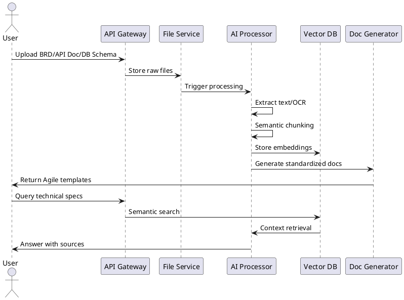

Dựa trên ý tưởng của bạn, tôi phát triển thành một hệ thống AI hoàn chỉnh với các thành phần chi tiết và kế hoạch triển khai:

# **Hệ Thống AI Tổng Hợp Tài Liệu Kỹ Thuật (Technical DocuMate)**

## **1. Kiến Trúc Hệ Thống Tổng Thể (Microservice Architecture)**

*(Sử dụng Python Diagram lib để generate)*

**Các service chính:**
1. File Ingestion Service
2. AI Processing Orchestrator
3. Vector Knowledge Base 
4. Q&A Interface
5. Documentation Generator
6. Diagram Engine

## **2. Luồng Xử Lý Chính (Sequence Diagram)**


## **3. Chi Tiết Các Thành Phần Chính**

### **3.1 Input Processing Pipeline**
- **Định dạng hỗ trợ:**
  - Văn bản: BRD (docx), BA Spec (pdf), API Docs (markdown)
  - Hình ảnh: Flowchart (png/jpg) → OCR + Diagram Parser
  - Database Schema: ERD (pdf/img) → Chuyển đổi thành SQLAlchemy models

- **Công nghệ:**
  - Apache Tika cho text extraction
  - Google Document AI cho table/form parsing
  - Custom CNN model cho diagram recognition

### **3.2 AI Processing Core**

```python
# Ví dụ multi-LLM orchestration
from langchain.chains import ConversationalRetrievalChain
from langchain_community.llms import OpenAI, Claude

class AIOrchestrator:
    def __init__(self):
        self.llms = {
            'openai': OpenAI(temperature=0),
            'claude': Claude(max_tokens=1000)
        }
        
    def analyze_architecture(self, docs):
        # Sử dụng Claude cho phân tích tổng hợp
        architecture_summary = self.llms['claude'].predict(
            f"Phân tích kiến trúc hệ thống từ: {docs}"
        )
        
        # Sử dụng OpenAI cho validation
        validation = self.llms['openai'].predict(
            f"Kiểm tra tính nhất quán của kiến trúc: {architecture_summary}"
        )
        
        return self.consensus_engine(architecture_summary, validation)
```

### **3.3 Output Generation System**
**a. Tự Động Tạo Tài Liệu:**
- Agile Template Engine:
  ```python
  def generate_user_story(requirements):
      template = """
      **Title**: {title}
      **As a**: {role}
      **I want**: {feature}
      **So that**: {benefit}
      -------------------
      **Acceptance Criteria**:
      {criteria}
      """
      # Sử dụng GPT-4 để điền template
      return llm.fill_template(template, requirements)
  ```

**b. Diagram Automation:**
- Microservice Visualization:
  ```python
  from diagrams import Diagram, Cluster
  from diagrams.aws.compute import ECS

  def generate_architecture_diagram(services):
      with Diagram("Microservice Architecture", show=False):
          with Cluster("Service Group"):
              [ECS(svc) for svc in services]
  ```

## **4. Công Nghệ Chính**

| Layer           | Công Nghệ                  | Mục Đích                           |
|-----------------|---------------------------|-----------------------------------|
| Processing      | Apache NiFi, Tesseract    | Xử lý file đa định dạng           |
| AI Core         | OpenAI GPT-4, Claude 3    | Phân tích semantic                 |
| Vector DB       | Pinecone, Weaviate        | Lưu trữ embedding                 |
| Orchestration   | LangChain, LlamaIndex     | Kết nối các thành phần AI         |
| Visualization   | Diagram (Python), PlantUML| Tự động sinh diagram              |
| Backend         | FastAPI, Celery           | Xây dựng API và xử lý bất đồng bộ |

## **5. Kế Hoạch Triển Khai**

**Giai Đoạn 1: MVP (6 tuần)**
1. Tuần 1-2: Xây dựng file processing pipeline
2. Tuần 3: Tích hợp AI text analysis cơ bản
3. Tuần 4: Triển khai vector database
4. Tuần 5: Xây dựng Q&A interface
5. Tuần 6: Tích hợp diagram generation

**Giai Đoạn 2: Nâng Cao (4 tuần)**
- Triển khai multi-LLM consensus mechanism
- Thêm support cho các diagram phức tạp (C4 model)
- Phát triển template editor cho Agile documents

## **6. Hướng Phát Triển Tương Lai**
- Thêm module tự động sinh API spec (OpenAPI)
- Tích hợp với Jira/Confluence
- Phát triển AI validation engine cho technical documents
- Thêm support cho real-time collaboration

Để triển khai hệ thống này, tôi đề xuất bắt đầu với Proof-of-Concept tập trung vào:
1. Thử nghiệm khả năng xử lý các loại tài liệu BRD thực tế
2. Đánh giá độ chính xác của Q&A engine
3. Tối ưu hóa quá trình chuyển đổi diagram sang code

Bạn cần hỗ trợ thêm phần nào chi tiết hơn?