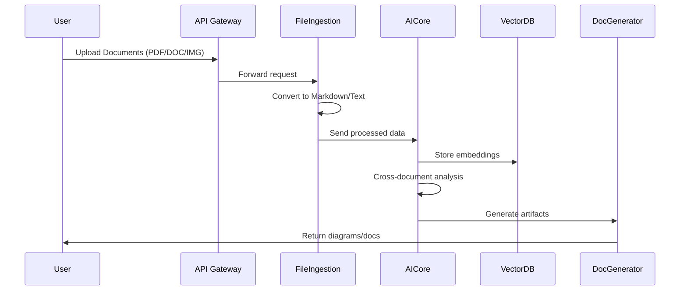

Dựa trên ý tưởng của bạn, tôi phát triển một kế hoạch chi tiết với các cải tiến và bổ sung quan trọng:

# **Hệ Thống AI Phân Tích Tài Liệu Kỹ Thuật (Technical Doc Analyzer)**

## **1. Kiến Trúc Hệ Thống (Microservice Architecture)**

*(Sử dụng thư viện Diagrams Python để generate)*

**Các Service Chính:**
- **File Ingestion Service**: Xử lý đa định dạng file
- **AI Processing Orchestrator**: Điều phối workflow AI
- **Vector Database Service**: Lưu trữ embeddings
- **Document Generation Engine**: Tạo tài liệu chuẩn hóa
- **Diagram Generator**: Tự động sinh diagram từ text

## **2. Luồng Xử Lý Chính**


## **3. Công Nghệ Chính**
| Thành Phần          | Công Nghệ                  | Mục Đích                     |
|----------------------|---------------------------|-----------------------------|
| File Parser          | PyPDF2, Tika, Tesseract   | Extract text từ file        |
| AI Models            | GPT-4, Claude 2, Gemini   | Phân tích đa mô hình        |
| Vector DB            | Pinecone + Redis          | Semantic search tốc độ cao  |
| Diagram Generation   | Diagrams + PlantUML       | Auto-generate architecture  |
| API Framework        | FastAPI + GraphQL         | Linh hoạt trong truy vấn    |

## **4. Cải Tiến Quan Trọng**

**a. Xử lý đa định dạng nâng cao:**
- OCR cho hình ảnh/phần mềm vẽ (Visio/Lucidchart)
- Phân tích layer trong PDF (text + hình ảnh + annotation)
- Nhận diện biểu đồ UML từ ảnh bằng YOLOv8

**b. Phân tích ngữ nghĩa:**
- Domain-specific embedding cho technical docs
- Cross-document reference resolution
- Technical term taxonomy builder

**c. Tự động hóa tài liệu Agile:**
- AI-generated user stories từ BRD
- Sprint planning advisor
- Technical debt analyzer
- API spec generator (OpenAPI 3.0)

**d. Hỗ trợ workflow end-to-end:**
- Jira/Trello integration
- GitLab CI/CD pipeline generator
- Architecture Decision Records (ADR) helper

## **5. Pipeline Xử Lý**

1. **Ingestion Layer**
   - File type detection
   - Parallel processing với Celery
   - Metadata extraction

2. **AI Processing**
   - Multi-model ensemble analysis
   - Technical consistency check
   - Dependency mapping

3. **Knowledge Graph**
   - Entity-relationship extraction
   - Cross-document linking
   - Version diff analysis

4. **Output Generation**
   - Interactive query interface
   - Auto-diagram correction
   - Compliance checker

## **6. Bảo Mật & Tuân Thủ**
- Role-based access control
- Data anonymization engine
- Audit trail với blockchain
- GDPR compliance checker

## **7. Triển Khai**

**Yêu cầu hệ thống:**
- Kubernetes cluster
- GPU-enabled nodes cho AI processing
- Distributed file storage (MinIO/IPFS)

**DevOps:**
- Terraform cho infrastructure
- ArgoCD cho continuous deployment
- Prometheus + Grafana monitoring

## **8. Roadmap**

| Phase | Thời Gian | Mục Tiêu                     |
|-------|-----------|-----------------------------|
| 1      | 2 tháng   | Core document processing     |
| 2      | 4 tháng   | Advanced AI integration      |
| 3      | 6 tháng   | Full workflow automation     |

## **9. Demo Code (Diagrams Python)**

```python
from diagrams import Diagram, Cluster
from diagrams.aws.compute import ECS
from diagrams.aws.database import ElastiCache
from diagrams.aws.network import Route53

with Diagram("Microservice Architecture", show=False):
    dns = Route53("User Interface")
    
    with Cluster("Processing Cluster"):
        ai_models = [ECS("GPT-4"), ECS("Claude"), ECS("Gemini")]
        queue = ElastiCache("Task Queue")
        
    vector_db = ElastiCache("VectorDB")
    
    dns >> ai_models >> queue >> vector_db
```

Để triển khai hệ thống này, cần:

1. Setup infrastructure với Terraform
2. Implement core processing engine
3. Tích hợp các AI model
4. Phát triển frontend dashboard

 