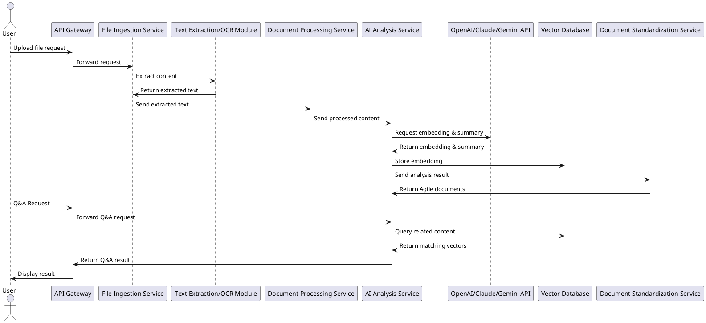

Dưới đây là mã UML Sequence Diagram mà bạn có thể nhập vào StartUML (hoặc công cụ UML tương thích với PlantUML) để vẽ sơ đồ tuần tự theo luồng bạn đã cung cấp:



```@startuml
actor User

participant "API Gateway" as AG
participant "File Ingestion Service" as FIS
participant "Text Extraction/OCR Module" as TEOM
participant "Document Processing Service" as DPS
participant "AI Analysis Service" as AIS
participant "OpenAI/Claude/Gemini API" as OCG
participant "Vector Database" as VD
participant "Document Standardization Service" as DSS

' Người dùng gửi yêu cầu tải lên file
User -> AG: Yêu cầu tải lên file

' API Gateway chuyển tiếp yêu cầu đến File Ingestion Service
AG -> FIS: Chuyển tiếp yêu cầu

' File Ingestion Service gọi module trích xuất nội dung (với OCR nếu cần)
FIS -> TEOM: Trích xuất nội dung từ file
TEOM -> FIS: Trả về nội dung đã trích xuất

' File Ingestion Service chuyển nội dung đã trích xuất đến Document Processing Service để xử lý
FIS -> DPS: Gửi nội dung đã trích xuất

' Document Processing Service xử lý và chuẩn hóa nội dung, sau đó gửi đến AI Analysis Service
DPS -> AIS: Gửi nội dung đã xử lý

' AI Analysis Service gọi API của OpenAI/Claude/Gemini để tạo embedding và tóm tắt nội dung
AIS -> OCG: Yêu cầu tạo embedding & tóm tắt nội dung
OCG -> AIS: Trả về embedding & tóm tắt

' AI Analysis Service lưu embedding vào Vector Database
AIS -> VD: Lưu embedding

' AI Analysis Service gửi kết quả phân tích đến Document Standardization Service để chuẩn hóa tài liệu theo Agile
AIS -> DSS: Gửi kết quả phân tích
DSS -> AIS: Trả về tài liệu Agile chuẩn hóa

' Người dùng gửi yêu cầu Q&A
User -> AG: Yêu cầu Q&A

' API Gateway chuyển tiếp yêu cầu Q&A đến AI Analysis Service
AG -> AIS: Chuyển tiếp yêu cầu Q&A

' AI Analysis Service truy vấn Vector Database để tìm kiếm nội dung liên quan
AIS -> VD: Truy vấn nội dung liên quan
VD -> AIS: Trả về các vector phù hợp

' AI Analysis Service trả kết quả Q&A cho API Gateway và hiển thị cho người dùng
AIS -> AG: Trả kết quả Q&A
AG -> User: Hiển thị kết quả
@enduml
```


Sơ đồ này thể hiện đầy đủ các bước từ lúc người dùng gửi yêu cầu upload file, xử lý nội dung file, gọi các API AI, lưu trữ embedding vào vector database và cuối cùng xử lý Q&A theo yêu cầu.