Dưới đây là một bản phân tích và kế hoạch hoàn chỉnh cho hệ thống AI “tương tự NotebookLM” mà bạn yêu cầu. Bản kế hoạch bao gồm phân tích yêu cầu, kiến trúc hệ thống theo mô hình Microservices, danh sách các công nghệ chính (cùng với vai trò của chúng), quy trình xử lý từ đầu vào đến đầu ra, và các biểu đồ minh họa (bao gồm kiến trúc tổng thể và 15 sequence diagram cho các flow quan trọng).

---

## I. Phân tích Yêu Cầu & Mục Tiêu Dự Án

### 1. Yêu Cầu Đầu Vào
- **Định dạng file hỗ trợ:**  
  - Văn bản: `doc`, `docx`, `pdf`  
  - Hình ảnh: `jpg`, `png`  
  - Video: `mp4`, …  
- **Nội dung các file:**  
  - Tài liệu yêu cầu kinh doanh (BRD), phân tích nghiệp vụ (BA)  
  - Tài liệu thiết kế kiến trúc hệ thống  
  - Sơ đồ luồng, biểu đồ tuần tự  
  - Kiến trúc cơ sở dữ liệu, thiết kế API, …  

### 2. Yêu Cầu Đầu Ra
- **Tổng hợp & Hỏi đáp:**  
  - Hệ thống tổng hợp kiến thức từ các file đã đính kèm  
  - Hỗ trợ hỏi đáp (QA) dựa trên nội dung tài liệu
- **Chuẩn hóa & Gợi ý Tài liệu:**  
  - Gợi ý các tài liệu được chuẩn hóa theo chuẩn Agile/Scrum  
  - Tự động tạo báo cáo tiến độ dự án (ví dụ: Grant Chart)  
  - Theo dõi, báo cáo chất lượng bug/issue (tích hợp với Jira, …)

### 3. Mục Tiêu Chính
- **Sử dụng AI tiên tiến:**  
  - Tích hợp các mô hình ngôn ngữ như OpenAI GPT-4, Claude 3, Gemini để phân tích, tổng hợp nội dung
  - Tạo embedding và lưu trữ trên vector database (Pinecone, Weaviate) để “hiểu” ngữ nghĩa của tài liệu
- **Kết nối các thành phần qua hệ thống Microservice:**  
  - Xử lý bất đồng bộ, điều phối workflow, tự động sinh diagram theo yêu cầu
  - Đảm bảo khả năng mở rộng và linh hoạt trong triển khai

---

## II. Kiến Trúc Hệ Thống & Các Thành Phần Chính

Hệ thống được thiết kế theo kiến trúc **Microservice Architecture** với các module độc lập, giao tiếp với nhau qua messaging (Kafka) và API. Dưới đây là các layer cùng công nghệ và mục đích sử dụng:

| **Layer**       | **Công Nghệ**                         | **Mục Đích**                                         |
|-----------------|---------------------------------------|------------------------------------------------------|
| **Processing**  | Apache NiFi, Tesseract                | Xử lý file đa định dạng (định tuyến, OCR, parsing)    |
| **AI Core**     | OpenAI GPT-4, Claude 3, Gemini        | Phân tích semantic, tóm tắt, QA, tạo embedding        |
| **Vector DB**   | Pinecone, Weaviate                    | Lưu trữ embedding của tài liệu                        |
| **Orchestration**| LangChain, LlamaIndex                | Kết nối, điều phối các thành phần AI, workflow         |
| **Visualization**| Diagram (Python), PlantUML           | Tự động sinh diagram (architecture, sequence, …)      |
| **Backend**     | FastAPI, Celery                       | Xây dựng API, xử lý bất đồng bộ, quản lý task           |
| **Messaging**   | Kafka                                 | Hệ thống Pub/Sub cho giao tiếp giữa các microservice   |
| **Database**    | PostgreSQL/NoSQL (cho metadata)       | Lưu trữ metadata, trạng thái tiến độ dự án, log, …       |

### Các thành phần chính của hệ thống:

1. **File Upload Service:**  
   - Nhận và lưu trữ các file được upload từ người dùng.
   - Gửi thông tin file qua Kafka để các service khác xử lý.

2. **File Processing Service:**  
   - Sử dụng Apache NiFi để định tuyến và Tesseract để xử lý file ảnh (OCR).
   - Trích xuất nội dung văn bản từ các định dạng tài liệu.

3. **AI Analysis Service (AI Core):**  
   - Nhận nội dung đã trích xuất, sử dụng các mô hình AI (GPT-4, Claude 3, Gemini) để phân tích, tóm tắt và trả lời các truy vấn.
   - Tạo embedding cho nội dung để lưu trữ vào Vector DB.

4. **Embedding & Vector Storage Service:**  
   - Tạo embedding của nội dung tài liệu và lưu trữ chúng trên các vector database (Pinecone, Weaviate).

5. **Orchestration Service:**  
   - Điều phối luồng xử lý từ các service AI, kết nối và tổng hợp dữ liệu.
   - Đề xuất chuẩn hóa tài liệu (Agile/Scrum, Grant Chart, …).

6. **Visualization Service:**  
   - Tự động tạo diagram (architecture diagram, sequence diagram, …) dựa trên dữ liệu phân tích.
   - Sử dụng Diagram (Python) và PlantUML để sinh các biểu đồ.

7. **Backend API & Async Processing Service:**  
   - Xây dựng API (với FastAPI) cho giao tiếp với UI và xử lý bất đồng bộ (với Celery) các tác vụ nặng.

8. **Messaging / Event Bus (Kafka):**  
   - Tạo kết nối pub/sub giữa các service, đảm bảo giao tiếp bất đồng bộ và mở rộng hệ thống.

9. **Database (Metadata & Logging):**  
   - Lưu trữ thông tin metadata của các file, kết quả phân tích, trạng thái tiến độ dự án và các log hệ thống.

---

## III. Quy Trình Xử Lý Toàn Bộ

1. **File Upload:**  
   - Người dùng upload file thông qua giao diện web (UI).  
   - File được gửi đến **File Upload Service**, sau đó thông báo được publish lên Kafka.

2. **Xử Lý File:**  
   - **File Processing Service** nhận thông báo từ Kafka, tải file về và xử lý:  
     - Dùng Apache NiFi để định tuyến.
     - Dùng Tesseract để thực hiện OCR (với file ảnh) hoặc các parser cho file văn bản.
   - Nội dung trích xuất được lưu tạm thời và chuyển tiếp cho bước xử lý tiếp theo.

3. **Phân Tích AI:**  
   - Nội dung trích xuất được gửi đến **AI Analysis Service**.  
   - Các mô hình AI (GPT-4, Claude 3, Gemini) tiến hành:
     - Tóm tắt nội dung
     - Phân tích semantic
     - Hỗ trợ hỏi đáp (QA)
     - Tạo embedding cho nội dung

4. **Lưu Trữ Embedding:**  
   - Các embedding được tạo sẽ được lưu vào **Vector DB** (Pinecone, Weaviate) để hỗ trợ các truy vấn sematic sau này.

5. **Orchestration & Chuẩn Hóa:**  
   - **Orchestration Service** tổng hợp kết quả từ AI Analysis và Vector DB:  
     - Đề xuất các tài liệu chuẩn hóa theo Agile/Scrum
     - Sinh báo cáo tiến độ dự án (Grant Chart)
     - Cập nhật trạng thái bug/issue (tích hợp với Jira)

6. **Sinh Diagram & Hiển Thị Kết Quả:**  
   - **Visualization Service** tự động sinh các diagram (kiến trúc, sequence, …) bằng Diagram (Python) và PlantUML.
   - **Backend API Service** (FastAPI, Celery) cung cấp các endpoint cho UI, hiển thị kết quả tổng hợp, báo cáo và kết quả phân tích.

7. **Giao Tiếp & Bảo Trì:**  
   - Các service liên lạc qua Kafka để đảm bảo tính bất đồng bộ và mở rộng.
   - Hệ thống logging & monitoring được tích hợp để theo dõi hiệu năng và phát hiện lỗi.

---

## IV. Kiến Trúc Hệ Thống (Architecture Diagram)

Sử dụng thư viện [diagrams](https://diagrams.mingrammer.com/) của Python, dưới đây là một mẫu code minh họa kiến trúc hệ thống theo mô hình Microservice:

```python
from diagrams import Diagram, Cluster
from diagrams.onprem.client import User
from diagrams.onprem.queue import Kafka
from diagrams.custom import Custom
from diagrams.onprem.compute import Server
from diagrams.onprem.database import PostgreSQL

with Diagram("AI Document Processing System Architecture", show=False):
    # Người dùng và Frontend
    user = User("Người dùng")
    with Cluster("Frontend"):
        ui = Custom("Web UI", "./icons/ui.png")
    
    # Backend Microservices
    with Cluster("Backend Microservices"):
        upload_service = Server("File Upload Service")
        processing_service = Server("File Processing Service\n(Apache NiFi, Tesseract)")
        ai_core = Server("AI Analysis Service\n(OpenAI GPT-4, Claude 3, Gemini)")
        vector_db = Custom("Vector DB\n(Pinecone, Weaviate)", "./icons/database.png")
        orchestration = Server("Orchestration Service\n(LangChain, LlamaIndex)")
        visualization = Server("Visualization Service\n(Diagram, PlantUML)")
        backend_api = Server("Backend API Service\n(FastAPI, Celery)")
        db = PostgreSQL("Metadata DB")
    
    # Messaging hệ thống
    kafka = Kafka("Kafka Pub/Sub")
    
    # Flow dữ liệu
    user >> ui >> upload_service
    upload_service >> kafka
    kafka >> processing_service
    processing_service >> ai_core
    ai_core >> vector_db
    ai_core >> orchestration
    orchestration >> visualization
    visualization >> backend_api
    ai_core >> backend_api
    backend_api >> db
    user << backend_api
```

> **Lưu ý:** Các icon (ví dụ: `./icons/ui.png`, `./icons/database.png`) chỉ mang tính minh họa. Bạn có thể thay đổi hoặc sử dụng icon khác tùy theo cấu hình.

---

## V. 15 Sequence Diagrams (Top Flow)

Dưới đây là 15 biểu đồ tuần tự (sequence diagram) mô tả các flow quan trọng của hệ thống. Bạn có thể sử dụng các đoạn mã PlantUML dưới đây trong StarUML hoặc các công cụ hỗ trợ PlantUML để trực quan hóa.

### 1. File Upload Flow

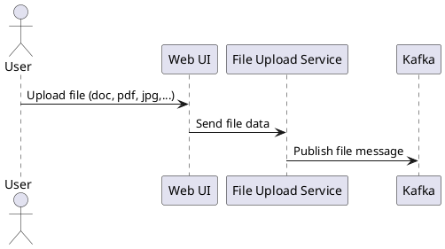

### 2. File Processing Flow

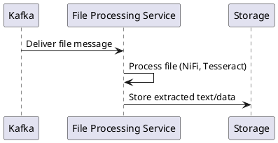

### 3. Text Extraction Flow

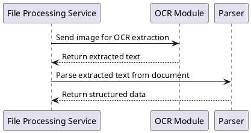

### 4. AI Analysis Flow

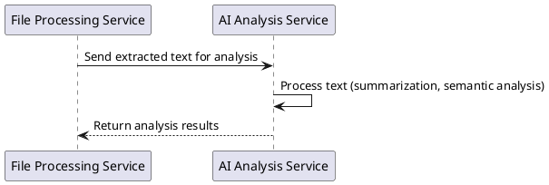

### 5. Embedding Generation Flow

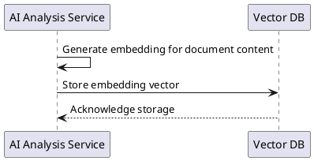

### 6. Orchestration Flow

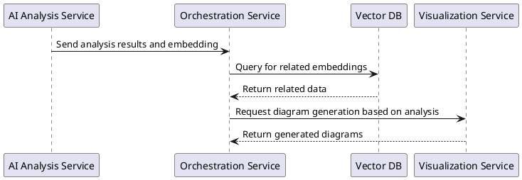

### 7. QA Query Flow

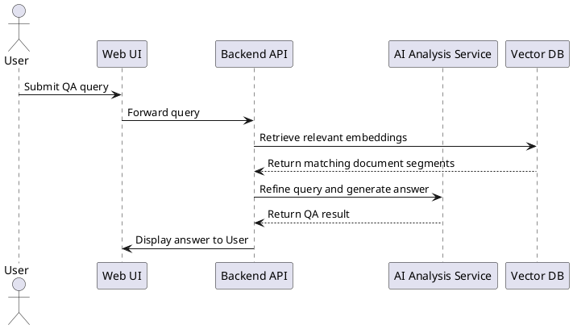

### 8. Document Suggestion Flow

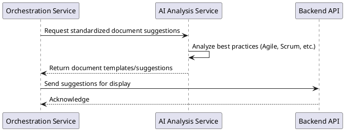

### 9. Diagram Generation Flow

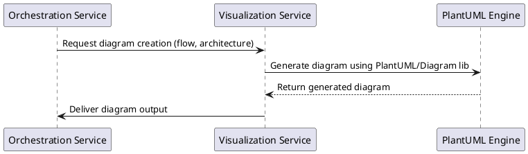

### 10. Agile Documentation Generation Flow

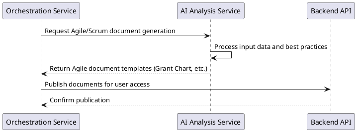

### 11. Project Progress Reporting Flow

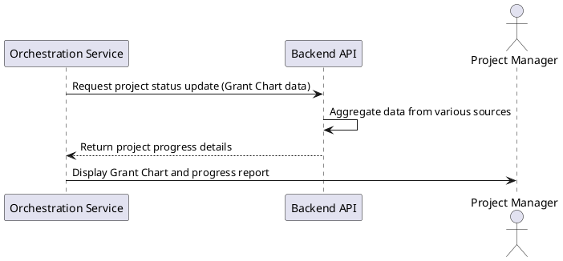

### 12. Bug/Issue Tracking Flow

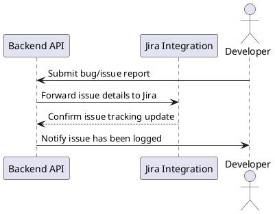

### 13. Notification Flow

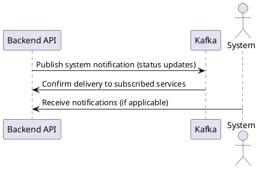

### 14. Asynchronous Task Processing Flow

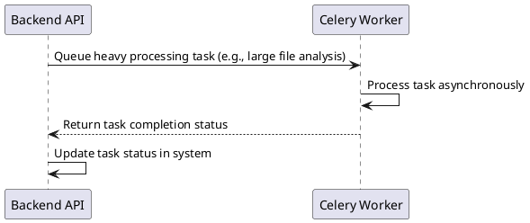

### 15. System Monitoring & Logging Flow

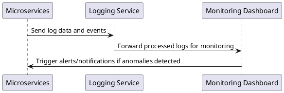

---

## VI. Tổng Kết & Hướng Triển Khai

1. **Triển khai & tích hợp:**  
   - Xây dựng từng microservice độc lập, đảm bảo giao tiếp qua Kafka và RESTful API.
   - Tích hợp các mô hình AI (GPT-4, Claude 3, Gemini) qua các API tương ứng.
   - Thiết lập vector database (Pinecone, Weaviate) để lưu trữ embedding cho các nội dung tài liệu.

2. **Kiểm thử & Mở rộng:**  
   - Xây dựng các kịch bản test cho từng flow (file upload, xử lý, phân tích, sinh diagram,…).
   - Theo dõi log và hệ thống monitoring để đảm bảo tính ổn định và mở rộng.

3. **Triển khai UI & Báo cáo:**  
   - Phát triển giao diện người dùng thân thiện để upload file, truy vấn kết quả và hiển thị báo cáo, diagram.
   - Tích hợp chức năng cập nhật trạng thái bug/issue với các công cụ quản lý (ví dụ Jira).

Với kế hoạch và kiến trúc như trên, hệ thống sẽ có khả năng:
- Xử lý đa định dạng tài liệu và trích xuất nội dung một cách hiệu quả.
- Sử dụng các mô hình AI tiên tiến để phân tích ngữ nghĩa, trả lời câu hỏi và tạo ra các gợi ý tài liệu chuẩn.
- Tự động sinh diagram, báo cáo tiến độ dự án, và tích hợp theo dõi bug/issue, từ đó hỗ trợ toàn bộ các pha tiếp theo của dự án.

Hy vọng rằng bản kế hoạch này đã cung cấp một cái nhìn tổng quát và chi tiết cho việc triển khai dự án. Nếu cần làm rõ hoặc bổ sung thêm các yêu cầu, bạn hãy cho biết để có thể tinh chỉnh kế hoạch cho phù hợp.