Dưới đây là một kế hoạch hoàn chỉnh cho hệ thống “NotebookLM-like” sử dụng kiến trúc Microservice, với các phân tích, bổ sung ý và các sơ đồ mẫu (bao gồm sơ đồ kiến trúc hệ thống theo draw.io với theme AWS và 20 sequence diagram flow quan trọng theo StartUML). Bạn có thể điều chỉnh, mở rộng hoặc tích hợp thêm các chi tiết cho phù hợp với yêu cầu cụ thể của dự án.

---

## 1. Giới thiệu dự án

**Mục tiêu:**  
Xây dựng một hệ thống thông minh có khả năng:
- **Nhận và xử lý đa định dạng file** (doc, docx, pdf, jpg, png, mp4, …) chứa các tài liệu quan trọng như BRD, BA, kiến trúc hệ thống, sơ đồ luồng, biểu đồ tuần tự, API design, …  
- **Tổng hợp và phân tích nội dung**: Hệ thống sẽ “đọc” nội dung từ các file đính kèm, trích xuất ý nghĩa (semantic) và cho phép hỏi đáp, tìm kiếm, cũng như gợi ý các tài liệu chuẩn theo các framework Agile/Scrum (ví dụ: báo cáo tiến độ dạng Gantt chart, theo dõi bug qua Jira, …).

**Lợi ích:**  
- Giúp các thành viên dự án nhanh chóng nắm bắt được tổng quan tài liệu.
- Hỗ trợ chuyển đổi và chuẩn hóa các tài liệu theo chuẩn quản lý hiện đại.
- Tích hợp các công nghệ AI tiên tiến để nâng cao hiệu quả xử lý thông tin và ra quyết định.

---

## 2. Yêu cầu chức năng và phi chức năng

### 2.1 Yêu cầu chức năng

- **File Upload & Ingestion:**
  - Cho phép người dùng đính kèm các file với định dạng: doc, docx, pdf, jpg, png, mp4, …  
  - Lưu trữ file và metadata (ngày upload, định dạng, …).

- **File Processing:**
  - Xử lý file đa định dạng:  
    - Với file văn bản: trích xuất nội dung, định dạng.
    - Với hình ảnh/video: sử dụng OCR (Tesseract) để chuyển đổi thành văn bản.
  - Phân loại và routing file tới các module xử lý phù hợp (ví dụ: tài liệu kỹ thuật, sơ đồ, …).

- **Semantic Analysis & Embedding:**
  - Sử dụng các mô hình AI (OpenAI GPT-4, Claude 3, Gemini) để phân tích nội dung.
  - Sinh embedding từ nội dung đã trích xuất và lưu vào **Vector Database** (Pinecone, Weaviate) để phục vụ tìm kiếm ngữ nghĩa sau này.

- **Orchestration & Q&A:**
  - Tích hợp các framework như LangChain, LlamaIndex để kết nối các module AI và xây dựng logic hỏi – đáp, tổng hợp kiến thức.
  - Hỗ trợ tính năng “chat” hoặc query-based, cho phép người dùng đặt câu hỏi liên quan đến tài liệu.

- **Standardization & Reporting:**
  - Gợi ý chuyển đổi tài liệu theo chuẩn Agile/Scrum, bao gồm:
    - Báo cáo tiến độ dự án (Gantt chart).
    - Theo dõi bug/issue qua Jira.
    - Sinh tự động sơ đồ (flow, sequence, kiến trúc hệ thống) bằng PlantUML, Diagram (Python).

- **API & Tích hợp:**
  - Cung cấp API RESTful (FastAPI) để tích hợp với các hệ thống khác.
  - Hỗ trợ xử lý bất đồng bộ (Celery) và giao tiếp giữa các dịch vụ (Kafka – pub/sub).

---

### 2.2 Yêu cầu phi chức năng

- **Scalability:**  
  - Kiến trúc Microservice cho phép mở rộng từng module độc lập.
  
- **Fault Tolerance & Reliability:**  
  - Sử dụng message broker (Kafka) để đảm bảo các thông điệp không bị mất trong quá trình truyền.

- **Performance:**  
  - Xử lý bất đồng bộ với Celery để tối ưu thời gian phản hồi.
  
- **Security:**  
  - Xác thực, phân quyền người dùng.
  - Mã hoá dữ liệu khi truyền tải và lưu trữ.

---

## 3. Kiến trúc hệ thống và các công nghệ chính

### 3.1. Bảng tóm tắt các Layer – Công Nghệ – Mục Đích

| **Layer**         | **Công Nghệ**                | **Mục Đích**                                |
|-------------------|------------------------------|---------------------------------------------|
| **Processing**    | Apache NiFi, Tesseract       | Xử lý file đa định dạng (trích xuất văn bản, OCR) |
| **AI Core**       | OpenAI GPT-4, Claude 3, Gemini | Phân tích semantic, trích xuất thông tin, sinh embedding |
| **Vector DB**     | Pinecone, Weaviate           | Lưu trữ embedding cho tìm kiếm ngữ nghĩa     |
| **Orchestration** | LangChain, LlamaIndex        | Kết nối, quản lý luồng xử lý giữa các thành phần AI |
| **Visualization** | Diagram (Python), PlantUML   | Tự động sinh diagram (sơ đồ, sequence, flow)  |
| **Backend**       | FastAPI, Celery              | Xây dựng API và xử lý bất đồng bộ (asynchronous tasks) |
| **Message Broker**| Apache Kafka                 | Hệ thống Pub/Sub, đảm bảo giao tiếp giữa các dịch vụ |

---

### 3.2. Kiến trúc Microservice (High-Level Architecture)

Dưới đây là mô tả sơ đồ kiến trúc hệ thống theo draw.io với theme AWS:

#### **Các thành phần chính:**

1. **User Interface (UI):**
   - **Icon AWS:** *AWS Amplify* (hoặc giao diện Web/SPA)
   - Chức năng: Cho phép người dùng upload file, đặt câu hỏi và xem kết quả.

2. **API Gateway:**
   - **Icon AWS:** *AWS API Gateway* (hoặc dịch vụ FastAPI được deploy trên EC2/Container)
   - Chức năng: Tiếp nhận request từ UI và chuyển tiếp tới các dịch vụ backend.

3. **Message Broker:**
   - **Icon AWS:** *AWS MSK (Managed Streaming for Kafka)*
   - Chức năng: Đảm bảo giao tiếp, pub/sub giữa các microservice (đặc biệt trong quá trình xử lý file bất đồng bộ).

4. **File Ingestion Service:**
   - **Icon AWS:** *AWS EC2* (hoặc Container Service – ECS/EKS)
   - Công nghệ: Apache NiFi, Tesseract.
   - Chức năng: Nhận file từ API Gateway, định tuyến đến các module xử lý phù hợp.

5. **Document Processing Service:**
   - **Icon AWS:** *AWS EC2* (hoặc Container Service)
   - Chức năng: Chuyển đổi file sang văn bản, xử lý định dạng, phân loại nội dung.

6. **AI Core Service:**
   - **Icon AWS:** *AWS EC2* (hoặc Container Service)
   - Công nghệ: OpenAI GPT-4, Claude 3, Gemini.
   - Chức năng: Phân tích semantic, sinh embedding, trả lời câu hỏi.

7. **Vector Database Service:**
   - **Icon AWS:** Có thể sử dụng dịch vụ bên ngoài như Pinecone hoặc Weaviate (deploy trên cloud).
   - Chức năng: Lưu trữ và truy vấn embedding theo ngữ nghĩa.

8. **Orchestration Service:**
   - **Icon AWS:** *AWS EC2* (hoặc Container Service)
   - Công nghệ: LangChain, LlamaIndex.
   - Chức năng: Điều phối luồng xử lý giữa các module AI, quản lý workflow tổng hợp kết quả.

9. **Visualization Service:**
   - **Icon AWS:** *AWS EC2* (hoặc Container Service)
   - Công nghệ: Diagram (Python), PlantUML.
   - Chức năng: Tự động sinh sơ đồ kiến trúc, flow, sequence dựa trên dữ liệu phân tích.

10. **Backend & Async Processing:**
    - **Icon AWS:** *AWS EC2*, sử dụng Celery cho các tác vụ bất đồng bộ.
    - Chức năng: Xây dựng API, quản lý tác vụ xử lý bất đồng bộ, tích hợp với các hệ thống bên ngoài (Jira, Agile tools).

11. **External Integration:**
    - **Ví dụ:** Jira, công cụ Agile (cho Grant Chart, bug tracking,…)

#### **Sơ đồ kiến trúc mẫu (dưới dạng mô tả):**

```plaintext
              +------------------------------------+
              |             Người dùng             |
              |            (AWS IAM)               |
              +----------------+-------------------+
                               │
                               ▼
              +-----------------------------+
              |   Web Frontend (AWS Amplify)|
              +-------------+---------------+
                            │
                            ▼
              +-----------------------------+
              | API Gateway (FastAPI on EC2)|
              +-------------+---------------+
                            │
                            ▼
              +-----------------------------+
              |      Message Broker         |
              |      (AWS MSK - Kafka)      |
              +------+-----------+----------+
                     │           │
                     │           │
     +---------------+           +-----------------+
     │                                             │
     ▼                                             ▼
+-------------+                             +--------------+
| File Ingestion|                             |  Other Core  |
| Service     |                             |  Services    |
| (NiFi, OCR) |                             | (AI Core,    |
+------+------|                             | Orchestration|
       │                                    | Visualization|
       ▼                                    +-------+------+
+-------------+                                        │
| Document    |                                        ▼
| Processing  |                              +--------------------+
| Service     |                              |  Backend & Async   |
+------+------|                              |   Processing       |
       │                                    +---------+----------+
       ▼                                              │
+--------------+                                      ▼
| AI Core      |                              +--------------------+
| Service      |                              |  External Systems  |
| (GPT-4, etc) |                              | (Jira, Agile Tools)|
+------+-------+                              +--------------------+
       │
       ▼
+--------------+
| Vector DB    |
| (Pinecone,   |
| Weaviate)    |
+--------------+
```

*Lưu ý:* Sơ đồ trên chỉ mang tính minh họa. Trên draw.io bạn nên sử dụng **AWS icons** (ví dụ: AWS Amplify, API Gateway, EC2, MSK, …) và bố trí các thành phần theo luồng truyền tải dữ liệu và xử lý của hệ thống.

---

## 4. Quy trình xử lý (Workflow)

1. **File Upload:**
   - Người dùng upload file thông qua giao diện web.
   - API Gateway (FastAPI) nhận và xác thực file, gửi thông điệp qua Kafka.

2. **File Ingestion & Processing:**
   - **File Ingestion Service** (Apache NiFi) nhận thông điệp, lấy file từ storage.
   - Nếu file cần xử lý hình ảnh (jpg, png, mp4), sử dụng **Tesseract** để chuyển đổi sang văn bản.
   - **Document Processing Service** trích xuất nội dung và metadata.

3. **AI Analysis & Embedding:**
   - Nội dung được gửi đến **AI Core Service**:
     - Sử dụng GPT-4, Claude 3, Gemini để phân tích semantic, trích xuất ý chính.
     - Sinh embedding từ nội dung và lưu vào **Vector Database**.
     
4. **Orchestration & Q&A:**
   - **Orchestration Service** (LangChain, LlamaIndex) kết hợp kết quả từ nhiều mô hình AI.
   - Xây dựng hệ thống Q&A dựa trên embedding và truy vấn semantic.

5. **Visualization & Reporting:**
   - **Visualization Service** tạo tự động các sơ đồ (sequence, flow, kiến trúc) dựa trên dữ liệu xử lý.
   - Hệ thống gợi ý chuyển đổi tài liệu thành báo cáo tiến độ (Gantt chart), cập nhật bug qua Jira, … 

6. **Response & Integration:**
   - Kết quả cuối cùng được tổng hợp và trả về cho người dùng qua API.
   - Tích hợp với các công cụ bên ngoài nếu cần.

---

## 5. Kế hoạch triển khai

1. **Khảo sát & Thiết kế chi tiết:**  
   - Xác định yêu cầu, phạm vi và các tính năng cụ thể.
   - Thiết kế kiến trúc tổng thể và các giao diện API.

2. **Xây dựng từng module (Microservices):**  
   - **Module File Ingestion & Processing:** Thiết lập Apache NiFi, tích hợp Tesseract.
   - **Module AI Core:** Tích hợp OpenAI, Claude, Gemini, phát triển logic embedding.
   - **Module Orchestration:** Triển khai LangChain, LlamaIndex.
   - **Module Visualization:** Phát triển với PlantUML và Diagram (Python).
   - **Backend & API:** Xây dựng API với FastAPI và xử lý bất đồng bộ với Celery.
   - **Message Broker:** Thiết lập Kafka (hoặc AWS MSK).

3. **Tích hợp Vector Database:**  
   - Kết nối và cấu hình Pinecone/Weaviate.

4. **Kiểm thử, triển khai & giám sát:**  
   - Test end-to-end, load testing, giám sát hệ thống (sử dụng CloudWatch, ELK,…).

5. **Tích hợp với External Tools:**  
   - Tích hợp với Jira, các công cụ Agile theo yêu cầu.

6. **Triển khai sản xuất:**  
   - Đưa hệ thống vào vận hành, theo dõi và tối ưu hóa hiệu năng.

---

## 6. Sequence Diagrams – Top 20 luồng quan trọng

Dưới đây là 20 sequence diagram mẫu (được mô phỏng theo cú pháp của StartUML/PlantUML) cho các flow quan trọng trong hệ thống. Bạn có thể dùng các sơ đồ này làm tài liệu tham khảo để mở rộng và chỉnh sửa chi tiết.

### **Sequence Diagram 1: Flow Upload File từ Người Dùng**

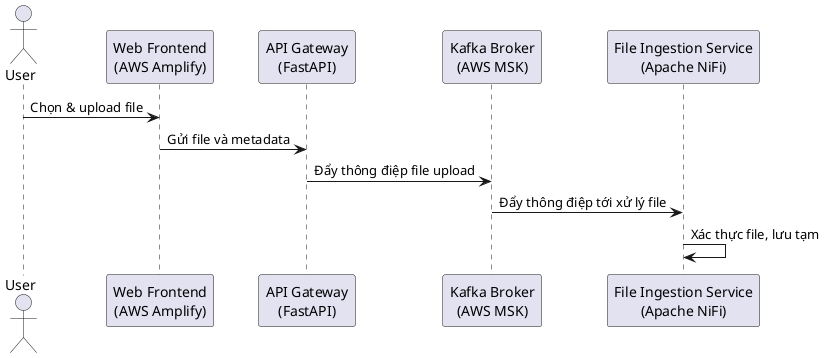

---

### **Sequence Diagram 2: Phân loại và Định tuyến File**

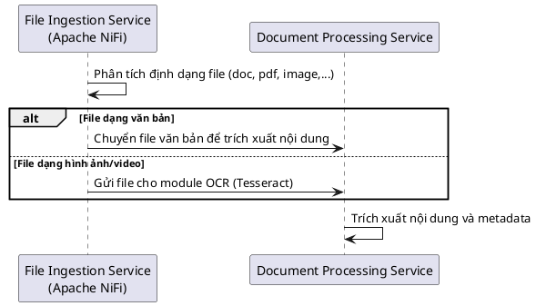

---

### **Sequence Diagram 3: Xử lý OCR cho File Hình Ảnh/Video**

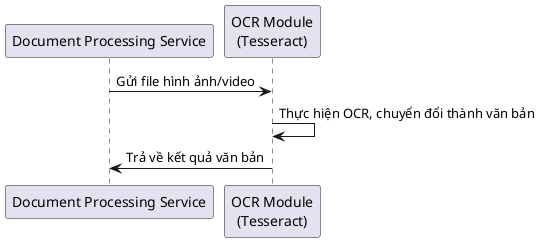

---

### **Sequence Diagram 4: Trích Xuất Nội Dung Từ File Văn Bản**

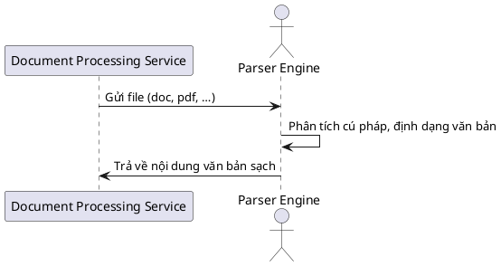

---

### **Sequence Diagram 5: Gửi Nội Dung Đến AI Core**

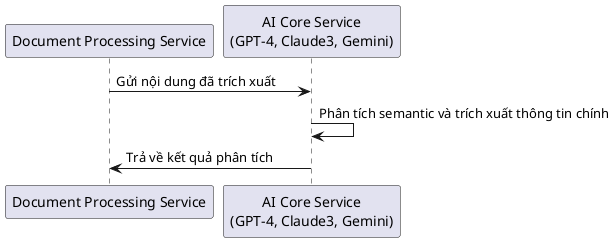

---

### **Sequence Diagram 6: Sinh Embedding Và Lưu Vào Vector DB**

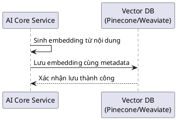

---

### **Sequence Diagram 7: Xử Lý Query Hỏi Đáp (Q&A)**

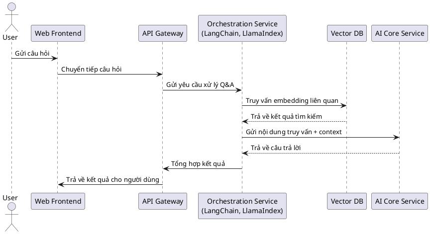

---

### **Sequence Diagram 8: Orchestration Xử Lý Nhiều Nguồn Dữ Liệu**

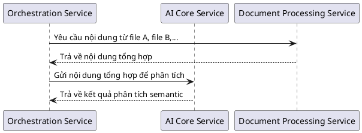

---

### **Sequence Diagram 9: Tạo Báo Cáo Tiến Độ (Gantt Chart)**

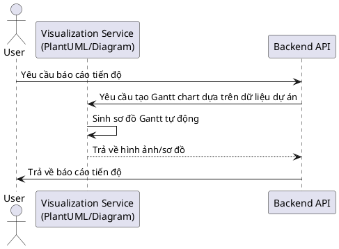

---

### **Sequence Diagram 10: Sinh Sequence Diagram Tự Động**

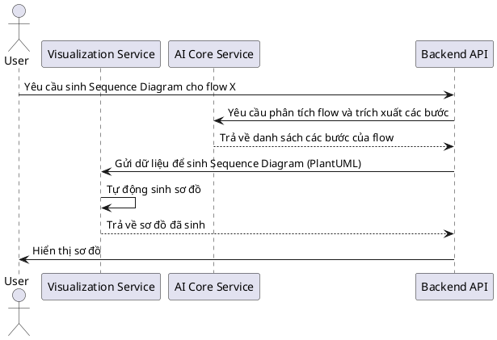

---

### **Sequence Diagram 11: Xác Thực Người Dùng Và Phân Quyền**

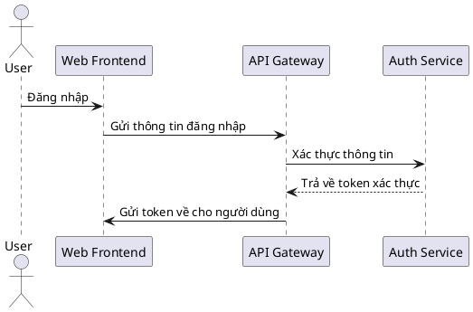

---

### **Sequence Diagram 12: Xử Lý Tác Vụ Bất Đồng Bộ Với Celery**

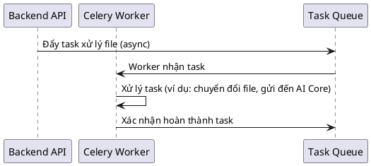

---

### **Sequence Diagram 13: Giao Tiếp Giữa Các Microservices Qua Kafka**

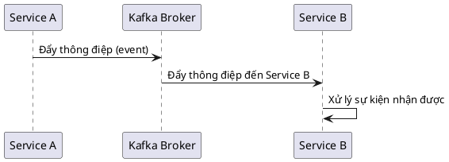

---

### **Sequence Diagram 14: Cập Nhật Dữ Liệu Trong Vector DB Sau Mỗi Phân Tích**

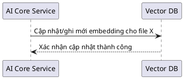

---

### **Sequence Diagram 15: Truy Vấn Lịch Sử Phân Tích Và Embedding**

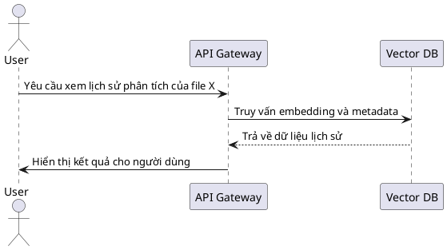

---

### **Sequence Diagram 16: Quá Trình Tích Hợp Với Jira (Theo Dõi Bug/Issue)**

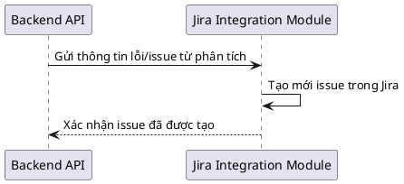

---

### **Sequence Diagram 17: Tạo Tài Liệu Chuẩn Agile/Scrum Tự Động**

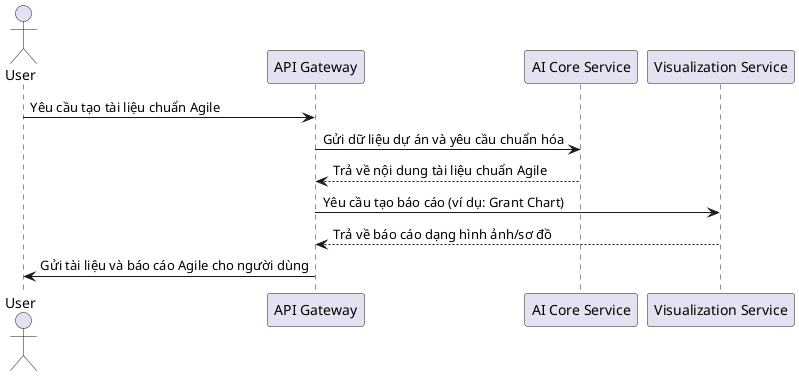

---

### **Sequence Diagram 18: Quản Lý Task Và Workflow (Orchestration Service)**

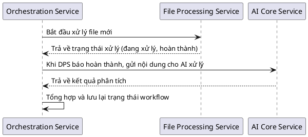

---

### **Sequence Diagram 19: Quá Trình Xử Lý Lỗi Và Retry Mechanism**

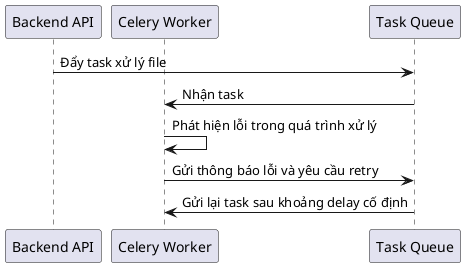

---

### **Sequence Diagram 20: Tổng Hợp Và Trả Về Kết Quả Cuối Cùng Cho Người Dùng**

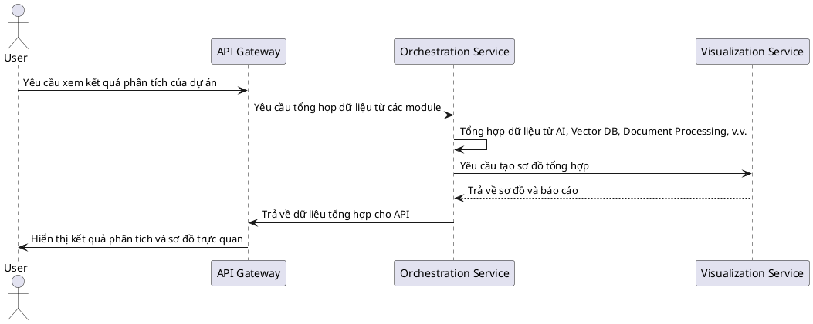

---

## 7. Kết luận

Kế hoạch triển khai này bao gồm:

- **Kiến trúc hệ thống Microservice** dựa trên các thành phần phân tách rõ ràng (File Ingestion, Document Processing, AI Core, Orchestration, Visualization, Backend, Message Broker, và External Integrations).  
- **Công nghệ hiện đại**: Sử dụng OpenAI, Claude, Gemini cho AI Core, Apache NiFi & Tesseract cho xử lý file, Pinecone/Weaviate cho vector DB, Kafka cho pub/sub, FastAPI & Celery cho backend, và LangChain/LlamaIndex cho orchestration.  
- **Quy trình xử lý** từ file upload cho đến phân tích, sinh embedding, tạo báo cáo và tích hợp với hệ thống bên ngoài.  
- **20 Sequence Diagrams mẫu** minh họa các flow quan trọng của hệ thống, hỗ trợ việc thiết kế chi tiết và kiểm thử.

Bạn có thể sử dụng sơ đồ kiến trúc (mô tả ở phần 3.2) và các sequence diagram mẫu (theo cú pháp PlantUML/StartUML) làm tài liệu hướng dẫn chi tiết cho việc phát triển và tích hợp các module. Các sơ đồ draw.io nên được xây dựng bằng cách sử dụng AWS icons có sẵn, bố trí theo luồng xử lý đã mô tả.

Hy vọng kế hoạch này đáp ứng được yêu cầu dự án của bạn và là cơ sở để phát triển hệ thống một cách toàn diện và hiệu quả.