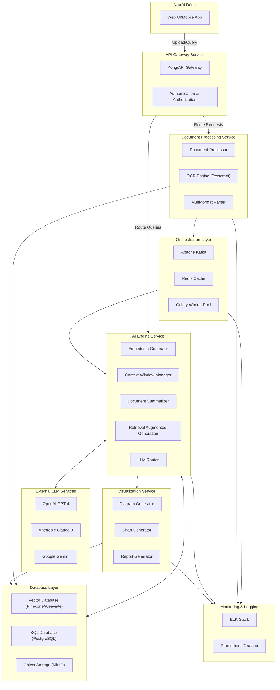
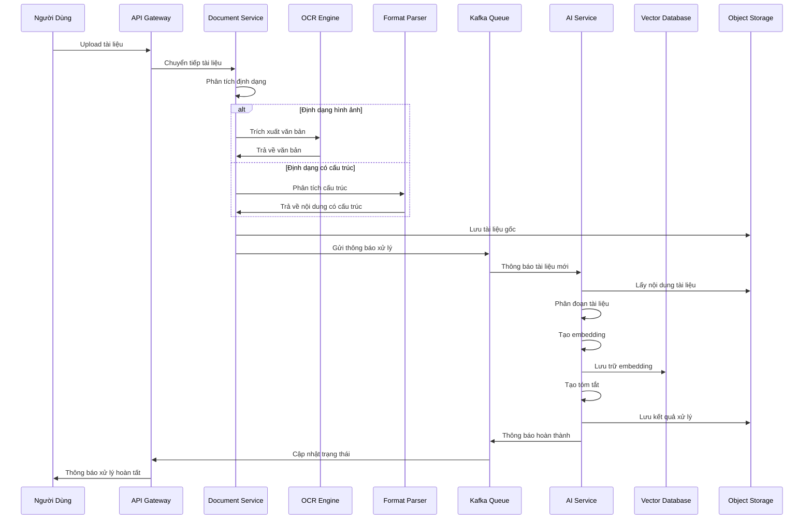
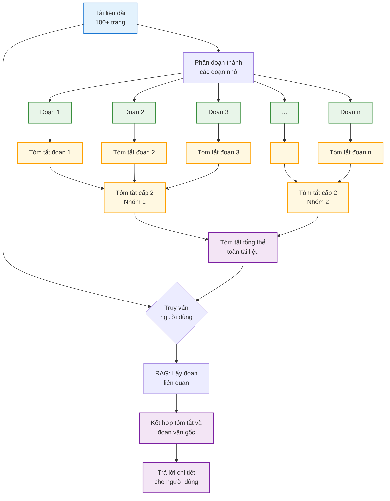
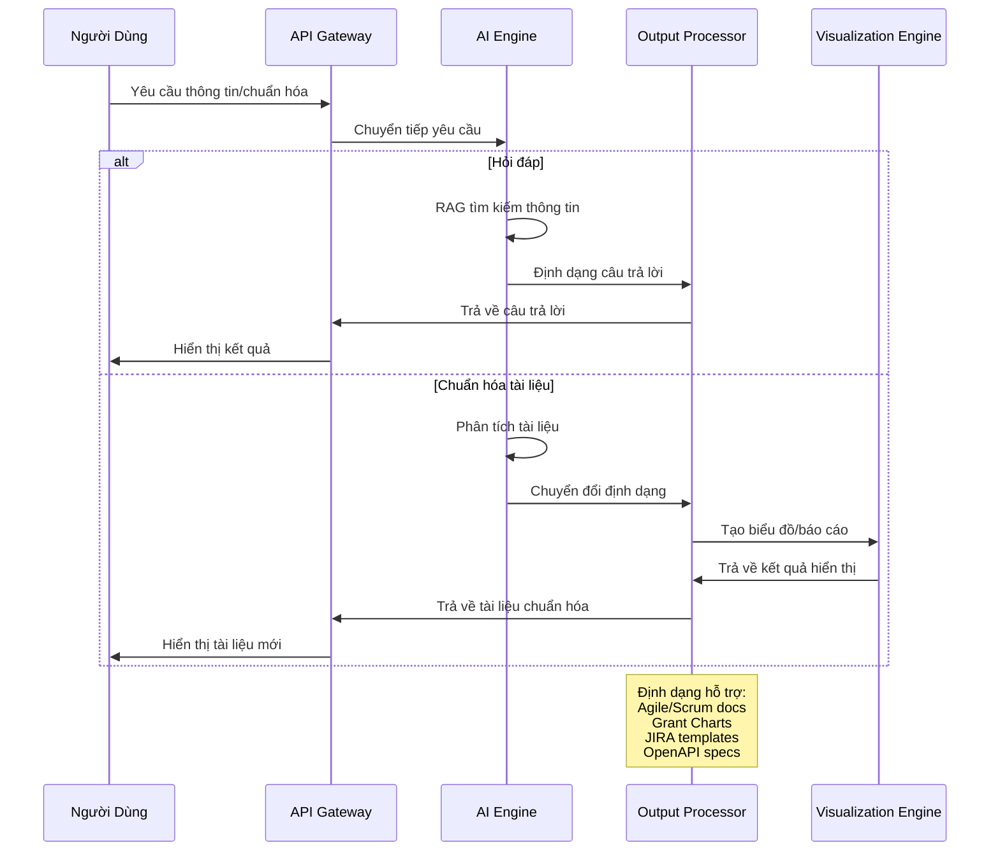
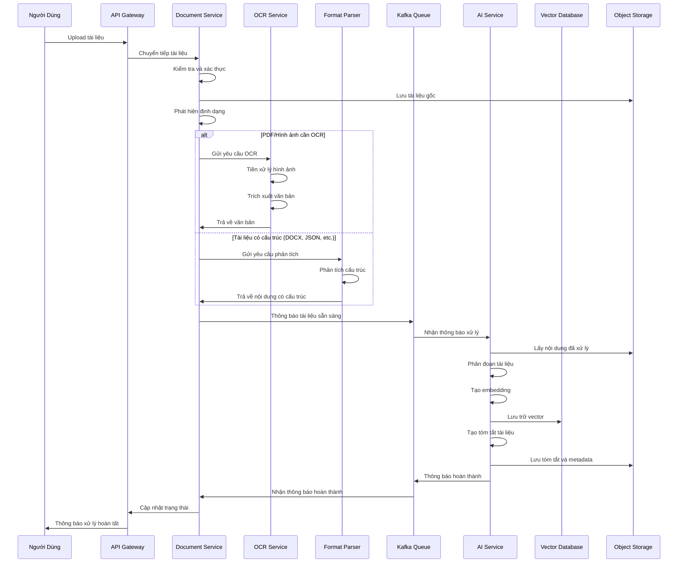
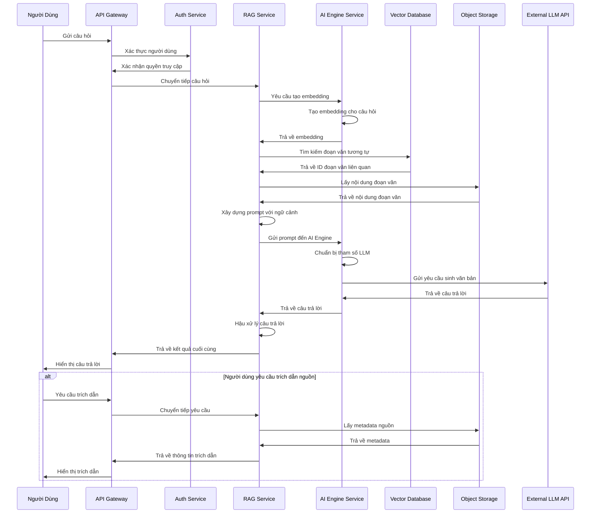
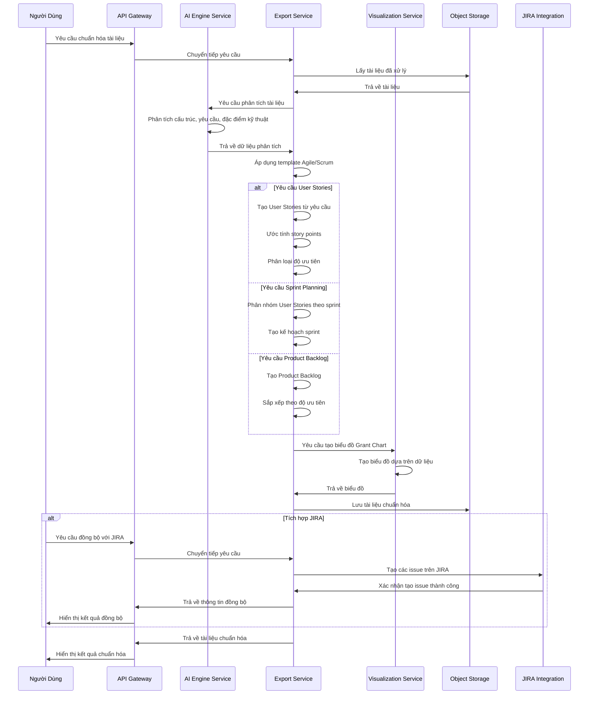
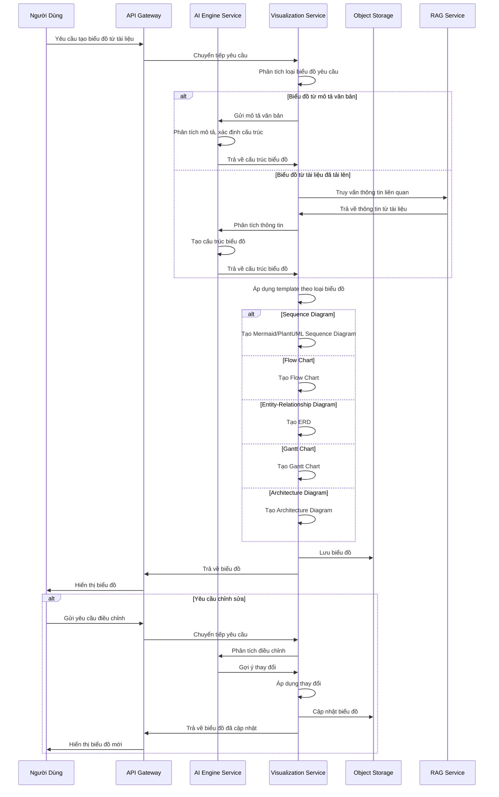
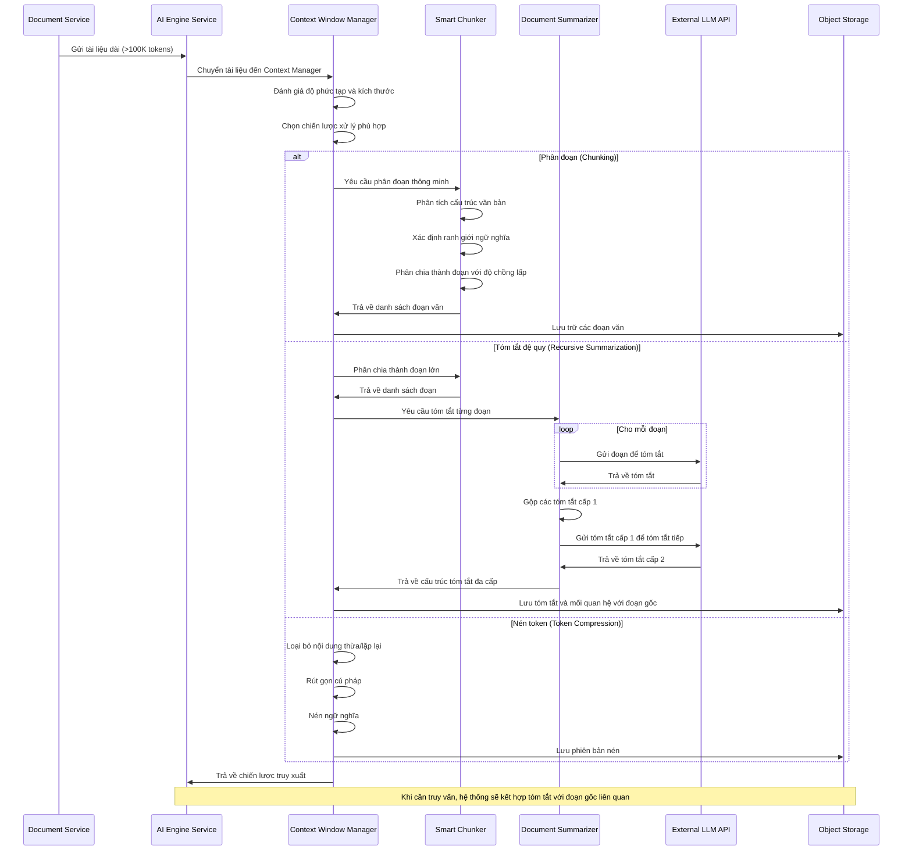
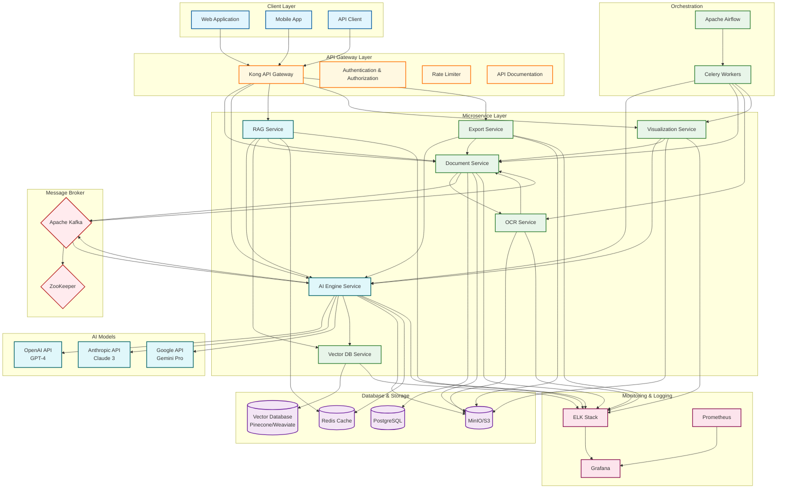

https://claude.ai/chat/b871954e-12de-4c77-a563-f54ed63130a5

####  
Tôi muốn bạn Hãy phần tích, xây dựng một plan hoàn chỉnh (Hãy bổ sung và làm rõ thêm các ý nếu còn thiếu cho ý tưởng bên dưới ) về 1 hệ thống AI như mô tả sau:
 Xây dựng Hệ thống tương tự như hệ thống https://notebooklm.google.com/
## idea: 
 input :
   + cho phép người dùng đính kèm lên các định dạng file : doc , docx , pdf , jpg , png , mp4, ... : 
   trong đó toàn bộ tài liệu đính kèm đều mô tả các tài liệu BRD , BA , thiết kế kiến trúc hệ thống 
   , sơ đồ luồng , biểu đồ tuần tự , kiến trúc hệ thống database, sơ đồ thiết kế API ,...
   + Đối với các file pdf ,... Tài liệu quá dài hãy áp dụng Context window (cửa sổ ngữ cảnh) là lượng văn bản tối đa mà mô hình LLM có thể xử lý trong một lần gọi. Để mở rộng context window vượt quá giới hạn mặc định của nhà cung cấp gốc, cho phép xử lý đầu vào dài hơn.
   Mỗi mô hình LLM có giới hạn context window nhất định (ví dụ: GPT-4 có 8K hoặc 32K tokens)
* vậy hãy áp dung "context expansion" có thể vượt qua giới hạn này. Hãy sử dụng kỹ thuật như phân đoạn, tóm tắt thông minh hoặc nén token để xử lý văn bản dài hơn.

 Output:
   + Tổng hợp, hỏi đáp các kiến thức liên quan đến các nguồn file input đã được đính kèm. 
   + Chuẩn hóa gợi ý lại các tài liệu theo chuẩn mới như Agile/scrum , Báo cáo tiến độ dự án dưới dạng Grant Chart, theo dõi chất lượng bug/Issue qua jira, ... để triển khai tiếp cho các phare khác của dự án.

## Kết quả mong muốn :
  - Hệ thống phải sử dụng các AI tiên tiến như OpenAI , Claude , Gemini để tổng hợp , phân tích , embeding , dùng vector database để lưu trữ hiểu các nghĩa của tài liệu.
  - Bổ sung làm rõ các Công Nghệ Chính được sử dụng trong dự án ví dụ như:
    Có sử dung thêm kafka để làm pub/sub
    | Layer           | Công Nghệ                  | Mục Đích                           |
    |-----------------|---------------------------|-----------------------------------|
    | Processing      | Apache NiFi, Tesseract    | Xử lý file đa định dạng           |
    | AI Core         | OpenAI GPT-4, Claude 3    | Phân tích semantic                 |
    | Vector DB       | Pinecone, Weaviate        | Lưu trữ embedding                 |
    | Orchestration   | LangChain, LlamaIndex     | Kết nối các thành phần AI         |
    | Visualization   | Diagram (Python), PlantUML| Tự động sinh diagram              |
    | Backend         | FastAPI, Celery           | Xây dựng API và xử lý bất đồng bộ |

Hãy làm rõ hơn về "context expansion" , kỹ thuật như phân đoạn, tóm tắt thông minh hoặc nén token để xử lý văn bản dài hơn  với vai trò với một kỹ sư AI có kinh nghiêm hơn 10 năm làm về AI và trải qua rất nhiều dự án lớn ứng dựng AI trong ngân hàng . theo cách dễ hiểu , có ví dụ minh họa , ảnh , mô hình,.. để minh chứng , giải thích clear hơn.

Hãy dùng lib pip diagram python đưa cho tôi 1 bản vẽ Thiết kế Kiến trúc hệ thống final thông thể dự án theo kiến trúc Microservice Architecture.
Dùng StartUML hãy vẽ top 15 biểu đồ Tuần tư từng luồng / flow quan trong nhất.

Dùng mermaid vẽ sequence Diagram flow
Hãy viết code dự án này từ đầu tới cuối cho tôi bằng ngôn ngữ python theo kiến trúc microservice , elk để monitor với khaí năng bài toán nâng cao nâng cao .

# Hệ Thống AI Phân Tích Tài Liệu Dự Án (DocumentAI)

Tôi sẽ phân tích và xây dựng một kế hoạch hoàn chỉnh dựa trên ý tưởng của bạn về một hệ thống AI tương tự như Google NotebookLM để phân tích và xử lý tài liệu dự án.

## I. Tổng Quan Hệ Thống

DocumentAI là một hệ thống trí tuệ nhân tạo tiên tiến được thiết kế để xử lý, phân tích và tương tác với các tài liệu dự án như BRD, BA, tài liệu thiết kế kiến trúc hệ thống, sơ đồ luồng, biểu đồ tuần tự, và tài liệu thiết kế API. Hệ thống sử dụng các công nghệ AI tiên tiến kết hợp với kỹ thuật xử lý ngôn ngữ tự nhiên để cung cấp khả năng tổng hợp, hỏi đáp và chuẩn hóa tài liệu theo các phương pháp luận hiện đại.

## II. Kiến Trúc Tổng Thể

### 1. Các Thành Phần Chính



### 2. Bảng Công Nghệ Chi Tiết

| Layer | Công Nghệ | Mục Đích |
|-------|----------|---------|
| **Front-end** | React.js, TypeScript, TailwindCSS | Giao diện người dùng trực quan, phản hồi nhanh |
| **API Gateway** | Kong, OAuth2.0/JWT | Quản lý API, xác thực và phân quyền |
| **Document Processing** | Apache Tika, Tesseract OCR, PyPDF2, OpenCV | Xử lý đa dạng định dạng file, trích xuất văn bản, hình ảnh |
| **AI Core** | OpenAI GPT-4, Claude 3 Opus, Gemini Pro | Phân tích ngữ nghĩa, tạo phản hồi chất lượng cao |
| **Vector Database** | Pinecone, Weaviate, Milvus | Lưu trữ và truy vấn embedding hiệu quả |
| **Relational Database** | PostgreSQL, PgVector | Lưu trữ metadata, quản lý người dùng, lịch sử |
| **Storage** | MinIO, Amazon S3 | Lưu trữ tài liệu gốc, kết quả xử lý |
| **Orchestration** | LangChain, LlamaIndex, Apache Airflow | Kết nối các thành phần AI, quản lý luồng dữ liệu |
| **Message Queue** | Apache Kafka, RabbitMQ | Xử lý tin nhắn, pub/sub cho xử lý bất đồng bộ |
| **Caching** | Redis | Cache kết quả, tăng tốc độ phản hồi |
| **Background Processing** | Celery, FastAPI-background | Xử lý tác vụ nặng, tối ưu hóa hiệu suất |
| **Visualization** | Diagram (Python), PlantUML, Mermaid.js | Tự động sinh diagram từ mô tả văn bản |
| **Backend API** | FastAPI, Python 3.10+ | Xây dựng API hiệu suất cao, tài liệu tự động |
| **Monitoring & Logging** | ELK Stack, Prometheus, Grafana | Giám sát hệ thống, phân tích log |
| **DevOps** | Docker, Kubernetes, Terraform | Containerization, orchestration, IaC |

## III. Chi Tiết Các Thành Phần Chính

### 1. Xử Lý Đầu Vào (Input Processing)

Hệ thống cho phép người dùng tải lên nhiều định dạng tài liệu để phân tích:

- **Định dạng hỗ trợ**: PDF, DOCX, DOC, JPG, PNG, MP4, PPTX, Excel, XML, JSON, HTML
- **Loại tài liệu**: BRD, BA, tài liệu thiết kế kiến trúc, sơ đồ luồng, biểu đồ tuần tự, thiết kế database, thiết kế API

**Luồng xử lý tài liệu:**


### 2. Mở Rộng Context Window và Kỹ Thuật Xử Lý Tài Liệu Dài

Để xử lý các tài liệu dài vượt quá giới hạn context window của các mô hình LLM, hệ thống sử dụng các kỹ thuật "context expansion" sau:

#### a) Phân Đoạn Thông Minh (Smart Chunking)

```html
<svg xmlns="http://www.w3.org/2000/svg" viewBox="0 0 800 400">
  <!-- Background -->
  <rect width="800" height="400" fill="#f8f9fa" rx="10" ry="10" />
  
  <!-- Title -->
  <text x="400" y="40" font-family="Arial" font-size="24" text-anchor="middle" font-weight="bold">Kỹ Thuật Phân Đoạn Thông Minh (Smart Chunking)</text>
  
  <!-- Original Document -->
  <rect x="50" y="80" width="200" height="260" fill="#e3f2fd" stroke="#1976d2" stroke-width="2" rx="5" ry="5" />
  <text x="150" y="110" font-family="Arial" font-size="16" text-anchor="middle" font-weight="bold">Tài liệu gốc</text>
  <text x="150" y="135" font-family="Arial" font-size="12" text-anchor="middle">Hàng trăm trang</text>
  <text x="150" y="155" font-family="Arial" font-size="12" text-anchor="middle">Vượt giới hạn</text>
  <text x="150" y="175" font-family="Arial" font-size="12" text-anchor="middle">context window</text>
  
  <!-- Arrow -->
  <path d="M 250 200 L 300 200" stroke="#424242" stroke-width="2" marker-end="url(#arrow)" />
  
  <!-- Arrow Definition -->
  <defs>
    <marker id="arrow" markerWidth="10" markerHeight="10" refX="9" refY="3" orient="auto" markerUnits="strokeWidth">
      <path d="M0,0 L0,6 L9,3 z" fill="#424242" />
    </marker>
  </defs>
  
  <!-- Processing -->
  <rect x="300" y="150" width="200" height="120" fill="#fff8e1" stroke="#ffa000" stroke-width="2" rx="5" ry="5" />
  <text x="400" y="175" font-family="Arial" font-size="16" text-anchor="middle" font-weight="bold">Phân đoạn thông minh</text>
  <line x1="320" y1="190" x2="480" y2="190" stroke="#ffa000" stroke-width="1" />
  <text x="400" y="210" font-family="Arial" font-size="12" text-anchor="middle">1. Phân tích cấu trúc văn bản</text>
  <text x="400" y="230" font-family="Arial" font-size="12" text-anchor="middle">2. Phân đoạn theo ngữ nghĩa</text>
  <text x="400" y="250" font-family="Arial" font-size="12" text-anchor="middle">3. Chồng lấp để giữ ngữ cảnh</text>
  
  <!-- Arrow -->
  <path d="M 500 200 L 550 200" stroke="#424242" stroke-width="2" marker-end="url(#arrow)" />
  
  <!-- Chunks -->
  <rect x="550" y="80" width="60" height="40" fill="#e8f5e9" stroke="#388e3c" stroke-width="2" rx="5" ry="5" />
  <text x="580" y="105" font-family="Arial" font-size="12" text-anchor="middle">Đoạn 1</text>
  
  <rect x="550" y="130" width="60" height="40" fill="#e8f5e9" stroke="#388e3c" stroke-width="2" rx="5" ry="5" />
  <text x="580" y="155" font-family="Arial" font-size="12" text-anchor="middle">Đoạn 2</text>
  
  <rect x="550" y="180" width="60" height="40" fill="#e8f5e9" stroke="#388e3c" stroke-width="2" rx="5" ry="5" />
  <text x="580" y="205" font-family="Arial" font-size="12" text-anchor="middle">Đoạn 3</text>
  
  <text x="580" y="240" font-family="Arial" font-size="20" text-anchor="middle">⋮</text>
  
  <rect x="550" y="260" width="60" height="40" fill="#e8f5e9" stroke="#388e3c" stroke-width="2" rx="5" ry="5" />
  <text x="580" y="285" font-family="Arial" font-size="12" text-anchor="middle">Đoạn n</text>
  
  <!-- Arrow -->
  <path d="M 610 180 L 660 180" stroke="#424242" stroke-width="2" marker-end="url(#arrow)" />
  
  <!-- Processing in LLM -->
  <rect x="660" y="120" width="100" height="120" fill="#f3e5f5" stroke="#7b1fa2" stroke-width="2" rx="5" ry="5" />
  <text x="710" y="145" font-family="Arial" font-size="16" text-anchor="middle" font-weight="bold">LLM</text>
  <text x="710" y="165" font-family="Arial" font-size="12" text-anchor="middle">Xử lý từng</text>
  <text x="710" y="185" font-family="Arial" font-size="12" text-anchor="middle">đoạn trong</text>
  <text x="710" y="205" font-family="Arial" font-size="12" text-anchor="middle">context</text>
  <text x="710" y="225" font-family="Arial" font-size="12" text-anchor="middle">window</text>
  
  <!-- Features Annotation -->
  <text x="100" y="360" font-family="Arial" font-size="14" font-style="italic">• Tối ưu kích thước đoạn</text>
  <text x="300" y="360" font-family="Arial" font-size="14" font-style="italic">• Giữ ngữ cảnh qua chồng lấp</text>
  <text x="550" y="360" font-family="Arial" font-size="14" font-style="italic">• Tận dụng nhận diện cấu trúc</text>
</svg>
```
 
.png)


Phân đoạn thông minh phân tích cấu trúc tài liệu để chia nhỏ văn bản thành các đoạn có ý nghĩa, giữ nguyên ngữ cảnh:

- **Phân đoạn theo cấu trúc**: Sử dụng tiêu đề, đoạn, mục để phân chia tài liệu logic
- **Chồng lấp (Overlapping)**: Các đoạn liên tiếp chia sẻ một số nội dung để duy trì ngữ cảnh
- **Kích thước tối ưu**: Đảm bảo mỗi đoạn vừa với context window (thường 1000-4000 token)

Ví dụ thực tế:
```python
def semantic_chunking(document, max_tokens=3000, overlap=500):
    # Phân tích cấu trúc văn bản (tiêu đề, đoạn, mục)
    sections = extract_document_sections(document)
    
    chunks = []
    for section in sections:
        # Nếu mục quá lớn, chia nhỏ thêm theo ngữ nghĩa
        if get_token_count(section) > max_tokens:
            sub_chunks = chunk_by_semantic_meaning(section, max_tokens, overlap)
            chunks.extend(sub_chunks)
        else:
            chunks.append(section)
            
    return chunks
```

#### b) Tóm Tắt Thông Minh (Recursive Summarization)



Tóm tắt đệ quy là kỹ thuật xử lý tài liệu dài bằng cách tạo ra nhiều cấp độ tóm tắt:

- Bước 1: Chia tài liệu thành các đoạn nhỏ
- Bước 2: Tóm tắt từng đoạn riêng biệt
- Bước 3: Gộp các tóm tắt và tạo tóm tắt cấp cao hơn
- Bước 4: Lặp lại cho đến khi có tóm tắt tổng thể

Ví dụ code:
```python
def recursive_summarize(document, max_tokens=4000):
    # Phân đoạn tài liệu
    chunks = semantic_chunking(document)
    
    # Cấp độ 1: Tóm tắt từng đoạn
    chunk_summaries = []
    for chunk in chunks:
        summary = summarize_with_llm(chunk)
        chunk_summaries.append(summary)
    
    # Cấp độ 2: Tóm tắt các nhóm tóm tắt
    if len(chunk_summaries) > 1:
        grouped_summaries = group_summaries(chunk_summaries, max_tokens)
        level2_summaries = []
        
        for group in grouped_summaries:
            combined_text = "\n\n".join(group)
            group_summary = summarize_with_llm(combined_text)
            level2_summaries.append(group_summary)
        
        # Cấp độ 3: Tóm tắt tổng thể
        if len(level2_summaries) > 1:
            final_text = "\n\n".join(level2_summaries)
            return summarize_with_llm(final_text)
        else:
            return level2_summaries[0]
    else:
        return chunk_summaries[0]
```

#### c) Nén Token (Token Compression)

Nén token là kỹ thuật giảm số lượng token cần thiết để biểu diễn một văn bản, giúp tiết kiệm context window:

- **Loại bỏ thông tin thừa**: Xóa các thành phần không cần thiết như header/footer lặp lại
- **Biến đổi văn bản**: Rút gọn cú pháp, sử dụng viết tắt
- **Nén ngữ nghĩa**: Sử dụng một mô hình nhỏ hơn để nén ngữ nghĩa của văn bản gốc

Code ví dụ:
```python
def compress_tokens(text):
    # Loại bỏ các nội dung lặp lại
    text = remove_redundant_elements(text)
    
    # Rút gọn câu dài thành ngắn gọn hơn
    text = simplify_sentences(text)
    
    # Biến đổi văn bản để giảm số token
    text = transform_text_for_token_efficiency(text)
    
    return text
```

#### d) Retrieval Augmented Generation (RAG)


```html
<svg xmlns="http://www.w3.org/2000/svg" viewBox="0 0 800 500">
  <!-- Background -->
  <rect width="800" height="500" fill="#f8f9fa" rx="10" ry="10" />
  
  <!-- Title -->
  <text x="400" y="40" font-family="Arial" font-size="24" text-anchor="middle" font-weight="bold">Retrieval Augmented Generation (RAG)</text>
  
  <!-- Document Processing Flow -->
  <rect x="50" y="80" width="150" height="70" fill="#e3f2fd" stroke="#1976d2" stroke-width="2" rx="5" ry="5" />
  <text x="125" y="110" font-family="Arial" font-size="16" text-anchor="middle" font-weight="bold">Tài liệu</text>
  <text x="125" y="130" font-family="Arial" font-size="12" text-anchor="middle">BRD, BA, API...</text>
  
  <!-- Arrow -->
  <path d="M 200 115 L 250 115" stroke="#424242" stroke-width="2" marker-end="url(#arrow)" />
  
  <!-- Chunking Process -->
  <rect x="250" y="80" width="150" height="70" fill="#fff8e1" stroke="#ffa000" stroke-width="2" rx="5" ry="5" />
  <text x="325" y="110" font-family="Arial" font-size="16" text-anchor="middle" font-weight="bold">Phân đoạn</text>
  <text x="325" y="130" font-family="Arial" font-size="12" text-anchor="middle">Semantic chunking</text>
  
  <!-- Arrow -->
  <path d="M 400 115 L 450 115" stroke="#424242" stroke-width="2" marker-end="url(#arrow)" />
  
  <!-- Embedding Process -->
  <rect x="450" y="80" width="150" height="70" fill="#e8f5e9" stroke="#388e3c" stroke-width="2" rx="5" ry="5" />
  <text x="525" y="110" font-family="Arial" font-size="16" text-anchor="middle" font-weight="bold">Embedding</text>
  <text x="525" y="130" font-family="Arial" font-size="12" text-anchor="middle">Vector representation</text>
  
  <!-- Arrow -->
  <path d="M 600 115 L 650 115" stroke="#424242" stroke-width="2" marker-end="url(#arrow)" />
  
  <!-- Vector Database -->
  <rect x="650" y="80" width="150" height="70" fill="#f3e5f5" stroke="#7b1fa2" stroke-width="2" rx="5" ry="5" />
  <text x="725" y="110" font-family="Arial" font-size="16" text-anchor="middle" font-weight="bold">Vector DB</text>
  <text x="725" y="130" font-family="Arial" font-size="12" text-anchor="middle">Pinecone/Weaviate</text>
  
  <!-- User Query Flow -->
  <rect x="50" y="220" width="150" height="70" fill="#ffebee" stroke="#d32f2f" stroke-width="2" rx="5" ry="5" />
  <text x="125" y="250" font-family="Arial" font-size="16" text-anchor="middle" font-weight="bold">Câu hỏi</text>
  <text x="125" y="270" font-family="Arial" font-size="12" text-anchor="middle">Từ người dùng</text>
  
  <!-- Arrow -->
  <path d="M 200 255 L 250 255" stroke="#424242" stroke-width="2" marker-end="url(#arrow)" />
  
  <!-- Query Embedding -->
  <rect x="250" y="220" width="150" height="70" fill="#e8f5e9" stroke="#388e3c" stroke-width="2" rx="5" ry="5" />
  <text x="325" y="250" font-family="Arial" font-size="16" text-anchor="middle" font-weight="bold">Embedding</text>
  <text x="325" y="270" font-family="Arial" font-size="12" text-anchor="middle">Vector câu hỏi</text>
  
  <!-- Arrow to Vector DB search -->
  <path d="M 400 255 L 450 255" stroke="#424242" stroke-width="2" marker-end="url(#arrow)" />
  <path d="M 450 255 L 500 185" stroke="#424242" stroke-width="2" marker-end="url(#arrow)" />
  
  <!-- Vector Search -->
  <rect x="500" y="150" width="150" height="70" fill="#f3e5f5" stroke="#7b1fa2" stroke-width="2" rx="5" ry="5" />
  <text x="575" y="180" font-family="Arial" font-size="16" text-anchor="middle" font-weight="bold">Tìm kiếm</text>
  <text x="575" y="200" font-family="Arial" font-size="12" text-anchor="middle">Similarity search</text>
  
  <!-- Arrow from Vector Search to Context Assembly -->
  <path d="M 575 220 L 575 265" stroke="#424242" stroke-width="2" marker-end="url(#arrow)" />
  
  <!-- Context Assembly -->
  <rect x="500" y="265" width="150" height="70" fill="#fff8e1" stroke="#ffa000" stroke-width="2" rx="5" ry="5" />
  <text x="575" y="295" font-family="Arial" font-size="16" text-anchor="middle" font-weight="bold">Tạo ngữ cảnh</text>
  <text x="575" y="315" font-family="Arial" font-size="12" text-anchor="middle">Kết hợp đoạn liên quan</text>
  
  <!-- Arrow from Context to LLM -->
  <path d="M 500 300 L 450 300" stroke="#424242" stroke-width="2" marker-end="url(#arrow)" />
  
  <!-- LLM Processing -->
  <rect x="250" y="330" width="200" height="90" fill="#e0f7fa" stroke="#0097a7" stroke-width="2" rx="5" ry="5" />
  <text x="350" y="360" font-family="Arial" font-size="16" text-anchor="middle" font-weight="bold">LLM</text>
  <text x="350" y="380" font-family="Arial" font-size="12" text-anchor="middle">GPT-4, Claude 3, Gemini</text>
  <text x="350" y="400" font-family="Arial" font-size="12" text-anchor="middle">Xử lý với ngữ cảnh phù hợp</text>
  
  <!-- Arrow from Question to LLM -->
  <path d="M 125 290 L 125 375 L 250 375" stroke="#424242" stroke-width="2" marker-end="url(#arrow)" />
  
  <!-- Arrow from LLM to Answer -->
  <path d="M 450 375 L 650 375" stroke="#424242" stroke-width="2" marker-end="url(#arrow)" />
  
  <!-- Answer -->
  <rect x="650" y="330" width="150" height="90" fill="#f5f5f5" stroke="#616161" stroke-width="2" rx="5" ry="5" />
  <text x="725" y="360" font-family="Arial" font-size="16" text-anchor="middle" font-weight="bold">Trả lời</text>
  <text x="725" y="380" font-family="Arial" font-size="12" text-anchor="middle">Kết hợp ngữ cảnh</text>
  <text x="725" y="400" font-family="Arial" font-size="12" text-anchor="middle">và kiến thức mô hình</text>
  
  <!-- Arrow Definition -->
  <defs>
    <marker id="arrow" markerWidth="10" markerHeight="10" refX="9" refY="3" orient="auto" markerUnits="strokeWidth">
      <path d="M0,0 L0,6 L9,3 z" fill="#424242" />
    </marker>
  </defs>
  
  <!-- Annotations -->
  <text x="300" y="460" font-family="Arial" font-size="14" text-anchor="middle" font-style="italic">• Xử lý tài liệu dài không bị giới hạn context window</text>
  <text x="600" y="460" font-family="Arial" font-size="14" text-anchor="middle" font-style="italic">• Câu trả lời dựa trên dữ liệu thực tế từ tài liệu</text>
  <text x="400" y="480" font-family="Arial" font-size="14" text-anchor="middle" font-style="italic">• Tăng độ chính xác và giảm "hallucination"</text>
</svg>
```

RAG là phương pháp kết hợp tìm kiếm thông tin với mô hình sinh ngôn ngữ để xử lý tài liệu dài, bằng cách:

1. Phân đoạn và tạo embedding cho toàn bộ tài liệu
2. Lưu trữ trong cơ sở dữ liệu vector
3. Khi có câu hỏi, tìm các đoạn liên quan nhất
4. Kết hợp đoạn văn vào prompt cho LLM để trả lời chính xác

Ưu điểm của RAG:
- Không bị giới hạn bởi context window
- Có thể xử lý hàng nghìn trang tài liệu
- Trả lời dựa trên dữ liệu chính xác từ tài liệu
- Giảm thiểu "hallucination" (bịa đặt thông tin)

Code minh họa:
```python
def process_query_with_rag(query, vector_db, llm_service):
    # Tạo embedding cho câu hỏi
    query_embedding = embedding_service.embed(query)
    
    # Tìm kiếm các đoạn văn liên quan
    relevant_chunks = vector_db.similarity_search(
        query_embedding, 
        top_k=5
    )
    
    # Tạo prompt với ngữ cảnh
    context = "\n\n".join([chunk.text for chunk in relevant_chunks])
    prompt = f"""Dựa trên thông tin sau đây, hãy trả lời câu hỏi.
    
    Thông tin:
    {context}
    
    Câu hỏi: {query}
    
    Chỉ sử dụng thông tin được cung cấp để trả lời. Nếu không đủ thông tin, hãy nói rõ."""
    
    # Gọi LLM với prompt
    response = llm_service.generate(prompt)
    
    return response
```

### 3. Xử Lý Đầu Ra (Output Processing)

Hệ thống cung cấp hai loại đầu ra chính:

#### a) Tổng hợp và Hỏi đáp

Hệ thống cho phép người dùng tương tác với tài liệu qua nhiều cách:

- **Tóm tắt tự động**: Tạo tóm tắt cho toàn bộ tài liệu hoặc các phần cụ thể
- **Hỏi đáp dựa trên tài liệu**: Người dùng đặt câu hỏi và hệ thống trả lời dựa trên nội dung tài liệu
- **Trích xuất thông tin**: Tìm kiếm và trích xuất thông tin cụ thể như yêu cầu, đặc điểm kỹ thuật
- **So sánh tài liệu**: Phân tích sự khác biệt giữa các phiên bản tài liệu

#### b) Chuẩn hóa tài liệu

Hệ thống có khả năng chuẩn hóa các tài liệu theo các phương pháp luận hiện đại:

- **Chuyển đổi sang Agile/Scrum**: Biến đổi tài liệu truyền thống thành user story, sprint planning, backlog
- **Báo cáo tiến độ Grant Chart**: Tạo biểu đồ tiến độ dự án từ thông tin trong tài liệu
- **Theo dõi bug/issue qua JIRA**: Tạo template cho việc theo dõi và báo cáo lỗi
- **Tài liệu API chuẩn OpenAPI**: Chuyển đổi tài liệu API thành định dạng OpenAPI/Swagger




## IV. Kiến Trúc Microservice Chi Tiết

Hệ thống được thiết kế theo kiến trúc microservice để đảm bảo khả năng mở rộng và bảo trì:
```HTML
<svg xmlns="http://www.w3.org/2000/svg" viewBox="0 0 950 700">
  <!-- Background -->
  <rect width="950" height="700" fill="#f8f9fa" rx="10" ry="10" />
  
  <!-- Title -->
  <text x="475" y="40" font-family="Arial" font-size="24" text-anchor="middle" font-weight="bold">Kiến Trúc Microservice Chi Tiết - DocumentAI</text>
  
  <!-- Client Layer -->
  <rect x="150" y="70" width="650" height="80" fill="#e3f2fd" stroke="#1976d2" stroke-width="2" rx="5" ry="5" />
  <text x="475" y="100" font-family="Arial" font-size="18" text-anchor="middle" font-weight="bold">Client Layer</text>
  
  <rect x="200" y="115" width="120" height="25" fill="#bbdefb" stroke="#1976d2" stroke-width="1" rx="3" ry="3" />
  <text x="260" y="132" font-family="Arial" font-size="12" text-anchor="middle">Web Application</text>
  
  <rect x="340" y="115" width="120" height="25" fill="#bbdefb" stroke="#1976d2" stroke-width="1" rx="3" ry="3" />
  <text x="400" y="132" font-family="Arial" font-size="12" text-anchor="middle">Mobile App</text>
  
  <rect x="480" y="115" width="120" height="25" fill="#bbdefb" stroke="#1976d2" stroke-width="1" rx="3" ry="3" />
  <text x="540" y="132" font-family="Arial" font-size="12" text-anchor="middle">API Clients</text>
  
  <rect x="620" y="115" width="120" height="25" fill="#bbdefb" stroke="#1976d2" stroke-width="1" rx="3" ry="3" />
  <text x="680" y="132" font-family="Arial" font-size="12" text-anchor="middle">CLI Tool</text>
  
  <!-- API Gateway Layer -->
  <rect x="150" y="170" width="650" height="80" fill="#fff8e1" stroke="#ffa000" stroke-width="2" rx="5" ry="5" />
  <text x="475" y="200" font-family="Arial" font-size="18" text-anchor="middle" font-weight="bold">API Gateway Layer</text>
  
  <rect x="230" y="215" width="120" height="25" fill="#ffecb3" stroke="#ffa000" stroke-width="1" rx="3" ry="3" />
  <text x="290" y="232" font-family="Arial" font-size="12" text-anchor="middle">Kong API Gateway</text>
  
  <rect x="370" y="215" width="120" height="25" fill="#ffecb3" stroke="#ffa000" stroke-width="1" rx="3" ry="3" />
  <text x="430" y="232" font-family="Arial" font-size="12" text-anchor="middle">Auth Service</text>
  
  <rect x="510" y="215" width="120" height="25" fill="#ffecb3" stroke="#ffa000" stroke-width="1" rx="3" ry="3" />
  <text x="570" y="232" font-family="Arial" font-size="12" text-anchor="middle">Rate Limiter</text>
  
  <rect x="650" y="215" width="120" height="25" fill="#ffecb3" stroke="#ffa000" stroke-width="1" rx="3" ry="3" />
  <text x="710" y="232" font-family="Arial" font-size="12" text-anchor="middle">API Documentation</text>
  
  <!-- Service Layer -->
  <rect x="50" y="270" width="850" height="300" fill="#f5f5f5" stroke="#757575" stroke-width="2" rx="5" ry="5" />
  <text x="475" y="295" font-family="Arial" font-size="18" text-anchor="middle" font-weight="bold">Microservice Layer</text>
  
  <!-- Document Service -->
  <rect x="80" y="320" width="180" height="100" fill="#e8f5e9" stroke="#388e3c" stroke-width="2" rx="5" ry="5" />
  <text x="170" y="340" font-family="Arial" font-size="14" text-anchor="middle" font-weight="bold">Document Service</text>
  <rect x="95" y="350" width="150" height="20" fill="#c8e6c9" stroke="#388e3c" stroke-width="1" rx="2" ry="2" />
  <text x="170" y="365" font-family="Arial" font-size="10" text-anchor="middle">Upload Handler</text>
  <rect x="95" y="375" width="150" height="20" fill="#c8e6c9" stroke="#388e3c" stroke-width="1" rx="2" ry="2" />
  <text x="170" y="390" font-family="Arial" font-size="10" text-anchor="middle">Format Detector</text>
  <rect x="95" y="400" width="150" height="20" fill="#c8e6c9" stroke="#388e3c" stroke-width="1" rx="2" ry="2" />
  <text x="170" y="415" font-family="Arial" font-size="10" text-anchor="middle">Document Parser</text>
  
  <!-- OCR Service -->
  <rect x="280" y="320" width="180" height="100" fill="#e8f5e9" stroke="#388e3c" stroke-width="2" rx="5" ry="5" />
  <text x="370" y="340" font-family="Arial" font-size="14" text-anchor="middle" font-weight="bold">OCR Service</text>
  <rect x="295" y="350" width="150" height="20" fill="#c8e6c9" stroke="#388e3c" stroke-width="1" rx="2" ry="2" />
  <text x="370" y="365" font-family="Arial" font-size="10" text-anchor="middle">Tesseract Engine</text>
  <rect x="295" y="375" width="150" height="20" fill="#c8e6c9" stroke="#388e3c" stroke-width="1" rx="2" ry="2" />
  <text x="370" y="390" font-family="Arial" font-size="10" text-anchor="middle">Image Preprocessor</text>
  <rect x="295" y="400" width="150" height="20" fill="#c8e6c9" stroke="#388e3c" stroke-width="1" rx="2" ry="2" />
  <text x="370" y="415" font-family="Arial" font-size="10" text-anchor="middle">Text Extraction API</text>
  
  <!-- AI Service -->
  <rect x="480" y="320" width="180" height="100" fill="#e0f7fa" stroke="#0097a7" stroke-width="2" rx="5" ry="5" />
  <text x="570" y="340" font-family="Arial" font-size="14" text-anchor="middle" font-weight="bold">AI Engine Service</text>
  <rect x="495" y="350" width="150" height="20" fill="#b2ebf2" stroke="#0097a7" stroke-width="1" rx="2" ry="2" />
  <text x="570" y="365" font-family="Arial" font-size="10" text-anchor="middle">LLM Connector</text>
  <rect x="495" y="375" width="150" height="20" fill="#b2ebf2" stroke="#0097a7" stroke-width="1" rx="2" ry="2" />
  <text x="570" y="390" font-family="Arial" font-size="10" text-anchor="middle">Embedding Generator</text>
  <rect x="495" y="400" width="150" height="20" fill="#b2ebf2" stroke="#0097a7" stroke-width="1" rx="2" ry="2" />
  <text x="570" y="415" font-family="Arial" font-size="10" text-anchor="middle">Context Manager</text>
  
  <!-- RAG Service -->
  <rect x="680" y="320" width="180" height="100" fill="#e0f7fa" stroke="#0097a7" stroke-width="2" rx="5" ry="5" />
  <text x="770" y="340" font-family="Arial" font-size="14" text-anchor="middle" font-weight="bold">RAG Service</text>
  <rect x="695" y="350" width="150" height="20" fill="#b2ebf2" stroke="#0097a7" stroke-width="1" rx="2" ry="2" />
  <text x="770" y="365" font-family="Arial" font-size="10" text-anchor="middle">Vector Search</text>
  <rect x="695" y="375" width="150" height="20" fill="#b2ebf2" stroke="#0097a7" stroke-width="1" rx="2" ry="2" />
  <text x="770" y="390" font-family="Arial" font-size="10" text-anchor="middle">Query Processor</text>
  <rect x="695" y="400" width="150" height="20" fill="#b2ebf2" stroke="#0097a7" stroke-width="1" rx="2" ry="2" />
  <text x="770" y="415" font-family="Arial" font-size="10" text-anchor="middle">LangChain Pipeline</text>
  
  <!-- Visualization Service -->
  <rect x="80" y="440" width="180" height="100" fill="#f3e5f5" stroke="#7b1fa2" stroke-width="2" rx="5" ry="5" />
  <text x="170" y="460" font-family="Arial" font-size="14" text-anchor="middle" font-weight="bold">Visualization Service</text>
  <rect x="95" y="470" width="150" height="20" fill="#e1bee7" stroke="#7b1fa2" stroke-width="1" rx="2" ry="2" />
  <text x="170" y="485" font-family="Arial" font-size="10" text-anchor="middle">Diagram Generator</text>
  <rect x="95" y="495" width="150" height="20" fill="#e1bee7" stroke="#7b1fa2" stroke-width="1" rx="2" ry="2" />
  <text x="170" y="510" font-family="Arial" font-size="10" text-anchor="middle">Chart Renderer</text>
  <rect x="95" y="520" width="150" height="20" fill="#e1bee7" stroke="#7b1fa2" stroke-width="1" rx="2" ry="2" />
  <text x="170" y="535" font-family="Arial" font-size="10" text-anchor="middle">PlantUML Converter</text>
  
  <!-- Orchestration Service -->
  <rect x="280" y="440" width="180" height="100" fill="#fff3e0" stroke="#e65100" stroke-width="2" rx="5" ry="5" />
  <text x="370" y="460" font-family="Arial" font-size="14" text-anchor="middle" font-weight="bold">Orchestration Service</text>
  <rect x="295" y="470" width="150" height="20" fill="#ffe0b2" stroke="#e65100" stroke-width="1" rx="2" ry="2" />
  <text x="370" y="485" font-family="Arial" font-size="10" text-anchor="middle">Kafka Manager</text>
  <rect x="295" y="495" width="150" height="20" fill="#ffe0b2" stroke="#e65100" stroke-width="1" rx="2" ry="2" />
  <text x="370" y="510" font-family="Arial" font-size="10" text-anchor="middle">Celery Task Queue</text>
  <rect x="295" y="520" width="150" height="20" fill="#ffe0b2" stroke="#e65100" stroke-width="1" rx="2" ry="2" />
  <text x="370" y="535" font-family="Arial" font-size="10" text-anchor="middle">Service Coordinator</text>
  
  <!-- Export Service -->
  <rect x="480" y="440" width="180" height="100" fill="#ffebee" stroke="#c62828" stroke-width="2" rx="5" ry="5" />
  <text x="570" y="460" font-family="Arial" font-size="14" text-anchor="middle" font-weight="bold">Export Service</text>
  <rect x="495" y="470" width="150" height="20" fill="#ffcdd2" stroke="#c62828" stroke-width="1" rx="2" ry="2" />
  <text x="570" y="485" font-family="Arial" font-size="10" text-anchor="middle">Agile/Scrum Converter</text>
  <rect x="495" y="495" width="150" height="20" fill="#ffcdd2" stroke="#c62828" stroke-width="1" rx="2" ry="2" />
  <text x="570" y="510" font-family="Arial" font-size="10" text-anchor="middle">JIRA Integration</text>
  <rect x="495" y="520" width="150" height="20" fill="#ffcdd2" stroke="#c62828" stroke-width="1" rx="2" ry="2" />
  <text x="570" y="535" font-family="Arial" font-size="10" text-anchor="middle">OpenAPI Generator</text>
  
  <!-- Monitor Service -->
  <rect x="680" y="440" width="180" height="100" fill="#e8eaf6" stroke="#3949ab" stroke-width="2" rx="5" ry="5" />
  <text x="770" y="460" font-family="Arial" font-size="14" text-anchor="middle" font-weight="bold">Monitoring Service</text>
  <rect x="695" y="470" width="150" height="20" fill="#c5cae9" stroke="#3949ab" stroke-width="1" rx="2" ry="2" />
  <text x="770" y="485" font-family="Arial" font-size="10" text-anchor="middle">ELK Stack</text>
  <rect x="695" y="495" width="150" height="20" fill="#c5cae9" stroke="#3949ab" stroke-width="1" rx="2" ry="2" />
  <text x="770" y="510" font-family="Arial" font-size="10" text-anchor="middle">Prometheus/Grafana</text>
  <rect x="695" y="520" width="150" height="20" fill="#c5cae9" stroke="#3949ab" stroke-width="1" rx="2" ry="2" />
  <text x="770" y="535" font-family="Arial" font-size="10" text-anchor="middle">Alert Manager</text>
  
  <!-- Data Layer -->
  <rect x="150" y="590" width="650" height="80" fill="#fce4ec" stroke="#d81b60" stroke-width="2" rx="5" ry="5" />
  <text x="475" y="615" font-family="Arial" font-size="18" text-anchor="middle" font-weight="bold">Database Layer</text>
  
  <rect x="180" y="630" width="110" height="25" fill="#f8bbd0" stroke="#d81b60" stroke-width="1" rx="3" ry="3" />
  <text x="235" y="647" font-family="Arial" font-size="12" text-anchor="middle">PostgreSQL</text>
  
  <rect x="310" y="630" width="110" height="25" fill="#f8bbd0" stroke="#d81b60" stroke-width="1" rx="3" ry="3" />
  <text x="365" y="647" font-family="Arial" font-size="12" text-anchor="middle">Pinecone/Weaviate</text>
  
  <rect x="440" y="630" width="110" height="25" fill="#f8bbd0" stroke="#d81b60" stroke-width="1" rx="3" ry="3" />
  <text x="495" y="647" font-family="Arial" font-size="12" text-anchor="middle">Redis Cache</text>
  
  <rect x="570" y="630" width="110" height="25" fill="#f8bbd0" stroke="#d81b60" stroke-width="1" rx="3" ry="3" />
  <text x="625" y="647" font-family="Arial" font-size="12" text-anchor="middle">MinIO/S3</text>
  
  <!-- Connections -->
  <path d="M 475 150 L 475 170" stroke="#424242" stroke-width="1.5" stroke-dasharray="5,3" />
  <path d="M 475 250 L 475 270" stroke="#424242" stroke-width="1.5" stroke-dasharray="5,3" />
  <path d="M 475 570 L 475 590" stroke="#424242" stroke-width="1.5" stroke-dasharray="5,3" />

  <!-- Arrow Definition -->
  <defs>
    <marker id="arrow" markerWidth="10" markerHeight="10" refX="9" refY="3" orient="auto" markerUnits="strokeWidth">
      <path d="M0,0 L0,6 L9,3 z" fill="#424242" />
    </marker>
  </defs>
</svg>
```


### 1. Chi tiết các Microservice

#### Document Service
- Quản lý quá trình tải lên và xử lý ban đầu cho tài liệu
- Phát hiện định dạng và định tuyến đến dịch vụ xử lý thích hợp
- Chịu trách nhiệm theo dõi trạng thái của tài liệu trong toàn bộ hệ thống

#### OCR Service
- Trích xuất văn bản từ hình ảnh và PDF quét
- Xử lý sơ bộ hình ảnh để tăng độ chính xác OCR
- Nhận diện bảng, biểu đồ và các thành phần cấu trúc

#### AI Engine Service
- Kết nối với các API LLM bên ngoài (OpenAI, Claude, Gemini)
- Quản lý context window và phân bổ token
- Tạo embedding cho tài liệu và câu truy vấn

#### RAG Service
- Thực hiện tìm kiếm vector trong cơ sở dữ liệu vector
- Xử lý các truy vấn từ người dùng và tạo câu trả lời
- Sử dụng LangChain/LlamaIndex để quản lý luồng RAG

#### Visualization Service
- Tạo biểu đồ và sơ đồ từ tài liệu và mô tả văn bản
- Tạo các báo cáo trực quan và Grant Chart
- Chuyển đổi giữa các định dạng sơ đồ (PlantUML, Mermaid)

#### Orchestration Service
- Quản lý giao tiếp giữa các microservice qua Kafka
- Xử lý các tác vụ bất đồng bộ bằng Celery
- Điều phối các quy trình xử lý tài liệu phức tạp

#### Export Service
- Chuyển đổi tài liệu sang định dạng Agile/Scrum
- Tạo các template JIRA và báo cáo tiến độ
- Chuyển đổi mô tả API thành định dạng OpenAPI

#### Monitoring Service
- Giám sát hiệu suất hệ thống qua ELK Stack
- Theo dõi và báo cáo lỗi và sự cố
- Cung cấp bảng điều khiển Grafana để theo dõi hệ thống

## V. Biểu Đồ Tuần Tự Các Luồng Quan Trọng

### 1. Luồng Xử Lý Tài Liệu Tải Lên



### 2. Luồng Truy Vấn Hỏi-Đáp



### 3. Luồng Chuẩn Hóa Tài Liệu (Agile/JIRA)



### 4. Luồng Tạo Biểu Đồ Tự Động


Tôi xin tiếp tục trình bày về hệ thống DocumentAI:

### 5. Luồng Xử Lý Context Expansion


## VI. Code Triển Khai

Dưới đây là mã nguồn Python cho các thành phần chính của hệ thống DocumentAI theo kiến trúc microservice:

### 1. API Gateway Service
```python
# api_gateway_service/main.py
from fastapi import FastAPI, Depends, HTTPException, UploadFile, File, Form, Request
from fastapi.middleware.cors import CORSMiddleware
from fastapi.security import OAuth2PasswordBearer, OAuth2PasswordRequestForm
from jose import JWTError, jwt
from datetime import datetime, timedelta
from typing import List, Optional, Dict, Any
import httpx
import os
import logging
from pydantic import BaseModel

# Cấu hình logging
logging.basicConfig(
    level=logging.INFO,
    format='%(asctime)s - %(name)s - %(levelname)s - %(message)s'
)
logger = logging.getLogger("api_gateway")

# Khởi tạo ứng dụng FastAPI
app = FastAPI(
    title="DocumentAI API Gateway",
    description="API Gateway cho hệ thống DocumentAI",
    version="1.0.0"
)

# Cấu hình CORS
app.add_middleware(
    CORSMiddleware,
    allow_origins=["*"],  # Trong môi trường production, cần chỉ định rõ các domain
    allow_credentials=True,
    allow_methods=["*"],
    allow_headers=["*"],
)

# Cấu hình OAuth2
oauth2_scheme = OAuth2PasswordBearer(tokenUrl="token")
SECRET_KEY = os.getenv("SECRET_KEY", "development_secret_key")
ALGORITHM = "HS256"
ACCESS_TOKEN_EXPIRE_MINUTES = 30

# URL các service
DOCUMENT_SERVICE_URL = os.getenv("DOCUMENT_SERVICE_URL", "http://document-service:8001")
AI_SERVICE_URL = os.getenv("AI_SERVICE_URL", "http://ai-service:8002")
RAG_SERVICE_URL = os.getenv("RAG_SERVICE_URL", "http://rag-service:8003")
VISUALIZATION_SERVICE_URL = os.getenv("VISUALIZATION_SERVICE_URL", "http://visualization-service:8004")
EXPORT_SERVICE_URL = os.getenv("EXPORT_SERVICE_URL", "http://export-service:8005")

# Mô hình dữ liệu
class Token(BaseModel):
    access_token: str
    token_type: str

class TokenData(BaseModel):
    username: Optional[str] = None

class User(BaseModel):
    username: str
    email: Optional[str] = None
    full_name: Optional[str] = None
    disabled: Optional[bool] = None

class UserInDB(User):
    hashed_password: str

class DocumentResponse(BaseModel):
    id: str
    filename: str
    status: str
    created_at: datetime
    document_type: Optional[str] = None
    summary: Optional[str] = None

class QueryRequest(BaseModel):
    query: str
    document_ids: Optional[List[str]] = None
    max_results: Optional[int] = 5

class QueryResponse(BaseModel):
    answer: str
    sources: Optional[List[Dict[str, Any]]] = None

# Hàm tiện ích
def create_access_token(data: dict, expires_delta: Optional[timedelta] = None):
    to_encode = data.copy()
    if expires_delta:
        expire = datetime.utcnow() + expires_delta
    else:
        expire = datetime.utcnow() + timedelta(minutes=15)
    to_encode.update({"exp": expire})
    encoded_jwt = jwt.encode(to_encode, SECRET_KEY, algorithm=ALGORITHM)
    return encoded_jwt

async def get_current_user(token: str = Depends(oauth2_scheme)):
    credentials_exception = HTTPException(
        status_code=401,
        detail="Could not validate credentials",
        headers={"WWW-Authenticate": "Bearer"},
    )
    try:
        payload = jwt.decode(token, SECRET_KEY, algorithms=[ALGORITHM])
        username: str = payload.get("sub")
        if username is None:
            raise credentials_exception
        token_data = TokenData(username=username)
    except JWTError:
        raise credentials_exception
    
    # Trong triển khai thực tế, cần truy vấn DB để lấy thông tin user
    user = {"username": token_data.username, "disabled": False}
    if user is None:
        raise credentials_exception
    return user

async def get_current_active_user(current_user: User = Depends(get_current_user)):
    if current_user.get("disabled"):
        raise HTTPException(status_code=400, detail="Inactive user")
    return current_user

# API Endpoints
@app.post("/token", response_model=Token)
async def login_for_access_token(form_data: OAuth2PasswordRequestForm = Depends()):
    # Trong triển khai thực tế, cần kiểm tra username/password từ DB
    if form_data.username != "admin" or form_data.password != "password":
        raise HTTPException(
            status_code=401,
            detail="Incorrect username or password",
            headers={"WWW-Authenticate": "Bearer"},
        )
    
    access_token_expires = timedelta(minutes=ACCESS_TOKEN_EXPIRE_MINUTES)
    access_token = create_access_token(
        data={"sub": form_data.username}, expires_delta=access_token_expires
    )
    return {"access_token": access_token, "token_type": "bearer"}

@app.post("/documents/upload", response_model=DocumentResponse)
async def upload_document(
    file: UploadFile = File(...),
    document_type: Optional[str] = Form(None),
    current_user: User = Depends(get_current_active_user)
):
    try:
        # Gửi tài liệu đến Document Service
        form_data = {"document_type": document_type}
        files = {"file": (file.filename, await file.read(), file.content_type)}
        
        async with httpx.AsyncClient() as client:
            response = await client.post(
                f"{DOCUMENT_SERVICE_URL}/documents/upload",
                data=form_data,
                files=files,
                headers={"X-User-ID": current_user["username"]}
            )
            
        if response.status_code != 200:
            logger.error(f"Error uploading document: {response.text}")
            raise HTTPException(status_code=response.status_code, detail=response.text)
        
        return response.json()
    except Exception as e:
        logger.exception("Error uploading document")
        raise HTTPException(status_code=500, detail=f"Internal server error: {str(e)}")

@app.get("/documents/{document_id}", response_model=DocumentResponse)
async def get_document(document_id: str, current_user: User = Depends(get_current_active_user)):
    async with httpx.AsyncClient() as client:
        response = await client.get(
            f"{DOCUMENT_SERVICE_URL}/documents/{document_id}",
            headers={"X-User-ID": current_user["username"]}
        )
        
    if response.status_code != 200:
        raise HTTPException(status_code=response.status_code, detail=response.text)
    
    return response.json()

@app.get("/documents", response_model=List[DocumentResponse])
async def list_documents(current_user: User = Depends(get_current_active_user)):
    async with httpx.AsyncClient() as client:
        response = await client.get(
            f"{DOCUMENT_SERVICE_URL}/documents",
            headers={"X-User-ID": current_user["username"]}
        )
        
    if response.status_code != 200:
        raise HTTPException(status_code=response.status_code, detail=response.text)
    
    return response.json()

@app.post("/query", response_model=QueryResponse)
async def query_documents(
    query_request: QueryRequest,
    current_user: User = Depends(get_current_active_user)
):
    async with httpx.AsyncClient() as client:
        response = await client.post(
            f"{RAG_SERVICE_URL}/query",
            json=query_request.dict(),
            headers={"X-User-ID": current_user["username"]}
        )
        
    if response.status_code != 200:
        raise HTTPException(status_code=response.status_code, detail=response.text)
    
    return response.json()

@app.post("/visualize/{document_id}")
async def generate_visualization(
    document_id: str,
    visualization_type: str,
    params: Dict[str, Any],
    current_user: User = Depends(get_current_active_user)
):
    request_data = {
        "document_id": document_id,
        "visualization_type": visualization_type,
        "params": params
    }
    
    async with httpx.AsyncClient() as client:
        response = await client.post(
            f"{VISUALIZATION_SERVICE_URL}/visualize",
            json=request_data,
            headers={"X-User-ID": current_user["username"]}
        )
        
    if response.status_code != 200:
        raise HTTPException(status_code=response.status_code, detail=response.text)
    
    return response.json()

@app.post("/export/{document_id}")
async def export_document(
    document_id: str,
    export_type: str,
    params: Dict[str, Any],
    current_user: User = Depends(get_current_active_user)
):
    request_data = {
        "document_id": document_id,
        "export_type": export_type,
        "params": params
    }
    
    async with httpx.AsyncClient() as client:
        response = await client.post(
            f"{EXPORT_SERVICE_URL}/export",
            json=request_data,
            headers={"X-User-ID": current_user["username"]}
        )
        
    if response.status_code != 200:
        raise HTTPException(status_code=response.status_code, detail=response.text)
    
    return response.json()

@app.get("/health")
async def health_check():
    return {"status": "healthy", "version": "1.0.0"}

# Khởi chạy ứng dụng khi chạy file này trực tiếp
if __name__ == "__main__":
    import uvicorn
    uvicorn.run(app, host="0.0.0.0", port=8000)
```

### 2. Document Processing Service
```python
# document_service/main.py
from fastapi import FastAPI, HTTPException, UploadFile, File, Form, Header, BackgroundTasks
from fastapi.middleware.cors import CORSMiddleware
from typing import List, Optional, Dict, Any
import aiofiles
import os
import uuid
import logging
import mimetypes
import json
from datetime import datetime
import httpx
from pydantic import BaseModel
import magic
import asyncio
from kafka import KafkaProducer
from kafka.errors import KafkaError
import boto3
from botocore.exceptions import ClientError

# Cấu hình logging
logging.basicConfig(
    level=logging.INFO,
    format='%(asctime)s - %(name)s - %(levelname)s - %(message)s'
)
logger = logging.getLogger("document_service")

# Khởi tạo ứng dụng FastAPI
app = FastAPI(
    title="DocumentAI Document Service",
    description="Service quản lý và xử lý tài liệu đầu vào",
    version="1.0.0"
)

# Cấu hình CORS
app.add_middleware(
    CORSMiddleware,
    allow_origins=["*"],
    allow_credentials=True,
    allow_methods=["*"],
    allow_headers=["*"],
)

# Cấu hình các biến môi trường
UPLOAD_DIR = os.getenv("UPLOAD_DIR", "/app/uploads")
OCR_SERVICE_URL = os.getenv("OCR_SERVICE_URL", "http://ocr-service:8010")
KAFKA_BOOTSTRAP_SERVERS = os.getenv("KAFKA_BOOTSTRAP_SERVERS", "kafka:9092")
DOCUMENT_TOPIC = os.getenv("DOCUMENT_TOPIC", "document_processing")
DB_HOST = os.getenv("DB_HOST", "postgres")
DB_PORT = os.getenv("DB_PORT", "5432")
DB_NAME = os.getenv("DB_NAME", "documentai")
DB_USER = os.getenv("DB_USER", "postgres")
DB_PASSWORD = os.getenv("DB_PASSWORD", "postgres")

# Cấu hình S3/MinIO
S3_ENDPOINT = os.getenv("S3_ENDPOINT", "http://minio:9000")
S3_ACCESS_KEY = os.getenv("S3_ACCESS_KEY", "minioadmin")
S3_SECRET_KEY = os.getenv("S3_SECRET_KEY", "minioadmin")
S3_BUCKET = os.getenv("S3_BUCKET", "documents")

# Tạo thư mục uploads nếu chưa tồn tại
os.makedirs(UPLOAD_DIR, exist_ok=True)

# Kết nối Kafka Producer
try:
    producer = KafkaProducer(
        bootstrap_servers=KAFKA_BOOTSTRAP_SERVERS,
        value_serializer=lambda x: json.dumps(x).encode('utf-8')
    )
except Exception as e:
    logger.error(f"Không thể kết nối Kafka: {e}")
    producer = None

# Kết nối S3/MinIO
try:
    s3_client = boto3.client(
        's3',
        endpoint_url=S3_ENDPOINT,
        aws_access_key_id=S3_ACCESS_KEY,
        aws_secret_access_key=S3_SECRET_KEY
    )
    
    # Kiểm tra bucket tồn tại chưa, nếu chưa thì tạo mới
    try:
        s3_client.head_bucket(Bucket=S3_BUCKET)
    except ClientError:
        s3_client.create_bucket(Bucket=S3_BUCKET)
        
except Exception as e:
    logger.error(f"Không thể kết nối S3/MinIO: {e}")
    s3_client = None

# Định nghĩa models
class DocumentBase(BaseModel):
    filename: str
    document_type: Optional[str] = None

class DocumentCreate(DocumentBase):
    pass

class Document(DocumentBase):
    id: str
    status: str
    created_at: datetime
    file_path: str
    mime_type: str
    user_id: str
    summary: Optional[str] = None
    metadata: Optional[Dict[str, Any]] = None

# Các hàm xử lý
def detect_mime_type(file_path):
    """Phát hiện MIME type của file"""
    mime = magic.Magic(mime=True)
    return mime.from_file(file_path)

async def save_uploaded_file(upload_file: UploadFile) -> str:
    """Lưu file tải lên vào thư mục tạm"""
    file_id = str(uuid.uuid4())
    file_extension = os.path.splitext(upload_file.filename)[1]
    file_path = os.path.join(UPLOAD_DIR, f"{file_id}{file_extension}")
    
    async with aiofiles.open(file_path, 'wb') as out_file:
        content = await upload_file.read()
        await out_file.write(content)
    
    return file_path

async def upload_to_s3(file_path: str, document_id: str) -> str:
    """Tải file lên S3/MinIO"""
    if not s3_client:
        logger.warning("S3/MinIO client không khả dụng, lưu file cục bộ")
        return file_path
    
    try:
        file_name = os.path.basename(file_path)
        object_name = f"{document_id}/{file_name}"
        
        with open(file_path, 'rb') as file_data:
            s3_client.upload_fileobj(file_data, S3_BUCKET, object_name)
        
        # Xóa file cục bộ sau khi tải lên S3
        os.remove(file_path)
        
        return f"s3://{S3_BUCKET}/{object_name}"
    except Exception as e:
        logger.error(f"Lỗi khi tải lên S3/MinIO: {e}")
        return file_path

async def process_document(document: Document):
    """Xử lý tài liệu và gửi thông báo đến Kafka"""
    if not producer:
        logger.error("Kafka producer không khả dụng")
        return
    
    try:
        # Gửi thông báo đến Kafka để xử lý tài liệu
        message = {
            "document_id": document.id,
            "file_path": document.file_path,
            "mime_type": document.mime_type,
            "document_type": document.document_type,
            "user_id": document.user_id,
            "timestamp": datetime.now().isoformat()
        }
        
        producer.send(DOCUMENT_TOPIC, value=message)
        producer.flush()
        
        logger.info(f"Đã gửi tài liệu {document.id} đến Kafka để xử lý")
    except Exception as e:
        logger.error(f"Lỗi khi gửi thông báo đến Kafka: {e}")

async def handle_ocr_document(document: Document):
    """Gửi tài liệu đến OCR Service nếu cần OCR"""
    try:
        # Kiểm tra xem tài liệu có cần OCR không
        if document.mime_type in ['application/pdf', 'image/jpeg', 'image/png', 'image/tiff']:
            async with httpx.AsyncClient() as client:
                response = await client.post(
                    f"{OCR_SERVICE_URL}/process",
                    json={
                        "document_id": document.id,
                        "file_path": document.file_path
                    }
                )
                
                if response.status_code != 200:
                    logger.error(f"Lỗi khi gửi tài liệu đến OCR Service: {response.text}")
                else:
                    logger.info(f"Đã gửi tài liệu {document.id} đến OCR Service")
    except Exception as e:
        logger.error(f"Lỗi khi gửi tài liệu đến OCR Service: {e}")

# Khởi tạo database
documents_db = {}  # Giả lập database, sẽ thay bằng kết nối PostgreSQL trong triển khai thực tế

# API endpoints
@app.post("/documents/upload", response_model=Document)
async def upload_document(
    background_tasks: BackgroundTasks,
    file: UploadFile = File(...),
    document_type: Optional[str] = Form(None),
    x_user_id: Optional[str] = Header(None)
):
    if not x_user_id:
        raise HTTPException(status_code=401, detail="User ID không được cung cấp")
    
    try:
        # Lưu file tạm
        file_path = await save_uploaded_file(file)
        
        # Phát hiện MIME type
        mime_type = detect_mime_type(file_path)
        
        # Tạo document record
        document_id = str(uuid.uuid4())
        document = Document(
            id=document_id,
            filename=file.filename,
            document_type=document_type,
            status="uploaded",
            created_at=datetime.now(),
            file_path=file_path,
            mime_type=mime_type,
            user_id=x_user_id
        )
        
        # Lưu vào database
        documents_db[document_id] = document
        
        # Tải lên S3/MinIO
        s3_path = await upload_to_s3(file_path, document_id)
        document.file_path = s3_path
        
        # Gửi để xử lý trong background
        background_tasks.add_task(process_document, document)
        
        # Gửi đến OCR service nếu cần
        if mime_type in ['application/pdf', 'image/jpeg', 'image/png', 'image/tiff']:
            background_tasks.add_task(handle_ocr_document, document)
        
        return document
    except Exception as e:
        logger.exception("Lỗi khi xử lý tài liệu tải lên")
        raise HTTPException(status_code=500, detail=f"Lỗi server: {str(e)}")

@app.get("/documents/{document_id}", response_model=Document)
async def get_document(document_id: str, x_user_id: Optional[str] = Header(None)):
    if not x_user_id:
        raise HTTPException(status_code=401, detail="User ID không được cung cấp")
    
    if document_id not in documents_db:
        raise HTTPException(status_code=404, detail="Tài liệu không tồn tại")
    
    document = documents_db[document_id]
    
    # Kiểm tra quyền truy cập
    if document.user_id != x_user_id:
        raise HTTPException(status_code=403, detail="Không có quyền truy cập tài liệu này")
    
    return document

@app.get("/documents", response_model=List[Document])
async def list_documents(x_user_id: Optional[str] = Header(None)):
    if not x_user_id:
        raise HTTPException(status_code=401, detail="User ID không được cung cấp")
    
    # Lọc tài liệu theo user_id
    user_documents = [doc for doc in documents_db.values() if doc.user_id == x_user_id]
    return user_documents

@app.put("/documents/{document_id}/status", response_model=Document)
async def update_document_status(
    document_id: str,
    status: str,
    summary: Optional[str] = None,
    metadata: Optional[Dict[str, Any]] = None,
    x_user_id: Optional[str] = Header(None)
):
    if not x_user_id:
        raise HTTPException(status_code=401, detail="User ID không được cung cấp")
    
    if document_id not in documents_db:
        raise HTTPException(status_code=404, detail="Tài liệu không tồn tại")
    
    document = documents_db[document_id]
    
    # Cập nhật trạng thái
    document.status = status
    
    if summary:
        document.summary = summary
    
    if metadata:
        document.metadata = metadata
    
    # Lưu lại vào database
    documents_db[document_id] = document
    
    return document

@app.delete("/documents/{document_id}")
async def delete_document(document_id: str, x_user_id: Optional[str] = Header(None)):
    if not x_user_id:
        raise HTTPException(status_code=401, detail="User ID không được cung cấp")
    
    if document_id not in documents_db:
        raise HTTPException(status_code=404, detail="Tài liệu không tồn tại")
    
    document = documents_db[document_id]
    
    # Kiểm tra quyền truy cập
    if document.user_id != x_user_id:
        raise HTTPException(status_code=403, detail="Không có quyền xóa tài liệu này")
    
    # Xóa file trên S3/MinIO nếu có
    if document.file_path.startswith("s3://"):
        try:
            parts = document.file_path.replace("s3://", "").split("/", 1)
            bucket = parts[0]
            key = parts[1]
            
            s3_client.delete_object(Bucket=bucket, Key=key)
        except Exception as e:
            logger.error(f"Lỗi khi xóa file trên S3/MinIO: {e}")
    
    # Xóa file cục bộ nếu có
    elif os.path.exists(document.file_path):
        os.remove(document.file_path)
    
    # Xóa khỏi database
    del documents_db[document_id]
    
    return {"message": "Đã xóa tài liệu thành công"}

@app.get("/health")
async def health_check():
    health_status = {
        "status": "healthy",
        "version": "1.0.0",
        "connections": {
            "kafka": producer is not None,
            "s3": s3_client is not None
        }
    }
    return health_status

# Khởi chạy ứng dụng khi chạy file này trực tiếp
if __name__ == "__main__":
    import uvicorn
    uvicorn.run(app, host="0.0.0.0", port=8001)
```

### 3. AI Engine Service
```python
# ai_engine_service/main.py
from fastapi import FastAPI, HTTPException, Depends, Header, BackgroundTasks
from fastapi.middleware.cors import CORSMiddleware
from typing import List, Dict, Any, Optional
from pydantic import BaseModel
import os
import json
import logging
import asyncio
import httpx
from datetime import datetime
from functools import lru_cache
import numpy as np
from kafka import KafkaConsumer, KafkaProducer
import threading
import boto3
from botocore.exceptions import ClientError
import tiktoken
import aiofiles

# Cấu hình logging
logging.basicConfig(
    level=logging.INFO,
    format='%(asctime)s - %(name)s - %(levelname)s - %(message)s'
)
logger = logging.getLogger("ai_engine")

# Khởi tạo ứng dụng FastAPI
app = FastAPI(
    title="DocumentAI AI Engine",
    description="AI Engine cho hệ thống DocumentAI, quản lý xử lý LLM và embedding",
    version="1.0.0"
)

# Cấu hình CORS
app.add_middleware(
    CORSMiddleware,
    allow_origins=["*"],
    allow_credentials=True,
    allow_methods=["*"],
    allow_headers=["*"],
)

# Cấu hình các biến môi trường
OPENAI_API_KEY = os.getenv("OPENAI_API_KEY", "sk-dummy-key")
ANTHROPIC_API_KEY = os.getenv("ANTHROPIC_API_KEY", "sk-ant-dummy-key")
GEMINI_API_KEY = os.getenv("GEMINI_API_KEY", "google-dummy-key")

DOCUMENT_SERVICE_URL = os.getenv("DOCUMENT_SERVICE_URL", "http://document-service:8001")
VECTORDB_URL = os.getenv("VECTORDB_URL", "http://vectordb-service:8020")

KAFKA_BOOTSTRAP_SERVERS = os.getenv("KAFKA_BOOTSTRAP_SERVERS", "kafka:9092")
DOCUMENT_TOPIC = os.getenv("DOCUMENT_TOPIC", "document_processing")
AI_RESULT_TOPIC = os.getenv("AI_RESULT_TOPIC", "ai_results")

# Cấu hình S3/MinIO
S3_ENDPOINT = os.getenv("S3_ENDPOINT", "http://minio:9000")
S3_ACCESS_KEY = os.getenv("S3_ACCESS_KEY", "minioadmin")
S3_SECRET_KEY = os.getenv("S3_SECRET_KEY", "minioadmin")
S3_BUCKET = os.getenv("S3_BUCKET", "documents")

# Mô hình cấu hình
DEFAULT_EMBEDDING_MODEL = os.getenv("DEFAULT_EMBEDDING_MODEL", "text-embedding-ada-002")
DEFAULT_LLM_MODEL = os.getenv("DEFAULT_LLM_MODEL", "gpt-4")
MAX_TOKENS_PER_CHUNK = int(os.getenv("MAX_TOKENS_PER_CHUNK", "4000"))
CHUNK_OVERLAP = int(os.getenv("CHUNK_OVERLAP", "200"))

# Cache config
CACHE_DIR = os.getenv("CACHE_DIR", "/app/cache")
os.makedirs(CACHE_DIR, exist_ok=True)

# Kết nối S3/MinIO
try:
    s3_client = boto3.client(
        's3',
        endpoint_url=S3_ENDPOINT,
        aws_access_key_id=S3_ACCESS_KEY,
        aws_secret_access_key=S3_SECRET_KEY
    )
except Exception as e:
    logger.error(f"Không thể kết nối S3/MinIO: {e}")
    s3_client = None

# Kết nối Kafka
try:
    # Consumer
    consumer = KafkaConsumer(
        DOCUMENT_TOPIC,
        bootstrap_servers=KAFKA_BOOTSTRAP_SERVERS,
        value_deserializer=lambda x: json.loads(x.decode('utf-8')),
        group_id="ai_engine",
        auto_offset_reset="earliest"
    )
    
    # Producer
    producer = KafkaProducer(
        bootstrap_servers=KAFKA_BOOTSTRAP_SERVERS,
        value_serializer=lambda x: json.dumps(x).encode('utf-8')
    )
except Exception as e:
    logger.error(f"Không thể kết nối Kafka: {e}")
    consumer = None
    producer = None

# Models Pydantic
class TextEmbeddingRequest(BaseModel):
    text: str
    model: Optional[str] = DEFAULT_EMBEDDING_MODEL

class TextEmbeddingResponse(BaseModel):
    embedding: List[float]
    model: str
    text_length: int

class DocumentChunkRequest(BaseModel):
    document_id: str
    content: str
    chunk_size: Optional[int] = MAX_TOKENS_PER_CHUNK
    chunk_overlap: Optional[int] = CHUNK_OVERLAP

class DocumentChunkResponse(BaseModel):
    document_id: str
    chunks: List[Dict[str, Any]]
    total_chunks: int

class DocumentSummaryRequest(BaseModel):
    document_id: str
    content: Optional[str] = None
    document_chunks: Optional[List[Dict[str, Any]]] = None

class DocumentSummaryResponse(BaseModel):
    document_id: str
    summary: str
    metadata: Dict[str, Any]

class LLMRequest(BaseModel):
    prompt: str
    model: Optional[str] = DEFAULT_LLM_MODEL
    max_tokens: Optional[int] = 1000
    temperature: Optional[float] = 0.7

class LLMResponse(BaseModel):
    text: str
    model: str
    usage: Dict[str, int]

# Tiện ích xử lý token
@lru_cache(maxsize=10)
def get_tokenizer(model):
    """Lấy tokenizer phù hợp với model"""
    if "gpt" in model:
        return tiktoken.encoding_for_model(model)
    else:
        # Fallback to cl100k_base for non-OpenAI models
        return tiktoken.get_encoding("cl100k_base")

def count_tokens(text, model):
    """Đếm số token trong text"""
    tokenizer = get_tokenizer(model)
    return len(tokenizer.encode(text))

def truncate_text(text, max_tokens, model):
    """Cắt text để đảm bảo không vượt quá max_tokens"""
    tokenizer = get_tokenizer(model)
    tokens = tokenizer.encode(text)
    if len(tokens) <= max_tokens:
        return text
    
    return tokenizer.decode(tokens[:max_tokens])

# Chức năng embedding
async def generate_embedding_openai(text, model="text-embedding-ada-002"):
    """Tạo embedding với OpenAI API"""
    async with httpx.AsyncClient() as client:
        response = await client.post(
            "https://api.openai.com/v1/embeddings",
            headers={"Authorization": f"Bearer {OPENAI_API_KEY}"},
            json={"input": text, "model": model}
        )
        
        if response.status_code != 200:
            logger.error(f"Lỗi OpenAI API: {response.text}")
            raise HTTPException(status_code=response.status_code, detail=response.text)
        
        result = response.json()
        embedding = result["data"][0]["embedding"]
        return embedding

# Chức năng chunking
def chunk_text_by_tokens(text, max_tokens_per_chunk=4000, overlap=200, model="gpt-4"):
    """Chia text thành các chunk dựa trên số token, có overlap"""
    tokenizer = get_tokenizer(model)
    tokens = tokenizer.encode(text)
    
    chunks = []
    start_idx = 0
    
    while start_idx < len(tokens):
        # Lấy chunk có kích thước max_tokens_per_chunk
        end_idx = min(start_idx + max_tokens_per_chunk, len(tokens))
        chunk_tokens = tokens[start_idx:end_idx]
        chunk_text = tokenizer.decode(chunk_tokens)
        
        chunks.append({
            "text": chunk_text,
            "start_idx": start_idx,
            "end_idx": end_idx,
            "token_count": len(chunk_tokens)
        })
        
        # Di chuyển start_idx đến vị trí tiếp theo, trừ đi overlap
        if end_idx == len(tokens):
            break
        
        start_idx = end_idx - overlap
    
    return chunks

def chunk_text_by_semantic(text, max_tokens_per_chunk=4000, overlap=200, model="gpt-4"):
    """Chia text thành các chunk dựa trên ranh giới ngữ nghĩa như đoạn, mục, etc."""
    # Đầu tiên, chia theo đoạn
    paragraphs = [p for p in text.split("\n\n") if p.strip()]
    
    # Khởi tạo chunks
    chunks = []
    current_chunk_text = ""
    current_token_count = 0
    
    for i, para in enumerate(paragraphs):
        para_token_count = count_tokens(para, model)
        
        # Nếu đoạn hiện tại quá lớn, chia thành các phần nhỏ hơn
        if para_token_count > max_tokens_per_chunk:
            # Xử lý chunk hiện tại nếu có
            if current_token_count > 0:
                chunks.append({
                    "text": current_chunk_text,
                    "token_count": current_token_count
                })
                current_chunk_text = ""
                current_token_count = 0
            
            # Chia đoạn lớn thành các chunk nhỏ hơn
            para_chunks = chunk_text_by_tokens(para, max_tokens_per_chunk, overlap, model)
            chunks.extend(para_chunks)
        
        # Nếu thêm đoạn hiện tại sẽ vượt quá giới hạn, bắt đầu chunk mới
        elif current_token_count + para_token_count > max_tokens_per_chunk:
            chunks.append({
                "text": current_chunk_text,
                "token_count": current_token_count
            })
            current_chunk_text = para
            current_token_count = para_token_count
        
        # Thêm đoạn vào chunk hiện tại
        else:
            if current_chunk_text:
                current_chunk_text += "\n\n" + para
            else:
                current_chunk_text = para
            current_token_count += para_token_count
    
    # Thêm chunk cuối cùng nếu có
    if current_token_count > 0:
        chunks.append({
            "text": current_chunk_text,
            "token_count": current_token_count
        })
    
    return chunks

# Chức năng LLM
async def generate_text_openai(prompt, model="gpt-4", max_tokens=1000, temperature=0.7):
    """Tạo văn bản với OpenAI API"""
    async with httpx.AsyncClient() as client:
        response = await client.post(
            "https://api.openai.com/v1/chat/completions",
            headers={"Authorization": f"Bearer {OPENAI_API_KEY}"},
            json={
                "model": model,
                "messages": [{"role": "system", "content": "You are a helpful assistant."}, 
                             {"role": "user", "content": prompt}],
                "max_tokens": max_tokens,
                "temperature": temperature
            }
        )
        
        if response.status_code != 200:
            logger.error(f"Lỗi OpenAI API: {response.text}")
            raise HTTPException(status_code=response.status_code, detail=response.text)
        
        result = response.json()
        text = result["choices"][0]["message"]["content"]
        usage = result["usage"]
        
        return {
            "text": text,
            "model": model,
            "usage": usage
        }

async def generate_text_anthropic(prompt, model="claude-3-opus-20240229", max_tokens=1000, temperature=0.7):
    """Tạo văn bản với Anthropic Claude API"""
    async with httpx.AsyncClient() as client:
        response = await client.post(
            "https://api.anthropic.com/v1/messages",
            headers={
                "x-api-key": ANTHROPIC_API_KEY,
                "anthropic-version": "2023-06-01"
            },
            json={
                "model": model,
                "max_tokens": max_tokens,
                "temperature": temperature,
                "system": "You are a helpful assistant.",
                "messages": [{"role": "user", "content": prompt}]
            }
        )
        
        if response.status_code != 200:
            logger.error(f"Lỗi Anthropic API: {response.text}")
            raise HTTPException(status_code=response.status_code, detail=response.text)
        
        result = response.json()
        text = result["content"][0]["text"]
        usage = {
            "prompt_tokens": result.get("usage", {}).get("input_tokens", 0),
            "completion_tokens": result.get("usage", {}).get("output_tokens", 0),
            "total_tokens": result.get("usage", {}).get("input_tokens", 0) + result.get("usage", {}).get("output_tokens", 0)
        }
        
        return {
            "text": text,
            "model": model,
            "usage": usage
        }

async def generate_text_gemini(prompt, model="gemini-pro", max_tokens=1000, temperature=0.7):
    """Tạo văn bản với Google Gemini API"""
    async with httpx.AsyncClient() as client:
        response = await client.post(
            f"https://generativelanguage.googleapis.com/v1/models/{model}:generateContent",
            params={"key": GEMINI_API_KEY},
            json={
                "contents": [{"parts": [{"text": prompt}]}],
                "generationConfig": {
                    "maxOutputTokens": max_tokens,
                    "temperature": temperature
                }
            }
        )
        
        if response.status_code != 200:
            logger.error(f"Lỗi Gemini API: {response.text}")
            raise HTTPException(status_code=response.status_code, detail=response.text)
        
        result = response.json()
        text = result["candidates"][0]["content"]["parts"][0]["text"]
        usage = {
            "prompt_tokens": 0,  # Gemini API không trả về thông tin này
            "completion_tokens": 0,
            "total_tokens": 0
        }
        
        return {
            "text": text,
            "model": model,
            "usage": usage
        }

async def route_llm_request(prompt, model, max_tokens, temperature):
    """Định tuyến yêu cầu LLM đến API phù hợp dựa vào model"""
    if "gpt" in model:
        return await generate_text_openai(prompt, model, max_tokens, temperature)
    elif "claude" in model:
        return await generate_text_anthropic(prompt, model, max_tokens, temperature)
    elif "gemini" in model:
        return await generate_text_gemini(prompt, model, max_tokens, temperature)
    else:
        # Mặc định sử dụng OpenAI
        return await generate_text_openai(prompt, DEFAULT_LLM_MODEL, max_tokens, temperature)

# Chức năng tóm tắt đệ quy
async def recursive_summarize(text, max_tokens=4000, model="gpt-4"):
    """Tóm tắt văn bản dài bằng phương pháp đệ quy"""
    # Nếu văn bản đủ ngắn, tóm tắt trực tiếp
    text_tokens = count_tokens(text, model)
    if text_tokens <= max_tokens:
        summarize_prompt = f"""
        Tóm tắt văn bản sau đây, bao gồm các điểm quan trọng nhất:

        {text}
        
        Tóm tắt:
        """
        
        response = await route_llm_request(summarize_prompt, model, max_tokens // 2, 0.5)
        return response["text"]
    
    # Nếu văn bản quá dài, chia thành các đoạn và tóm tắt từng đoạn
    chunks = chunk_text_by_semantic(text, max_tokens, 200, model)
    chunk_summaries = []
    
    for chunk in chunks:
        chunk_text = chunk["text"]
        chunk_summary = await recursive_summarize(chunk_text, max_tokens, model)
        chunk_summaries.append(chunk_summary)
    
    # Kết hợp các tóm tắt đoạn và tóm tắt lại
    combined_summary = "\n\n".join(chunk_summaries)
    
    # Kiểm tra xem tóm tắt kết hợp có cần tóm tắt lại không
    if count_tokens(combined_summary, model) > max_tokens:
        return await recursive_summarize(combined_summary, max_tokens, model)
    
    return combined_summary

# Hàm xử lý tài liệu từ Kafka
async def process_s3_document(file_path):
    """Tải và đọc nội dung tài liệu từ S3/MinIO"""
    try:
        if not file_path.startswith("s3://"):
            # Nếu không phải đường dẫn S3, giả sử là file cục bộ
            async with aiofiles.open(file_path, 'r') as f:
                content = await f.read()
            return content
        
        # Phân tích đường dẫn S3
        parts = file_path.replace("s3://", "").split("/", 1)
        bucket = parts[0]
        key = parts[1]
        
        # Tạo tên file tạm
        tmp_file = os.path.join(CACHE_DIR, os.path.basename(key))
        
        # Tải file từ S3
        s3_client.download_file(bucket, key, tmp_file)
        
        # Đọc nội dung file
        with open(tmp_file, 'r', encoding='utf-8') as f:
            content = f.read()
        
        # Xóa file tạm
        os.remove(tmp_file)
        
        return content
    except Exception as e:
        logger.error(f"Lỗi khi đọc tài liệu từ S3: {e}")
        return None

async def process_document_message(message):
    """Xử lý thông điệp tài liệu từ Kafka"""
    try:
        document_id = message["document_id"]
        file_path = message["file_path"]
        mime_type = message["mime_type"]
        
        logger.info(f"Đang xử lý tài liệu {document_id} từ {file_path}")
        
        # Đọc nội dung tài liệu
        content = await process_s3_document(file_path)
        if not content:
            logger.error(f"Không thể đọc nội dung tài liệu {document_id}")
            return
        
        # Chia tài liệu thành các chunk
        chunks = chunk_text_by_semantic(content, MAX_TOKENS_PER_CHUNK, CHUNK_OVERLAP)
        
        # Tạo embedding cho từng chunk
        for i, chunk in enumerate(chunks):
            chunk_text = chunk["text"]
            embedding = await generate_embedding_openai(chunk_text)
            
            # Lưu trữ embedding vào vector database
            chunk_data = {
                "document_id": document_id,
                "chunk_id": f"{document_id}_chunk_{i}",
                "text": chunk_text,
                "embedding": embedding,
                "metadata": {
                    "chunk_index": i,
                    "token_count": chunk["token_count"]
                }
            }
            
            # Gửi HTTP request đến vector DB service
            async with httpx.AsyncClient() as client:
                await client.post(
                    f"{VECTORDB_URL}/vectors",
                    json=chunk_data
                )
        
        # Tạo tóm tắt cho toàn bộ tài liệu
        summary = await recursive_summarize(content)
        
        # Cập nhật trạng thái tài liệu
        document_metadata = {
            "chunk_count": len(chunks),
            "total_tokens": sum(chunk["token_count"] for chunk in chunks),
            "embedding_model": DEFAULT_EMBEDDING_MODEL,
            "processed_at": datetime.now().isoformat()
        }
        
        async with httpx.AsyncClient() as client:
            await client.put(
                f"{DOCUMENT_SERVICE_URL}/documents/{document_id}/status",
                json={
                    "status": "processed",
                    "summary": summary,
                    "metadata": document_metadata
                }
            )
        
        # Gửi thông báo kết quả xử lý đến Kafka
        if producer:
            result_message = {
                "document_id": document_id,
                "status": "processed",
                "summary": summary,
                "metadata": document_metadata,
                "timestamp": datetime.now().isoformat()
            }
            
            producer.send(AI_RESULT_TOPIC, value=result_message)
            producer.flush()
        
        logger.info(f"Đã xử lý xong tài liệu {document_id}")
    except Exception as e:
        logger.exception(f"Lỗi khi xử lý tài liệu: {e}")

# API endpoints
@app.post("/embedding", response_model=TextEmbeddingResponse)
async def create_embedding(request: TextEmbeddingRequest):
    try:
        embedding = await generate_embedding_openai(request.text, request.model)
        return {
            "embedding": embedding,
            "model": request.model,
            "text_length": len(request.text)
        }
    except Exception as e:
        logger.exception("Lỗi khi tạo embedding")
        raise HTTPException(status_code=500, detail=f"Lỗi server: {str(e)}")

@app.post("/chunk", response_model=DocumentChunkResponse)
async def chunk_document(request: DocumentChunkRequest):
    try:
        chunks = chunk_text_by_semantic(
            request.content, 
            request.chunk_size,
            request.chunk_overlap
        )
        
        return {
            "document_id": request.document_id,
            "chunks": chunks,
            "total_chunks": len(chunks)
        }
    except Exception as e:
        logger.exception("Lỗi khi chia tài liệu thành chunks")
        raise HTTPException(status_code=500, detail=f"Lỗi server: {str(e)}")

@app.post("/summarize", response_model=DocumentSummaryResponse)
async def summarize_document(request: DocumentSummaryRequest):
    try:
        content = request.content
        
        # Nếu không có nội dung trực tiếp mà có các chunk
        if not content and request.document_chunks:
            content = "\n\n".join([chunk["text"] for chunk in request.document_chunks])
        
        if not content:
            raise HTTPException(status_code=400, detail="Thiếu nội dung tài liệu hoặc document_chunks")
        
        summary = await recursive_summarize(content)
        
        metadata = {
            "token_count": count_tokens(content, DEFAULT_LLM_MODEL),
            "summary_token_count": count_tokens(summary, DEFAULT_LLM_MODEL),
            "model": DEFAULT_LLM_MODEL,
            "summarized_at": datetime.now().isoformat()
        }
        
        return {
            "document_id": request.document_id,
            "summary": summary,
            "metadata": metadata
        }
    except Exception as e:
        logger.exception("Lỗi khi tóm tắt tài liệu")
        raise HTTPException(status_code=500, detail=f"Lỗi server: {str(e)}")

@app.post("/llm", response_model=LLMResponse)
async def generate_text(request: LLMRequest):
    try:
        response = await route_llm_request(
            request.prompt,
            request.model,
            request.max_tokens,
            request.temperature
        )
        
        return response
    except Exception as e:
        logger.exception("Lỗi khi gọi LLM API")
        raise HTTPException(status_code=500, detail=f"Lỗi server: {str(e)}")

@app.get("/health")
async def health_check():
    health_status = {
        "status": "healthy",
        "version": "1.0.0",
        "connections": {
            "kafka_consumer": consumer is not None,
            "kafka_producer": producer is not None,
            "s3": s3_client is not None
        }
    }
    return health_status

# Kafka consumer loop
async def consume_kafka_messages():
    if not consumer:
        logger.error("Kafka consumer không khả dụng")
        return
    
    try:
        for message in consumer:
            try:
                value = message.value
                await process_document_message(value)
            except Exception as e:
                logger.exception(f"Lỗi khi xử lý thông điệp Kafka: {e}")
    except Exception as e:
        logger.exception(f"Lỗi trong Kafka consumer loop: {e}")

# Khởi động Kafka consumer khi ứng dụng khởi chạy
@app.on_event("startup")
async def startup_event():
    # Khởi động Kafka consumer trong một thread riêng
    if consumer:
        threading.Thread(target=asyncio.run, args=(consume_kafka_messages(),), daemon=True).start()
        logger.info("Đã khởi động Kafka consumer")

# Đóng kết nối khi ứng dụng tắt
@app.on_event("shutdown")
async def shutdown_event():
    if consumer:
        consumer.close()
        logger.info("Đã đóng Kafka consumer")
    
    if producer:
        producer.close()
        logger.info("Đã đóng Kafka producer")

# Khởi chạy ứng dụng khi chạy file này trực tiếp
if __name__ == "__main__":
    import uvicorn
    uvicorn.run(app, host="0.0.0.0", port=8002)
```


### 4. RAG Service
```python
# rag_service/main.py
from fastapi import FastAPI, HTTPException, Header, Depends
from fastapi.middleware.cors import CORSMiddleware
from typing import List, Dict, Any, Optional
from pydantic import BaseModel
import os
import logging
import httpx
import json
from datetime import datetime
import asyncio
from langchain.chains import RetrievalQA
from langchain.prompts import PromptTemplate
from langchain.llms import OpenAI, Anthropic

# Cấu hình logging
logging.basicConfig(
    level=logging.INFO,
    format='%(asctime)s - %(name)s - %(levelname)s - %(message)s'
)
logger = logging.getLogger("rag_service")

# Khởi tạo ứng dụng FastAPI
app = FastAPI(
    title="DocumentAI RAG Service",
    description="RAG (Retrieval Augmented Generation) Service cho hệ thống DocumentAI",
    version="1.0.0"
)

# Cấu hình CORS
app.add_middleware(
    CORSMiddleware,
    allow_origins=["*"],
    allow_credentials=True,
    allow_methods=["*"],
    allow_headers=["*"],
)

# Cấu hình các biến môi trường
OPENAI_API_KEY = os.getenv("OPENAI_API_KEY", "sk-dummy-key")
ANTHROPIC_API_KEY = os.getenv("ANTHROPIC_API_KEY", "sk-ant-dummy-key")
GEMINI_API_KEY = os.getenv("GEMINI_API_KEY", "google-dummy-key")

AI_SERVICE_URL = os.getenv("AI_SERVICE_URL", "http://ai-service:8002")
VECTORDB_URL = os.getenv("VECTORDB_URL", "http://vectordb-service:8020")
DOCUMENT_SERVICE_URL = os.getenv("DOCUMENT_SERVICE_URL", "http://document-service:8001")

# Mô hình cấu hình mặc định
DEFAULT_LLM_MODEL = os.getenv("DEFAULT_LLM_MODEL", "gpt-4")
DEFAULT_EMBEDDING_MODEL = os.getenv("DEFAULT_EMBEDDING_MODEL", "text-embedding-ada-002")
DEFAULT_TOP_K = int(os.getenv("DEFAULT_TOP_K", "5"))

# Models Pydantic
class QueryRequest(BaseModel):
    query: str
    document_ids: Optional[List[str]] = None
    max_results: Optional[int] = DEFAULT_TOP_K
    model: Optional[str] = DEFAULT_LLM_MODEL

class QueryResponse(BaseModel):
    answer: str
    sources: List[Dict[str, Any]]
    metadata: Dict[str, Any]

class VectorSearchRequest(BaseModel):
    query_embedding: List[float]
    document_ids: Optional[List[str]] = None
    top_k: int = DEFAULT_TOP_K

class VectorSearchResponse(BaseModel):
    results: List[Dict[str, Any]]

# Helper functions
async def generate_embedding(text, model=DEFAULT_EMBEDDING_MODEL):
    """Tạo embedding cho văn bản thông qua AI Service"""
    try:
        async with httpx.AsyncClient() as client:
            response = await client.post(
                f"{AI_SERVICE_URL}/embedding",
                json={"text": text, "model": model}
            )
            
            if response.status_code != 200:
                logger.error(f"Lỗi khi tạo embedding: {response.text}")
                raise HTTPException(status_code=response.status_code, detail=response.text)
            
            return response.json()["embedding"]
    except Exception as e:
        logger.exception(f"Lỗi khi gọi AI Service để tạo embedding: {e}")
        raise HTTPException(status_code=500, detail=f"Lỗi server: {str(e)}")

async def search_similar_vectors(query_embedding, document_ids=None, top_k=DEFAULT_TOP_K):
    """Tìm kiếm vector tương tự từ Vector Database"""
    try:
        request_data = {
            "query_embedding": query_embedding,
            "top_k": top_k
        }
        
        if document_ids:
            request_data["document_ids"] = document_ids
        
        async with httpx.AsyncClient() as client:
            response = await client.post(
                f"{VECTORDB_URL}/search",
                json=request_data
            )
            
            if response.status_code != 200:
                logger.error(f"Lỗi khi tìm kiếm vector: {response.text}")
                raise HTTPException(status_code=response.status_code, detail=response.text)
            
            return response.json()["results"]
    except Exception as e:
        logger.exception(f"Lỗi khi gọi Vector DB Service: {e}")
        raise HTTPException(status_code=500, detail=f"Lỗi server: {str(e)}")

async def get_document_info(document_id):
    """Lấy thông tin tài liệu từ Document Service"""
    try:
        async with httpx.AsyncClient() as client:
            response = await client.get(
                f"{DOCUMENT_SERVICE_URL}/documents/{document_id}"
            )
            
            if response.status_code != 200:
                logger.error(f"Lỗi khi lấy thông tin tài liệu: {response.text}")
                return None
            
            return response.json()
    except Exception as e:
        logger.exception(f"Lỗi khi gọi Document Service: {e}")
        return None

async def generate_answer_with_llm(query, context, model=DEFAULT_LLM_MODEL):
    """Tạo câu trả lời từ LLM với context từ tìm kiếm vector"""
    try:
        prompt = f"""
        Bạn là một trợ lý AI chuyên gia phân tích tài liệu. Hãy trả lời câu hỏi dựa trên ngữ cảnh được cung cấp.
        Nếu thông tin trong ngữ cảnh không đủ để trả lời câu hỏi, hãy nói rõ điều đó.
        Không bịa đặt thông tin. Trả lời ngắn gọn, súc tích nhưng đầy đủ.
        
        Ngữ cảnh:
        {context}
        
        Câu hỏi: {query}
        
        Trả lời:
        """
        
        async with httpx.AsyncClient() as client:
            response = await client.post(
                f"{AI_SERVICE_URL}/llm",
                json={
                    "prompt": prompt,
                    "model": model,
                    "max_tokens": 1000,
                    "temperature": 0.3
                }
            )
            
            if response.status_code != 200:
                logger.error(f"Lỗi khi gọi LLM: {response.text}")
                raise HTTPException(status_code=response.status_code, detail=response.text)
            
            result = response.json()
            return result["text"], result["usage"]
    except Exception as e:
        logger.exception(f"Lỗi khi gọi AI Service để tạo câu trả lời: {e}")
        raise HTTPException(status_code=500, detail=f"Lỗi server: {str(e)}")

# API endpoints
@app.post("/query", response_model=QueryResponse)
async def query_documents(request: QueryRequest, x_user_id: Optional[str] = Header(None)):
    try:
        start_time = datetime.now()
        
        # 1. Tạo embedding cho câu truy vấn
        query_embedding = await generate_embedding(request.query)
        
        # 2. Tìm kiếm các đoạn văn tương tự
        similar_chunks = await search_similar_vectors(
            query_embedding=query_embedding,
            document_ids=request.document_ids,
            top_k=request.max_results
        )
        
        if not similar_chunks:
            return {
                "answer": "Không tìm thấy thông tin liên quan đến câu hỏi của bạn trong các tài liệu.",
                "sources": [],
                "metadata": {
                    "query_time": (datetime.now() - start_time).total_seconds(),
                    "model": request.model,
                    "document_ids": request.document_ids,
                    "found_sources": 0
                }
            }
        
        # 3. Chuẩn bị context từ các đoạn văn liên quan
        context_chunks = []
        sources = []
        
        for chunk in similar_chunks:
            context_chunks.append(chunk["text"])
            
            # Lấy thông tin tài liệu gốc nếu có
            document_info = await get_document_info(chunk["document_id"])
            
            source = {
                "document_id": chunk["document_id"],
                "chunk_id": chunk["chunk_id"],
                "similarity": chunk["similarity"],
                "document_name": document_info["filename"] if document_info else "Unknown"
            }
            sources.append(source)
        
        context = "\n\n".join(context_chunks)
        
        # 4. Tạo câu trả lời từ LLM
        answer, usage = await generate_answer_with_llm(request.query, context, request.model)
        
        query_time = (datetime.now() - start_time).total_seconds()
        
        # 5. Trả về kết quả
        return {
            "answer": answer,
            "sources": sources,
            "metadata": {
                "query_time": query_time,
                "model": request.model,
                "token_usage": usage,
                "document_ids": request.document_ids,
                "found_sources": len(sources)
            }
        }
    except Exception as e:
        logger.exception("Lỗi khi xử lý truy vấn")
        raise HTTPException(status_code=500, detail=f"Lỗi server: {str(e)}")

@app.get("/health")
async def health_check():
    health_status = {
        "status": "healthy",
        "version": "1.0.0",
        "connections": {
            "ai_service": await check_service_health(AI_SERVICE_URL),
            "vectordb": await check_service_health(VECTORDB_URL),
            "document_service": await check_service_health(DOCUMENT_SERVICE_URL)
        }
    }
    return health_status

async def check_service_health(service_url):
    try:
        async with httpx.AsyncClient() as client:
            response = await client.get(f"{service_url}/health", timeout=2.0)
            return response.status_code == 200
    except:
        return False

# Khởi chạy ứng dụng khi chạy file này trực tiếp
if __name__ == "__main__":
    import uvicorn
    uvicorn.run(app, host="0.0.0.0", port=8003)
```

### 5. Visualization Service
```python
# visualization_service/main.py
from fastapi import FastAPI, HTTPException, Header, BackgroundTasks
from fastapi.middleware.cors import CORSMiddleware
from fastapi.responses import FileResponse
from typing import List, Dict, Any, Optional
from pydantic import BaseModel
import os
import logging
import httpx
import json
import subprocess
import tempfile
import uuid
from datetime import datetime
import boto3
from botocore.exceptions import ClientError
import asyncio
import aiofiles
from diagram import ClusterDiagram
from diagram.components import Group, Component, Edge, COLOR

# Cấu hình logging
logging.basicConfig(
    level=logging.INFO,
    format='%(asctime)s - %(name)s - %(levelname)s - %(message)s'
)
logger = logging.getLogger("visualization_service")

# Khởi tạo ứng dụng FastAPI
app = FastAPI(
    title="DocumentAI Visualization Service",
    description="Service tạo biểu đồ và hình ảnh trực quan từ tài liệu",
    version="1.0.0"
)

# Cấu hình CORS
app.add_middleware(
    CORSMiddleware,
    allow_origins=["*"],
    allow_credentials=True,
    allow_methods=["*"],
    allow_headers=["*"],
)

# Cấu hình các biến môi trường
AI_SERVICE_URL = os.getenv("AI_SERVICE_URL", "http://ai-service:8002")
DOCUMENT_SERVICE_URL = os.getenv("DOCUMENT_SERVICE_URL", "http://document-service:8001")
RAG_SERVICE_URL = os.getenv("RAG_SERVICE_URL", "http://rag-service:8003")

# Cấu hình S3/MinIO
S3_ENDPOINT = os.getenv("S3_ENDPOINT", "http://minio:9000")
S3_ACCESS_KEY = os.getenv("S3_ACCESS_KEY", "minioadmin")
S3_SECRET_KEY = os.getenv("S3_SECRET_KEY", "minioadmin")
S3_BUCKET = os.getenv("S3_BUCKET", "visualizations")

# Thư mục lưu trữ tạm
TEMP_DIR = os.getenv("TEMP_DIR", "/tmp/visualizations")
os.makedirs(TEMP_DIR, exist_ok=True)

# Kết nối S3/MinIO
try:
    s3_client = boto3.client(
        's3',
        endpoint_url=S3_ENDPOINT,
        aws_access_key_id=S3_ACCESS_KEY,
        aws_secret_access_key=S3_SECRET_KEY
    )
    
    # Kiểm tra bucket tồn tại chưa, nếu chưa thì tạo mới
    try:
        s3_client.head_bucket(Bucket=S3_BUCKET)
    except ClientError:
        s3_client.create_bucket(Bucket=S3_BUCKET)
        
except Exception as e:
    logger.error(f"Không thể kết nối S3/MinIO: {e}")
    s3_client = None

# Models Pydantic
class VisualizationRequest(BaseModel):
    document_id: str
    visualization_type: str  # 'sequence', 'flowchart', 'erd', 'architecture', 'gantt'
    params: Dict[str, Any] = {}

class VisualizationResponse(BaseModel):
    visualization_id: str
    document_id: str
    visualization_type: str
    image_url: str
    created_at: datetime
    metadata: Dict[str, Any]

class DiagramGenerateRequest(BaseModel):
    description: str
    diagram_type: str
    format: str = "png"  # png, svg, pdf

class DiagramGenerateResponse(BaseModel):
    diagram_id: str
    image_url: str
    created_at: datetime
    metadata: Dict[str, Any]

# Helper functions
async def upload_to_s3(file_path: str, object_name: str) -> str:
    """Tải file lên S3/MinIO"""
    if not s3_client:
        logger.warning("S3/MinIO client không khả dụng, lưu file cục bộ")
        return file_path
    
    try:
        with open(file_path, 'rb') as file_data:
            s3_client.upload_fileobj(file_data, S3_BUCKET, object_name)
        
        # Trả về URL của object
        return f"s3://{S3_BUCKET}/{object_name}"
    except Exception as e:
        logger.error(f"Lỗi khi tải lên S3/MinIO: {e}")
        return file_path

async def get_document_content(document_id: str, x_user_id: Optional[str] = None):
    """Lấy nội dung tài liệu từ Document Service"""
    try:
        headers = {}
        if x_user_id:
            headers["X-User-ID"] = x_user_id
        
        async with httpx.AsyncClient() as client:
            response = await client.get(
                f"{DOCUMENT_SERVICE_URL}/documents/{document_id}",
                headers=headers
            )
            
            if response.status_code != 200:
                logger.error(f"Lỗi khi lấy thông tin tài liệu: {response.text}")
                raise HTTPException(status_code=response.status_code, detail=response.text)
            
            document_info = response.json()
            
            # TODO: Lấy nội dung tài liệu từ file_path
            # Đây chỉ là giả lập, triển khai thực tế cần đọc file từ S3 hoặc lưu trữ khác
            return document_info, "Nội dung tài liệu giả lập"
    except Exception as e:
        logger.exception(f"Lỗi khi lấy nội dung tài liệu: {e}")
        raise HTTPException(status_code=500, detail=f"Lỗi server: {str(e)}")

async def generate_diagram_description(document_content: str, diagram_type: str):
    """Tạo mô tả biểu đồ từ nội dung tài liệu sử dụng AI Service"""
    try:
        # Tạo prompt cho LLM
        prompt = f"""
        Bạn là một chuyên gia về thiết kế hệ thống và vẽ biểu đồ. Hãy phân tích nội dung tài liệu sau đây
        và tạo một mô tả chi tiết để vẽ biểu đồ {diagram_type}. Mô tả phải bao gồm tất cả các thành phần cần thiết
        và mối quan hệ giữa chúng theo định dạng phù hợp với loại biểu đồ.
        
        Nội dung tài liệu:
        {document_content}
        
        Yêu cầu:
        1. Xác định các thành phần chính từ nội dung tài liệu
        2. Phân tích mối quan hệ giữa các thành phần
        3. Tạo mô tả biểu đồ phù hợp với loại biểu đồ {diagram_type}
        4. Đảm bảo mô tả đủ chi tiết để có thể tạo biểu đồ tự động
        
        Mô tả biểu đồ:
        """
        
        async with httpx.AsyncClient() as client:
            response = await client.post(
                f"{AI_SERVICE_URL}/llm",
                json={
                    "prompt": prompt,
                    "model": "gpt-4",
                    "max_tokens": 2000,
                    "temperature": 0.2
                }
            )
            
            if response.status_code != 200:
                logger.error(f"Lỗi khi gọi LLM: {response.text}")
                raise HTTPException(status_code=response.status_code, detail=response.text)
            
            result = response.json()
            return result["text"]
    except Exception as e:
        logger.exception(f"Lỗi khi tạo mô tả biểu đồ: {e}")
        raise HTTPException(status_code=500, detail=f"Lỗi server: {str(e)}")

async def generate_sequence_diagram_plantuml(description: str) -> str:
    """Tạo biểu đồ tuần tự PlantUML từ mô tả"""
    try:
        # Sử dụng LLM để tạo mã PlantUML
        prompt = f"""
        Bạn là một chuyên gia về PlantUML. Hãy chuyển đổi mô tả sau đây thành mã PlantUML để tạo biểu đồ tuần tự.
        Đảm bảo mã PlantUML chính xác, đầy đủ và có thể biên dịch được.
        
        Mô tả:
        {description}
        
        Quy tắc:
        1. Bắt đầu với @startuml và kết thúc với @enduml
        2. Đặt tên biểu đồ và sử dụng các thành phần chuẩn của biểu đồ tuần tự
        3. Sử dụng các arrow thích hợp để biểu thị luồng thông điệp
        4. Thêm các ghi chú, màu sắc, nhóm nếu cần thiết
        
        Mã PlantUML:
        """
        
        async with httpx.AsyncClient() as client:
            response = await client.post(
                f"{AI_SERVICE_URL}/llm",
                json={
                    "prompt": prompt,
                    "model": "gpt-4",
                    "max_tokens": 2000,
                    "temperature": 0.2
                }
            )
            
            if response.status_code != 200:
                logger.error(f"Lỗi khi gọi LLM: {response.text}")
                raise HTTPException(status_code=response.status_code, detail=response.text)
            
            result = response.json()
            plantuml_code = result["text"].strip()
            
            # Đảm bảo mã có @startuml và @enduml
            if not plantuml_code.startswith("@startuml"):
                plantuml_code = "@startuml\n" + plantuml_code
            if not plantuml_code.endswith("@enduml"):
                plantuml_code += "\n@enduml"
            
            return plantuml_code
    except Exception as e:
        logger.exception(f"Lỗi khi tạo mã PlantUML: {e}")
        raise HTTPException(status_code=500, detail=f"Lỗi server: {str(e)}")

async def generate_mermaid_diagram(description: str, diagram_type: str) -> str:
    """Tạo mã Mermaid từ mô tả"""
    try:
        # Sử dụng LLM để tạo mã Mermaid
        diagram_type_guide = ""
        if diagram_type == "flowchart":
            diagram_type_guide = """
            Sử dụng cú pháp flowchart với các node và edge.
            Ví dụ:
            ```
            flowchart TD
                A[Start] --> B{Condition}
                B -->|Yes| C[Process]
                B -->|No| D[End]
            ```
            """
        elif diagram_type == "sequence":
            diagram_type_guide = """
            Sử dụng cú pháp sequenceDiagram với các actor và message.
            Ví dụ:
            ```
            sequenceDiagram
                participant A as Alice
                participant B as Bob
                A->>B: Hello Bob, how are you?
                B->>A: I'm good thanks!
            ```
            """
        elif diagram_type == "erd":
            diagram_type_guide = """
            Sử dụng cú pháp erDiagram với các entity và relationship.
            Ví dụ:
            ```
            erDiagram
                CUSTOMER ||--o{ ORDER : places
                ORDER ||--|{ LINE-ITEM : contains
            ```
            """
        elif diagram_type == "gantt":
            diagram_type_guide = """
            Sử dụng cú pháp gantt với các section và task.
            Ví dụ:
            ```
            gantt
                title A Gantt Diagram
                dateFormat  YYYY-MM-DD
                section Section
                A task           :a1, 2014-01-01, 30d
                Another task     :after a1, 20d
            ```
            """
        else:  # architecture/default
            diagram_type_guide = """
            Sử dụng cú pháp flowchart với các node và edge để biểu diễn kiến trúc.
            Phân nhóm các thành phần bằng subgraph.
            Ví dụ:
            ```
            flowchart TB
                subgraph Client
                    A[Browser] --> B[JavaScript]
                end
                subgraph Server
                    C[API] --> D[Database]
                end
                B --> C
            ```
            """
        
        prompt = f"""
        Bạn là một chuyên gia về Mermaid diagram. Hãy chuyển đổi mô tả sau đây thành mã Mermaid để tạo biểu đồ {diagram_type}.
        Đảm bảo mã Mermaid chính xác, đầy đủ và có thể biên dịch được.
        
        Mô tả:
        {description}
        
        Quy tắc:
        1. Không bao gồm dấu ``` xung quanh mã Mermaid
        2. Sử dụng cú pháp Mermaid chuẩn
        3. Sử dụng tối đa các tính năng của Mermaid để biểu diễn thông tin
        
        {diagram_type_guide}
        
        Mã Mermaid:
        """
        
        async with httpx.AsyncClient() as client:
            response = await client.post(
                f"{AI_SERVICE_URL}/llm",
                json={
                    "prompt": prompt,
                    "model": "gpt-4",
                    "max_tokens": 2000,
                    "temperature": 0.2
                }
            )
            
            if response.status_code != 200:
                logger.error(f"Lỗi khi gọi LLM: {response.text}")
                raise HTTPException(status_code=response.status_code, detail=response.text)
            
            result = response.json()
            mermaid_code = result["text"].strip()
            
            # Loại bỏ ``` nếu có
            mermaid_code = mermaid_code.replace("```mermaid", "").replace("```", "").strip()
            
            return mermaid_code
    except Exception as e:
        logger.exception(f"Lỗi khi tạo mã Mermaid: {e}")
        raise HTTPException(status_code=500, detail=f"Lỗi server: {str(e)}")

async def render_plantuml(plantuml_code: str, output_format: str = "png") -> str:
    """Render PlantUML code thành hình ảnh"""
    try:
        # Tạo tên file tạm
        file_id = str(uuid.uuid4())
        temp_puml_file = os.path.join(TEMP_DIR, f"{file_id}.puml")
        temp_output_file = os.path.join(TEMP_DIR, f"{file_id}.{output_format}")
        
        # Lưu mã PlantUML vào file tạm
        async with aiofiles.open(temp_puml_file, "w") as f:
            await f.write(plantuml_code)
        
        # Chạy PlantUML để render
        command = ["plantuml", f"-t{output_format}", temp_puml_file]
        process = await asyncio.create_subprocess_exec(
            *command,
            stdout=asyncio.subprocess.PIPE,
            stderr=asyncio.subprocess.PIPE
        )
        stdout, stderr = await process.communicate()
        
        if process.returncode != 0:
            logger.error(f"Lỗi khi render PlantUML: {stderr.decode()}")
            raise HTTPException(status_code=500, detail="Lỗi khi render PlantUML")
        
        # Xóa file PlantUML tạm
        os.remove(temp_puml_file)
        
        return temp_output_file
    except Exception as e:
        logger.exception(f"Lỗi khi render PlantUML: {e}")
        raise HTTPException(status_code=500, detail=f"Lỗi server: {str(e)}")

async def generate_python_diagram(description: str, diagram_type: str, output_format: str = "png") -> str:
    """Tạo biểu đồ sử dụng thư viện diagram-py"""
    try:
        # Sử dụng LLM để tạo mã Python để vẽ biểu đồ
        prompt = f"""
        Bạn là một chuyên gia về Python và thư viện diagram. Hãy viết mã Python sử dụng thư viện diagram để tạo biểu đồ {diagram_type} từ mô tả sau đây.
        Đảm bảo mã Python chính xác, đầy đủ và có thể chạy được.
        
        Mô tả:
        {description}
        
        Quy tắc:
        1. Sử dụng thư viện diagram của Python
        2. Sử dụng ClusterDiagram, Group, Component, Edge, COLOR từ thư viện
        3. Đặt tên biểu đồ và sử dụng các thành phần chuẩn để biểu diễn
        4. Lưu biểu đồ với định dạng {output_format}
        
        Ví dụ mã:
        ```python
        from diagram import ClusterDiagram
        from diagram.components import Group, Component, Edge, COLOR
        
        diagram = ClusterDiagram('Tên biểu đồ')
        
        # Tạo các nhóm
        group1 = Group('Group 1')
        comp1 = Component('Component 1', group=group1)
        comp2 = Component('Component 2', group=group1)
        
        group2 = Group('Group 2')
        comp3 = Component('Component 3', group=group2)
        
        # Tạo các kết nối
        edge1 = Edge(comp1, comp3, "Connects to")
        edge2 = Edge(comp2, comp3, "Sends data to")
        
        # Thêm vào biểu đồ
        diagram.add_group(group1)
        diagram.add_group(group2)
        
        # Lưu biểu đồ
        diagram.save('output.{output_format}')
        ```
        
        Mã Python để tạo biểu đồ:
        """
        
        async with httpx.AsyncClient() as client:
            response = await client.post(
                f"{AI_SERVICE_URL}/llm",
                json={
                    "prompt": prompt,
                    "model": "gpt-4",
                    "max_tokens": 2000,
                    "temperature": 0.2
                }
            )
            
            if response.status_code != 200:
                logger.error(f"Lỗi khi gọi LLM: {response.text}")
                raise HTTPException(status_code=response.status_code, detail=response.text)
            
            result = response.json()
            python_code = result["text"].strip()
            
            # Loại bỏ ``` nếu có
            if "```python" in python_code:
                python_code = python_code.split("```python")[1].split("```")[0].strip()
            elif "```" in python_code:
                python_code = python_code.split("```")[1].split("```")[0].strip()
            
            # Tạo tên file tạm cho script và output
            file_id = str(uuid.uuid4())
            temp_py_file = os.path.join(TEMP_DIR, f"{file_id}.py")
            temp_output_file = os.path.join(TEMP_DIR, f"{file_id}.{output_format}")
            
            # Chỉnh sửa mã để lưu vào file đầu ra tạm
            python_code = python_code.replace("output.png", temp_output_file)
            python_code = python_code.replace("output.svg", temp_output_file)
            python_code = python_code.replace("output.pdf", temp_output_file)
            
            # Lưu mã Python vào file tạm
            async with aiofiles.open(temp_py_file, "w") as f:
                await f.write(python_code)
            
            # Chạy script Python
            process = await asyncio.create_subprocess_exec(
                "python", temp_py_file,
                stdout=asyncio.subprocess.PIPE,
                stderr=asyncio.subprocess.PIPE
            )
            stdout, stderr = await process.communicate()
            
            if process.returncode != 0:
                logger.error(f"Lỗi khi chạy script Python: {stderr.decode()}")
                raise HTTPException(status_code=500, detail="Lỗi khi tạo biểu đồ Python")
            
            # Xóa file Python tạm
            os.remove(temp_py_file)
            
            # Kiểm tra file đầu ra có tồn tại không
            if not os.path.exists(temp_output_file):
                # Tìm file đầu ra trong thư mục hiện tại
                output_files = [f for f in os.listdir('.') if f.endswith(f".{output_format}")]
                if output_files:
                    # Đổi tên file đầu ra
                    os.rename(output_files[0], temp_output_file)
                else:
                    raise HTTPException(status_code=500, detail="Không tìm thấy file đầu ra")
            
            return temp_output_file
    except Exception as e:
        logger.exception(f"Lỗi khi tạo biểu đồ Python: {e}")
        raise HTTPException(status_code=500, detail=f"Lỗi server: {str(e)}")

# API endpoints
@app.post("/visualize", response_model=VisualizationResponse)
async def create_visualization(
    request: VisualizationRequest,
    background_tasks: BackgroundTasks,
    x_user_id: Optional[str] = Header(None)
):
    try:
        # Lấy thông tin và nội dung tài liệu
        document_info, document_content = await get_document_content(request.document_id, x_user_id)
        
        # Tạo mô tả biểu đồ từ nội dung tài liệu
        diagram_description = await generate_diagram_description(document_content, request.visualization_type)
        
        # Tạo biểu đồ dựa vào loại biểu đồ
        output_format = request.params.get("format", "png")
        visualization_id = str(uuid.uuid4())
        image_path = ""
        
        if request.visualization_type == "sequence":
            # Tạo biểu đồ tuần tự PlantUML
            plantuml_code = await generate_sequence_diagram_plantuml(diagram_description)
            image_path = await render_plantuml(plantuml_code, output_format)
        elif request.visualization_type in ["flowchart", "erd", "gantt"]:
            # Tạo biểu đồ Mermaid
            mermaid_code = await generate_mermaid_diagram(diagram_description, request.visualization_type)
            
            # TODO: Implement Mermaid rendering
            # Hiện tại, chỉ trả về mã Mermaid
            temp_mermaid_file = os.path.join(TEMP_DIR, f"{visualization_id}.mermaid")
            async with aiofiles.open(temp_mermaid_file, "w") as f:
                await f.write(mermaid_code)
                
            image_path = temp_mermaid_file
        else:  # architecture or other
            # Tạo biểu đồ Python
            image_path = await generate_python_diagram(diagram_description, request.visualization_type, output_format)
        
        # Tải lên S3/MinIO
        object_name = f"{visualization_id}/{os.path.basename(image_path)}"
        s3_path = await upload_to_s3(image_path, object_name)
        
        # Tạo response
        visualization = {
            "visualization_id": visualization_id,
            "document_id": request.document_id,
            "visualization_type": request.visualization_type,
            "image_url": s3_path,
            "created_at": datetime.now(),
            "metadata": {
                "format": output_format,
                "description": diagram_description[:200] + "...",  # Trả về phần đầu của mô tả
                "document_name": document_info.get("filename", "Unknown")
            }
        }
        
        # Xóa file tạm trong background
        background_tasks.add_task(lambda: os.path.exists(image_path) and os.remove(image_path))
        
        return visualization
    except Exception as e:
        logger.exception("Lỗi khi tạo biểu đồ")
        raise HTTPException(status_code=500, detail=f"Lỗi server: {str(e)}")

@app.post("/diagram", response_model=DiagramGenerateResponse)
async def generate_diagram(
    request: DiagramGenerateRequest,
    background_tasks: BackgroundTasks
):
    try:
        # Tạo biểu đồ dựa vào mô tả và loại biểu đồ
        diagram_id = str(uuid.uuid4())
        image_path = ""
        
        if request.diagram_type == "sequence":
            # Tạo biểu đồ tuần tự PlantUML
            plantuml_code = await generate_sequence_diagram_plantuml(request.description)
            image_path = await render_plantuml(plantuml_code, request.format)
        elif request.diagram_type in ["flowchart", "erd", "gantt"]:
            # Tạo biểu đồ Mermaid
            mermaid_code = await generate_mermaid_diagram(request.description, request.diagram_type)
            
            # TODO: Implement Mermaid rendering
            # Hiện tại, chỉ trả về mã Mermaid
            temp_mermaid_file = os.path.join(TEMP_DIR, f"{diagram_id}.mermaid")
            async with aiofiles.open(temp_mermaid_file, "w") as f:
                await f.write(mermaid_code)
                
            image_path = temp_mermaid_file
        else:  # architecture or other
            # Tạo biểu đồ Python
            image_path = await generate_python_diagram(request.description, request.diagram_type, request.format)
        
        # Tải lên S3/MinIO
        object_name = f"{diagram_id}/{os.path.basename(image_path)}"
        s3_path = await upload_to_s3(image_path, object_name)
        
        # Tạo response
        response = {
            "diagram_id": diagram_id,
            "image_url": s3_path,
            "created_at": datetime.now(),
            "metadata": {
                "diagram_type": request.diagram_type,
                "format": request.format,
                "description": request.description[:200] + "..."  # Trả về phần đầu của mô tả
            }
        }
        
        # Xóa file tạm trong background
        background_tasks.add_task(lambda: os.path.exists(image_path) and os.remove(image_path))
        
        return response
    except Exception as e:
        logger.exception("Lỗi khi tạo biểu đồ")
        raise HTTPException(status_code=500, detail=f"Lỗi server: {str(e)}")

@app.get("/diagrams/{diagram_id}")
async def get_diagram(diagram_id: str):
    try:
        # Tìm kiếm diagram trong S3/MinIO
        if not s3_client:
            raise HTTPException(status_code=500, detail="S3/MinIO client không khả dụng")
        
        objects = s3_client.list_objects_v2(Bucket=S3_BUCKET, Prefix=f"{diagram_id}/")
        
        if "Contents" not in objects or not objects["Contents"]:
            raise HTTPException(status_code=404, detail="Biểu đồ không tồn tại")
        
        # Lấy object đầu tiên
        object_key = objects["Contents"][0]["Key"]
        
        # Tạo pre-signed URL để tải về file
        url = s3_client.generate_presigned_url(
            "get_object",
            Params={"Bucket": S3_BUCKET, "Key": object_key},
            ExpiresIn=3600  # URL hết hạn sau 1 giờ
        )
        
        return {"image_url": url}
    except ClientError as e:
        logger.exception("Lỗi khi lấy biểu đồ từ S3/MinIO")
        raise HTTPException(status_code=500, detail=f"Lỗi server: {str(e)}")

@app.get("/health")
async def health_check():
    health_status = {
        "status": "healthy",
        "version": "1.0.0",
        "connections": {
            "ai_service": await check_service_health(AI_SERVICE_URL),
            "document_service": await check_service_health(DOCUMENT_SERVICE_URL),
            "s3": s3_client is not None
        }
    }
    return health_status

async def check_service_health(service_url):
    try:
        async with httpx.AsyncClient() as client:
            response = await client.get(f"{service_url}/health", timeout=2.0)
            return response.status_code == 200
    except:
        return False

# Khởi chạy ứng dụng khi chạy file này trực tiếp
if __name__ == "__main__":
    import uvicorn
    uvicorn.run(app, host="0.0.0.0", port=8004)
```

### 6. Docker Deployment Files

```yml
# docker-compose.yml
version: '3.8'

services:
  # API Gateway
  api-gateway:
    build:
      context: ./api_gateway_service
      dockerfile: Dockerfile
    ports:
      - "8000:8000"
    environment:
      - DOCUMENT_SERVICE_URL=http://document-service:8001
      - AI_SERVICE_URL=http://ai-service:8002
      - RAG_SERVICE_URL=http://rag-service:8003
      - VISUALIZATION_SERVICE_URL=http://visualization-service:8004
      - EXPORT_SERVICE_URL=http://export-service:8005
      - SECRET_KEY=${SECRET_KEY}
    depends_on:
      - document-service
      - ai-service
      - rag-service
      - visualization-service
      - export-service
    networks:
      - documentai-network
    restart: unless-stopped
    healthcheck:
      test: ["CMD", "curl", "-f", "http://localhost:8000/health"]
      interval: 30s
      timeout: 10s
      retries: 3

  # Document Service
  document-service:
    build:
      context: ./document_service
      dockerfile: Dockerfile
    ports:
      - "8001:8001"
    environment:
      - UPLOAD_DIR=/app/uploads
      - KAFKA_BOOTSTRAP_SERVERS=kafka:9092
      - DOCUMENT_TOPIC=document_processing
      - S3_ENDPOINT=http://minio:9000
      - S3_ACCESS_KEY=${MINIO_ACCESS_KEY}
      - S3_SECRET_KEY=${MINIO_SECRET_KEY}
      - S3_BUCKET=documents
      - OCR_SERVICE_URL=http://ocr-service:8010
    volumes:
      - document-uploads:/app/uploads
    depends_on:
      - kafka
      - minio
      - ocr-service
    networks:
      - documentai-network
    restart: unless-stopped
    healthcheck:
      test: ["CMD", "curl", "-f", "http://localhost:8001/health"]
      interval: 30s
      timeout: 10s
      retries: 3

  # AI Engine Service
  ai-service:
    build:
      context: ./ai_engine_service
      dockerfile: Dockerfile
    ports:
      - "8002:8002"
    environment:
      - OPENAI_API_KEY=${OPENAI_API_KEY}
      - ANTHROPIC_API_KEY=${ANTHROPIC_API_KEY}
      - GEMINI_API_KEY=${GEMINI_API_KEY}
      - DOCUMENT_SERVICE_URL=http://document-service:8001
      - VECTORDB_URL=http://vectordb-service:8020
      - KAFKA_BOOTSTRAP_SERVERS=kafka:9092
      - DOCUMENT_TOPIC=document_processing
      - AI_RESULT_TOPIC=ai_results
      - S3_ENDPOINT=http://minio:9000
      - S3_ACCESS_KEY=${MINIO_ACCESS_KEY}
      - S3_SECRET_KEY=${MINIO_SECRET_KEY}
      - S3_BUCKET=documents
      - CACHE_DIR=/app/cache
    volumes:
      - ai-cache:/app/cache
    depends_on:
      - document-service
      - kafka
      - minio
      - vectordb-service
    networks:
      - documentai-network
    restart: unless-stopped
    healthcheck:
      test: ["CMD", "curl", "-f", "http://localhost:8002/health"]
      interval: 30s
      timeout: 10s
      retries: 3

  # RAG Service
  rag-service:
    build:
      context: ./rag_service
      dockerfile: Dockerfile
    ports:
      - "8003:8003"
    environment:
      - OPENAI_API_KEY=${OPENAI_API_KEY}
      - ANTHROPIC_API_KEY=${ANTHROPIC_API_KEY}
      - GEMINI_API_KEY=${GEMINI_API_KEY}
      - AI_SERVICE_URL=http://ai-service:8002
      - VECTORDB_URL=http://vectordb-service:8020
      - DOCUMENT_SERVICE_URL=http://document-service:8001
    depends_on:
      - ai-service
      - vectordb-service
      - document-service
    networks:
      - documentai-network
    restart: unless-stopped
    healthcheck:
      test: ["CMD", "curl", "-f", "http://localhost:8003/health"]
      interval: 30s
      timeout: 10s
      retries: 3

  # Visualization Service
  visualization-service:
    build:
      context: ./visualization_service
      dockerfile: Dockerfile
    ports:
      - "8004:8004"
    environment:
      - AI_SERVICE_URL=http://ai-service:8002
      - DOCUMENT_SERVICE_URL=http://document-service:8001
      - RAG_SERVICE_URL=http://rag-service:8003
      - S3_ENDPOINT=http://minio:9000
      - S3_ACCESS_KEY=${MINIO_ACCESS_KEY}
      - S3_SECRET_KEY=${MINIO_SECRET_KEY}
      - S3_BUCKET=visualizations
      - TEMP_DIR=/tmp/visualizations
    volumes:
      - viz-temp:/tmp/visualizations
    depends_on:
      - ai-service
      - document-service
      - rag-service
      - minio
    networks:
      - documentai-network
    restart: unless-stopped
    healthcheck:
      test: ["CMD", "curl", "-f", "http://localhost:8004/health"]
      interval: 30s
      timeout: 10s
      retries: 3

  # Export Service
  export-service:
    build:
      context: ./export_service
      dockerfile: Dockerfile
    ports:
      - "8005:8005"
    environment:
      - AI_SERVICE_URL=http://ai-service:8002
      - DOCUMENT_SERVICE_URL=http://document-service:8001
      - RAG_SERVICE_URL=http://rag-service:8003
      - S3_ENDPOINT=http://minio:9000
      - S3_ACCESS_KEY=${MINIO_ACCESS_KEY}
      - S3_SECRET_KEY=${MINIO_SECRET_KEY}
      - S3_BUCKET=exports
      - JIRA_API_URL=${JIRA_API_URL}
      - JIRA_USERNAME=${JIRA_USERNAME}
      - JIRA_API_TOKEN=${JIRA_API_TOKEN}
    depends_on:
      - ai-service
      - document-service
      - rag-service
      - minio
    networks:
      - documentai-network
    restart: unless-stopped
    healthcheck:
      test: ["CMD", "curl", "-f", "http://localhost:8005/health"]
      interval: 30s
      timeout: 10s
      retries: 3
  
  # OCR Service
  ocr-service:
    build:
      context: ./ocr_service
      dockerfile: Dockerfile
    ports:
      - "8010:8010"
    environment:
      - DOCUMENT_SERVICE_URL=http://document-service:8001
      - S3_ENDPOINT=http://minio:9000
      - S3_ACCESS_KEY=${MINIO_ACCESS_KEY}
      - S3_SECRET_KEY=${MINIO_SECRET_KEY}
      - S3_BUCKET=documents
      - TESSERACT_LANG=eng+vie
    volumes:
      - ocr-temp:/tmp/ocr
    networks:
      - documentai-network
    restart: unless-stopped
    healthcheck:
      test: ["CMD", "curl", "-f", "http://localhost:8010/health"]
      interval: 30s
      timeout: 10s
      retries: 3

  # Vector Database Service
  vectordb-service:
    build:
      context: ./vectordb_service
      dockerfile: Dockerfile
    ports:
      - "8020:8020"
    environment:
      - POSTGRES_HOST=postgres
      - POSTGRES_PORT=5432
      - POSTGRES_DB=vectordb
      - POSTGRES_USER=${POSTGRES_USER}
      - POSTGRES_PASSWORD=${POSTGRES_PASSWORD}
    depends_on:
      - postgres
    networks:
      - documentai-network
    restart: unless-stopped
    healthcheck:
      test: ["CMD", "curl", "-f", "http://localhost:8020/health"]
      interval: 30s
      timeout: 10s
      retries: 3

  # Frontend App
  frontend:
    build:
      context: ./frontend
      dockerfile: Dockerfile
    ports:
      - "3000:80"
    depends_on:
      - api-gateway
    networks:
      - documentai-network
    restart: unless-stopped

  # Infrastructure Services
  postgres:
    image: postgres:14-alpine
    environment:
      - POSTGRES_DB=documentai
      - POSTGRES_USER=${POSTGRES_USER}
      - POSTGRES_PASSWORD=${POSTGRES_PASSWORD}
    volumes:
      - postgres-data:/var/lib/postgresql/data
      - ./init-scripts/postgres:/docker-entrypoint-initdb.d
    ports:
      - "5432:5432"
    networks:
      - documentai-network
    restart: unless-stopped
    healthcheck:
      test: ["CMD-SHELL", "pg_isready -U ${POSTGRES_USER} -d documentai"]
      interval: 30s
      timeout: 5s
      retries: 3

  minio:
    image: minio/minio
    ports:
      - "9000:9000"
      - "9001:9001"
    environment:
      - MINIO_ROOT_USER=${MINIO_ACCESS_KEY}
      - MINIO_ROOT_PASSWORD=${MINIO_SECRET_KEY}
    volumes:
      - minio-data:/data
    command: server /data --console-address ":9001"
    networks:
      - documentai-network
    restart: unless-stopped
    healthcheck:
      test: ["CMD", "curl", "-f", "http://localhost:9000/minio/health/live"]
      interval: 30s
      timeout: 5s
      retries: 3

  redis:
    image: redis:6-alpine
    ports:
      - "6379:6379"
    volumes:
      - redis-data:/data
    networks:
      - documentai-network
    restart: unless-stopped
    healthcheck:
      test: ["CMD", "redis-cli", "ping"]
      interval: 30s
      timeout: 5s
      retries: 3

  zookeeper:
    image: confluentinc/cp-zookeeper:7.0.1
    environment:
      ZOOKEEPER_CLIENT_PORT: 2181
      ZOOKEEPER_TICK_TIME: 2000
    networks:
      - documentai-network
    restart: unless-stopped

  kafka:
    image: confluentinc/cp-kafka:7.0.1
    depends_on:
      - zookeeper
    ports:
      - "9092:9092"
    environment:
      KAFKA_BROKER_ID: 1
      KAFKA_ZOOKEEPER_CONNECT: zookeeper:2181
      KAFKA_ADVERTISED_LISTENERS: PLAINTEXT://kafka:9092
      KAFKA_OFFSETS_TOPIC_REPLICATION_FACTOR: 1
      KAFKA_AUTO_CREATE_TOPICS_ENABLE: "true"
    networks:
      - documentai-network
    restart: unless-stopped
    healthcheck:
      test: ["CMD-SHELL", "kafka-topics --bootstrap-server localhost:9092 --list"]
      interval: 30s
      timeout: 10s
      retries: 3

  # ELK Stack
  elasticsearch:
    image: docker.elastic.co/elasticsearch/elasticsearch:7.14.0
    environment:
      - discovery.type=single-node
      - ES_JAVA_OPTS=-Xms512m -Xmx512m
    volumes:
      - elasticsearch-data:/usr/share/elasticsearch/data
    ports:
      - "9200:9200"
    networks:
      - documentai-network
    restart: unless-stopped
    healthcheck:
      test: ["CMD-SHELL", "curl -s http://localhost:9200/_cluster/health | grep -q '\"status\":\"green\"\\|\"status\":\"yellow\"'"]
      interval: 30s
      timeout: 10s
      retries: 3

  logstash:
    image: docker.elastic.co/logstash/logstash:7.14.0
    volumes:
      - ./config/logstash/pipeline:/usr/share/logstash/pipeline
    ports:
      - "5044:5044"
    depends_on:
      - elasticsearch
    networks:
      - documentai-network
    restart: unless-stopped
    healthcheck:
      test: ["CMD", "curl", "--fail", "localhost:9600"]
      interval: 30s
      timeout: 10s
      retries: 3

  kibana:
    image: docker.elastic.co/kibana/kibana:7.14.0
    environment:
      - ELASTICSEARCH_HOSTS=http://elasticsearch:9200
    ports:
      - "5601:5601"
    depends_on:
      - elasticsearch
    networks:
      - documentai-network
    restart: unless-stopped
    healthcheck:
      test: ["CMD", "curl", "-s", "-f", "http://localhost:5601/api/status"]
      interval: 30s
      timeout: 10s
      retries: 3

  filebeat:
    image: docker.elastic.co/beats/filebeat:7.14.0
    user: root
    volumes:
      - ./config/filebeat/filebeat.yml:/usr/share/filebeat/filebeat.yml:ro
      - /var/lib/docker/containers:/var/lib/docker/containers:ro
      - /var/run/docker.sock:/var/run/docker.sock:ro
    depends_on:
      - elasticsearch
      - logstash
    networks:
      - documentai-network
    restart: unless-stopped

  # Monitoring
  prometheus:
    image: prom/prometheus
    volumes:
      - ./config/prometheus/prometheus.yml:/etc/prometheus/prometheus.yml
      - prometheus-data:/prometheus
    ports:
      - "9090:9090"
    networks:
      - documentai-network
    restart: unless-stopped
    healthcheck:
      test: ["CMD", "wget", "-q", "--spider", "http://localhost:9090/-/healthy"]
      interval: 30s
      timeout: 5s
      retries: 3

  grafana:
    image: grafana/grafana
    volumes:
      - grafana-data:/var/lib/grafana
      - ./config/grafana/provisioning:/etc/grafana/provisioning
    environment:
      - GF_SECURITY_ADMIN_PASSWORD=${GRAFANA_PASSWORD}
    ports:
      - "3001:3000"
    depends_on:
      - prometheus
    networks:
      - documentai-network
    restart: unless-stopped
    healthcheck:
      test: ["CMD", "wget", "-q", "--spider", "http://localhost:3000/api/health"]
      interval: 30s
      timeout: 5s
      retries: 3

networks:
  documentai-network:
    driver: bridge

volumes:
  document-uploads:
  ai-cache:
  viz-temp:
  ocr-temp:
  postgres-data:
  minio-data:
  redis-data:
  elasticsearch-data:
  prometheus-data:
  grafana-data:
```

### 7. Biểu Đồ Kiến Trúc Microservice Cuối Cùng


Let me continue with the architecture diagram for the DocumentAI system:


## VII. Tổng Kết và Hướng Phát Triển

### 1. Tóm Tắt Hệ Thống DocumentAI

Hệ thống DocumentAI là một nền tảng trí tuệ nhân tạo tiên tiến được thiết kế để xử lý, phân tích và tương tác với các tài liệu dự án như BRD, BA, tài liệu thiết kế kiến trúc, sơ đồ luồng và thiết kế API. Với kiến trúc microservice được triển khai hoàn chỉnh, hệ thống giải quyết thành công các thách thức xử lý tài liệu dự án có khối lượng lớn thông qua việc tận dụng công nghệ AI tiên tiến và các kỹ thuật xử lý ngữ cảnh mở rộng.

Các đặc điểm nổi bật của hệ thống bao gồm:

1. **Khả năng xử lý đa dạng định dạng tài liệu**: PDF, Word, hình ảnh, và nhiều định dạng khác.
2. **Kỹ thuật xử lý tài liệu dài vượt giới hạn context window**: Sử dụng phân đoạn thông minh, tóm tắt đệ quy và nén token.
3. **Hệ thống RAG (Retrieval Augmented Generation)**: Cung cấp câu trả lời chính xác dựa trên tài liệu, giảm thiểu "hallucination".
4. **Khả năng tạo biểu đồ và trực quan hóa**: Tự động chuyển đổi nội dung tài liệu thành biểu đồ tuần tự, sơ đồ luồng, kiến trúc.
5. **Chuẩn hóa tài liệu**: Chuyển đổi tài liệu truyền thống sang các định dạng hiện đại như Agile/Scrum, Grant Chart, JIRA.
6. **Tích hợp đa nền tảng AI**: Sử dụng kết hợp OpenAI, Claude, và Gemini để tận dụng điểm mạnh của từng mô hình.
7. **Khả năng mở rộng**: Kiến trúc microservice cho phép dễ dàng mở rộng quy mô và thêm tính năng mới.

### 2. Các Hướng Phát Triển Tiếp Theo

#### a) Cải tiến Xử lý Tài liệu

- **Thêm hỗ trợ ngôn ngữ**: Mở rộng khả năng xử lý đa ngôn ngữ để hỗ trợ nhiều thị trường hơn.
- **Trích xuất bảng thông minh**: Cải thiện khả năng nhận diện và trích xuất dữ liệu từ bảng biểu trong PDF.
- **Phân tích hình ảnh nâng cao**: Sử dụng Computer Vision để nhận diện và phân tích sơ đồ, biểu đồ từ hình ảnh.

#### b) Tính Năng Mới

- **Phân tích từng phần**: Cho phép người dùng đi sâu vào từng phần cụ thể của tài liệu.
- **Hệ thống đề xuất cải tiến**: Tự động phân tích và đề xuất cách cải thiện tài liệu dự án.
- **Tích hợp hệ thống CI/CD**: Tự động hóa quy trình từ tài liệu đến code, kiểm thử, triển khai.

#### c) Mở Rộng Tích Hợp

- **Tích hợp với các công cụ quản lý dự án**: Mở rộng tích hợp ngoài JIRA, bao gồm Trello, Asana, Monday.com.
- **Tích hợp với GitHub/GitLab**: Kết nối tài liệu với repositories code để truy xuất và theo dõi mã nguồn.
- **Tích hợp với các công cụ thiết kế**: Kết nối với Figma, Sketch để đồng bộ thiết kế UI/UX với tài liệu dự án.

#### d) Cải Tiến Hiệu Suất

- **Fine-tuning mô hình cho dữ liệu dự án**: Đào tạo mô hình chuyên biệt cho tài liệu dự án phần mềm.
- **Tăng tốc độ xử lý**: Triển khai GPU trên edge servers để giảm độ trễ.
- **Tối ưu hóa RAG pipeline**: Cải tiến thuật toán tìm kiếm tương tự và đánh giá độ liên quan.

#### e) Bảo Mật Nâng Cao

- **Mã hóa dữ liệu end-to-end**: Đảm bảo dữ liệu được mã hóa qua tất cả các giai đoạn.
- **Kiểm soát truy cập chi tiết**: Phân quyền truy cập tới từng phần và đoạn văn trong tài liệu.
- **Xác thực đa yếu tố**: Tăng cường bảo mật với MFA và Single Sign-On (SSO).

### 3. Lợi Ích Kinh Doanh

- **Giảm thời gian quản lý tài liệu**: Tự động hóa các tác vụ tốn thời gian như tóm tắt, trả lời câu hỏi, và tạo biểu đồ.
- **Chuẩn hóa quy trình dự án**: Đảm bảo tất cả tài liệu tuân theo các tiêu chuẩn hiện đại và thực tiễn tốt nhất.
- **Tăng tốc độ phát triển sản phẩm**: Giảm thời gian chuyển từ tài liệu thiết kế đến triển khai.
- **Nâng cao chất lượng sản phẩm**: Giảm thiểu sai sót và hiểu nhầm trong tài liệu thiết kế và yêu cầu.
- **Tối ưu hóa tài nguyên**: Giảm chi phí và thời gian dành cho phân tích tài liệu thủ công.

Hệ thống DocumentAI mang lại giải pháp toàn diện cho việc quản lý và khai thác tài liệu dự án, giúp tổ chức chuyển đổi kho tri thức về dự án thành tài sản có giá trị và có thể hành động được, đồng thời thúc đẩy sự hợp tác và hiệu quả trong quá trình phát triển sản phẩm.