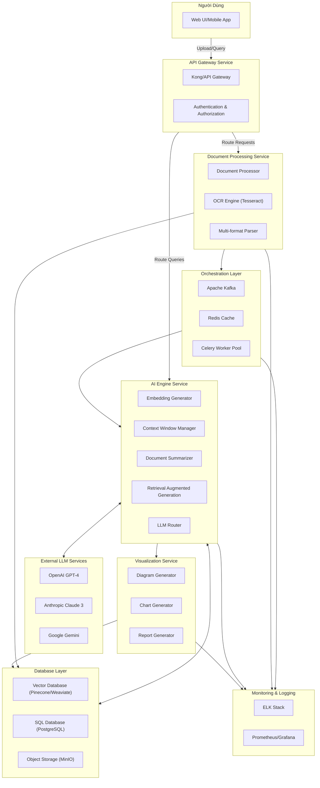

## Kiến Trúc Hệ Thống DocumentAI

```mermaid
flowchart TB
    subgraph User["Người Dùng"]
        UI["Web UI/Mobile App"]
    end
    
    subgraph API_Gateway["API Gateway Service"]
        Gateway["Kong/API Gateway"]
        Auth["Authentication & Authorization"]
    end
    
    subgraph Document_Processing["Document Processing Service"]
        Doc_Processor["Document Processor"]
        OCR["OCR Engine (Tesseract)"]
        Parser["Multi-format Parser"]
    end
    
    subgraph AI_Service["AI Engine Service"]
        Embedding["Embedding Generator"]
        Context_Manager["Context Window Manager"]
        Summarizer["Document Summarizer"]
        RAG["Retrieval Augmented Generation"]
        LLM_Router["LLM Router"]
    end
    
    subgraph External_LLMs["External LLM Services"]
        OpenAI["OpenAI GPT-4"]
        Claude["Anthropic Claude 3"]
        Gemini["Google Gemini"]
    end
    
    subgraph DB_Layer["Database Layer"]
        Vector_DB["Vector Database (Pinecone/Weaviate)"]
        SQL_DB["SQL Database (PostgreSQL)"]
        File_Storage["Object Storage (MinIO)"]
    end
    
    subgraph Visualization["Visualization Service"]
        Diagram_Gen["Diagram Generator"]
        Chart_Gen["Chart Generator"]
        Report_Gen["Report Generator"]
    end
    
    subgraph Orchestration["Orchestration Layer"]
        Kafka["Apache Kafka"]
        Redis["Redis Cache"]
        Celery["Celery Worker Pool"]
    end
    
    subgraph Monitoring["Monitoring & Logging"]
        ELK["ELK Stack"]
        Prometheus["Prometheus/Grafana"]
    end
    
    User -- "Upload/Query" --> API_Gateway
    API_Gateway -- "Route Requests" --> Document_Processing
    API_Gateway -- "Route Queries" --> AI_Service
    
    Document_Processing --> Orchestration
    Orchestration --> AI_Service
    AI_Service <--> External_LLMs
    AI_Service <--> DB_Layer
    AI_Service --> Visualization
    
    Document_Processing --> DB_Layer
    Visualization --> DB_Layer
    
    Orchestration --> Monitoring
    Document_Processing --> Monitoring
    AI_Service --> Monitoring
    Visualization --> Monitoring
```