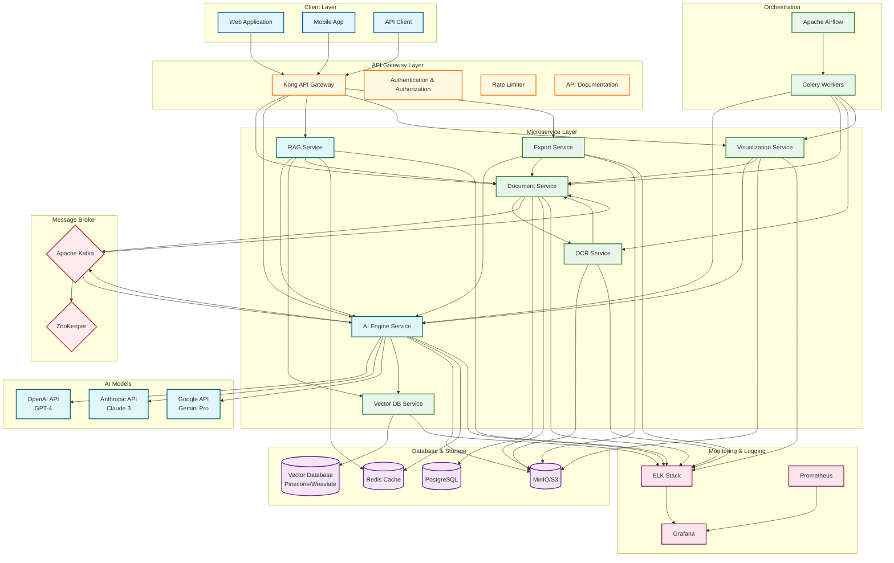

```mermaid
flowchart TB
    classDef client fill:#e1f5fe,stroke:#01579b,stroke-width:2px
    classDef gateway fill:#fff8e1,stroke:#ff6f00,stroke-width:2px
    classDef service fill:#e8f5e9,stroke:#2e7d32,stroke-width:2px
    classDef database fill:#f3e5f5,stroke:#6a1b9a,stroke-width:2px
    classDef messaging fill:#ffebee,stroke:#b71c1c,stroke-width:2px
    classDef storage fill:#e8eaf6,stroke:#283593,stroke-width:2px
    classDef monitoring fill:#fce4ec,stroke:#880e4f,stroke-width:2px
    classDef ai fill:#e0f7fa,stroke:#006064,stroke-width:2px
    
    subgraph Client["Client Layer"]
        WebApp["Web Application"]
        MobileApp["Mobile App"]
        APIClient["API Client"]
    end
    
    subgraph Gateway["API Gateway Layer"]
        Kong["Kong API Gateway"]
        Auth["Authentication & Authorization"]
        RateLimit["Rate Limiter"]
        APIDocs["API Documentation"]
    end
    
    subgraph Services["Microservice Layer"]
        DocService["Document Service"]
        OCRService["OCR Service"]
        AIEngine["AI Engine Service"]
        RAGService["RAG Service"]
        VizService["Visualization Service"]
        ExportService["Export Service"]
        VectorDBService["Vector DB Service"]
    end
    
    subgraph AI["AI Models"]
        OpenAI["OpenAI API\nGPT-4"]
        Claude["Anthropic API\nClaude 3"]
        Gemini["Google API\nGemini Pro"]
    end
    
    subgraph Data["Database & Storage"]
        Postgres[(PostgreSQL)]
        MinIO[(MinIO/S3)]
        Redis[(Redis Cache)]
        VectorDB[(Vector Database\nPinecone/Weaviate)]
    end
    
    subgraph Messaging["Message Broker"]
        Kafka{"Apache Kafka"}
        ZooKeeper{"ZooKeeper"}
    end
    
    subgraph Monitoring["Monitoring & Logging"]
        ELK["ELK Stack"]
        Prometheus["Prometheus"]
        Grafana["Grafana"]
    end
    
    subgraph Orchestration["Orchestration"]
        Celery["Celery Workers"]
        Airflow["Apache Airflow"]
    end
    
    %% Connections
    %% Client to Gateway
    WebApp --> Kong
    MobileApp --> Kong
    APIClient --> Kong
    
    %% Gateway to Services
    Kong --> DocService
    Kong --> AIEngine
    Kong --> RAGService
    Kong --> VizService
    Kong --> ExportService
    
    %% Services interconnections
    DocService --> OCRService
    DocService --> Kafka
    OCRService --> DocService
    AIEngine --> OpenAI & Claude & Gemini
    AIEngine --> VectorDBService
    AIEngine --> Kafka
    RAGService --> AIEngine
    RAGService --> VectorDBService
    RAGService --> DocService
    VizService --> AIEngine
    VizService --> DocService
    ExportService --> AIEngine
    ExportService --> DocService
    VectorDBService --> VectorDB
    
    %% Services to Data
    DocService --> Postgres
    DocService --> MinIO
    AIEngine --> MinIO
    VizService --> MinIO
    ExportService --> MinIO
    OCRService --> MinIO
    AIEngine --> Redis
    RAGService --> Redis
    
    %% Messaging
    Kafka --> ZooKeeper
    Kafka --> AIEngine
    Kafka --> DocService
    
    %% Orchestration
    Celery --> AIEngine
    Celery --> DocService
    Celery --> OCRService
    Celery --> VizService
    Airflow --> Celery
    
    %% Monitoring
    DocService & AIEngine & RAGService & VizService & ExportService & OCRService & VectorDBService --> ELK
    ELK --> Grafana
    Prometheus --> Grafana
    
    %% Styling
    class WebApp,MobileApp,APIClient client
    class Kong,Auth,RateLimit,APIDocs gateway
    class DocService,OCRService,VizService,ExportService,VectorDBService service
    class AIEngine,RAGService ai
    class Postgres,MinIO,Redis,VectorDB database
    class Kafka,ZooKeeper messaging
    class ELK,Prometheus,Grafana monitoring
    class Celery,Airflow service
    class OpenAI,Claude,Gemini ai
```