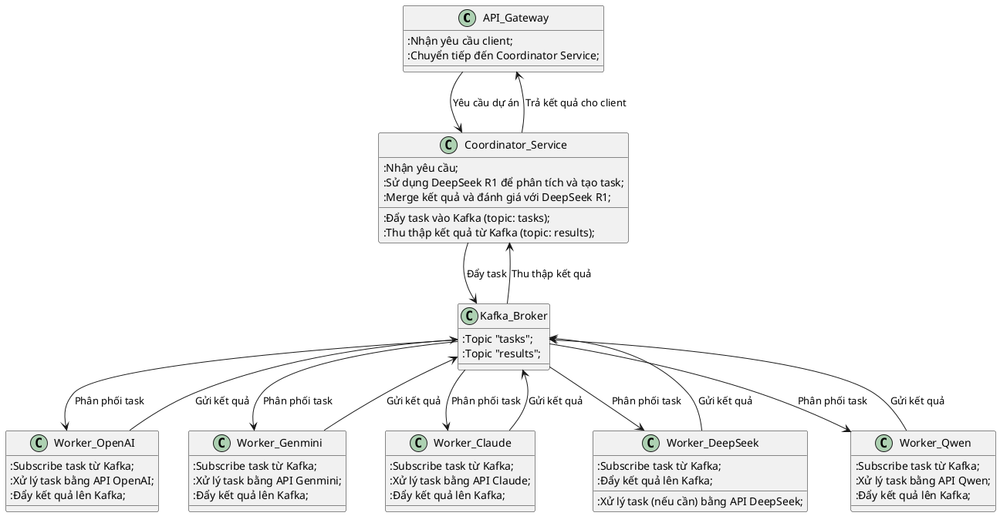
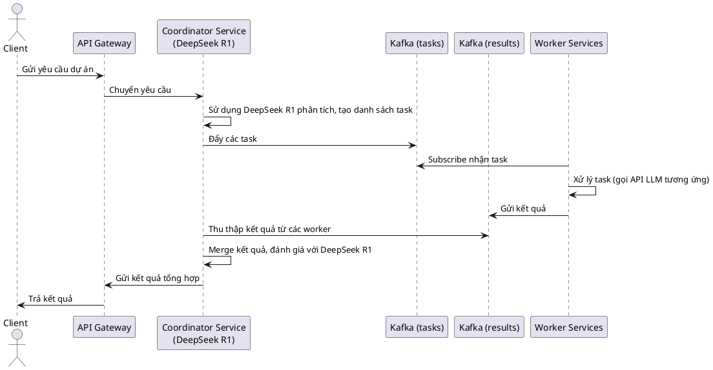

https://chatgpt.com/share/67a491c0-3d58-800d-aa34-35a56c6f865f

Dưới đây là một bản phân tích, kế hoạch triển khai và mẫu code minh họa cho hệ thống “dịch vụ LLM đa tiến trình – đa tài khoản” theo kiến trúc microservice kết hợp với hệ thống giám sát ELK. Bạn có thể xem đây là “proof of concept” để phát triển thêm tính năng cũng như mở rộng quy mô. Tôi cũng sẽ cung cấp các sơ đồ kiến trúc (với PlantUML) và sơ đồ tuần tự (sequence diagram) mô tả các flow chính.

---

## 1. Phân tích và Kế hoạch Triển khai

### 1.1. Yêu Cầu Hệ Thống
- **Tài khoản & LLM:**
  - Có **n** tài khoản Gmail đã tạo sẵn. Mỗi tài khoản này tương ứng với các tài khoản đã đăng ký cho các LLM:  
    + OpenAI  
    + Genmini  
    + Claude  
    + DeepSeek (phiên bản R1 được dùng làm “coordinator” chính)  
    + Qwen-2.5  
- **Xử lý dự án lớn với n task cụ thể:**
  - Với mỗi yêu cầu, sử dụng DeepSeek R1 làm LLM điều phối để:
    - Điều phối, phân chia các sub-task.
    - Làm rõ lại yêu cầu nếu cần.
  - Sau khi có danh sách các task, đẩy lần lượt từng task qua Kafka tới các dịch vụ “worker” đại diện cho các LLM khác (mỗi worker có thể dùng tài khoản Gmail để gọi API LLM tương ứng).
  - Thực hiện đa tiến trình, song song xử lý các task.
  - Sau đó, merge kết quả từ các worker lại và cho DeepSeek R1 đánh giá mức độ hoàn thành của từng task.
- **Yêu cầu về Concurrency & Auto Scaling:**
  - Hệ thống cần chạy song song, xử lý đa tiến trình, tự động cân bằng (load balance) các lần gọi API, đảm bảo tuân thủ giới hạn (rate limit) của từng LLM.
- **Giám sát & Log:**
  - Sử dụng ELK (Elasticsearch, Logstash, Kibana) để giám sát, log toàn bộ hệ thống, đặc biệt với khả năng xử lý bài toán nâng cao.

### 1.2. Kiến Trúc Hệ Thống (Microservice Architecture)
Các thành phần chính:
- **API Gateway:** Tiếp nhận yêu cầu từ client và định tuyến tới các service phù hợp.
- **Coordinator Service:**  
  - Nhận yêu cầu, sử dụng DeepSeek R1 để phân tích, chia nhỏ task.
  - Gửi danh sách task vào Kafka.
  - Thu thập kết quả từ Kafka và thực hiện merge.
- **Worker Services (cho từng LLM):**  
  - Mỗi worker sẽ subscribe vào topic của Kafka để nhận task.
  - Sử dụng tài khoản Gmail tương ứng để gọi API của LLM (OpenAI, Genmini, Claude, DeepSeek (nếu cần) và Qwen-2.5).
  - Đẩy kết quả xử lý task vào một Kafka topic “results”.
- **Kafka Broker:**  
  - Đóng vai trò làm message queue giữa coordinator và các worker.
- **Load Balancer & Rate Limit Handler:**  
  - Có thể tích hợp trong mỗi worker hoặc dưới dạng service chung, đảm bảo không vượt quá giới hạn API của từng LLM.
- **ELK Stack:**  
  - Ghi nhận log, theo dõi hiệu năng, cảnh báo lỗi của toàn bộ hệ thống.
  
### 1.3. Quy Trình Xử Lý Task (Flow chính)
1. **Client gửi yêu cầu dự án** đến API Gateway.
2. **API Gateway** chuyển tiếp yêu cầu tới **Coordinator Service**.
3. **Coordinator Service (DeepSeek R1)**:
   - Phân tích yêu cầu.
   - Tạo danh sách các sub-task cần xử lý.
4. **Coordinator Service** đẩy các sub-task vào Kafka (topic “tasks”).
5. Các **Worker Services** subscribe vào topic “tasks”, mỗi worker nhận task phù hợp với loại LLM.
   - Worker gọi API LLM tương ứng qua tài khoản Gmail được cấu hình.
6. Mỗi **Worker** sau khi xử lý task sẽ đẩy kết quả vào Kafka (topic “results”).
7. **Coordinator Service** thu thập kết quả từ topic “results”:
   - Thực hiện merge kết quả.
   - Gửi kết quả tổng hợp cho DeepSeek R1 đánh giá mức độ hoàn thành của toàn bộ task.
8. **Coordinator Service** trả về kết quả cuối cùng qua API Gateway tới client.

---

## 2. Mẫu Code Python (Demos)

### 2.1. Cấu Trúc Dự Án

```
llm_system/
├── api_gateway.py         # API Gateway (có thể dùng FastAPI/Flask)
├── coordinator_service.py # Service sử dụng DeepSeek R1
├── worker_service.py      # Worker Service dùng cho các LLM khác nhau
├── kafka_client.py        # Helper cho việc đẩy/subscribe Kafka topics
├── config.py              # Cấu hình các thông số (API keys, Kafka broker, rate limit,...)
├── requirements.txt       # Danh sách dependencies (fastapi/flask, confluent-kafka, uvicorn, requests,...)
└── docker-compose.yml     # (Tùy chọn) triển khai các service container + Kafka + ELK stack
```

### 2.2. Ví Dụ Mã Code

#### 2.2.1. `config.py`
```python
# config.py
KAFKA_BROKER = "localhost:9092"
TASK_TOPIC = "tasks"
RESULT_TOPIC = "results"

# API endpoints cho LLM (giả định)
LLM_ENDPOINTS = {
    "openai": "https://api.openai.com/v1/chat/completions",
    "genmini": "https://api.genmini.com/v1/chat",
    "claude": "https://api.anthropic.com/v1/complete",
    "deepseek": "https://api.deepseek.com/v1/chat",
    "qwen": "https://api.qwen.com/v1/chat"
}

# Tài khoản Gmail và token tương ứng (giả lập)
GMAIL_ACCOUNTS = {
    "openai": {"email": "user_openai@gmail.com", "token": "token_openai"},
    "genmini": {"email": "user_genmini@gmail.com", "token": "token_genmini"},
    "claude": {"email": "user_claude@gmail.com", "token": "token_claude"},
    "deepseek": {"email": "user_deepseek@gmail.com", "token": "token_deepseek"},
    "qwen": {"email": "user_qwen@gmail.com", "token": "token_qwen"},
}
```

#### 2.2.2. `kafka_client.py`
```python
# kafka_client.py
from confluent_kafka import Producer, Consumer
from config import KAFKA_BROKER

def create_producer():
    conf = {'bootstrap.servers': KAFKA_BROKER}
    return Producer(conf)

def create_consumer(group_id, topics):
    conf = {
        'bootstrap.servers': KAFKA_BROKER,
        'group.id': group_id,
        'auto.offset.reset': 'earliest'
    }
    consumer = Consumer(conf)
    consumer.subscribe(topics)
    return consumer
```

#### 2.2.3. `coordinator_service.py`
```python
# coordinator_service.py
import json
import time
from kafka_client import create_producer, create_consumer
from config import TASK_TOPIC, RESULT_TOPIC, LLM_ENDPOINTS, GMAIL_ACCOUNTS
import requests

# Giả định DeepSeek R1 được dùng để phân tích và tổng hợp kết quả
def deepseek_analyze(input_text):
    # Gọi API của DeepSeek (giả lập)
    response = requests.post(LLM_ENDPOINTS["deepseek"],
                             json={"prompt": input_text},
                             headers={"Authorization": f"Bearer {GMAIL_ACCOUNTS['deepseek']['token']}"})
    if response.ok:
        return response.json().get("analysis", "No analysis")
    return "Error in deepseek analysis"

def deepseek_evaluate(results):
    # Gọi API DeepSeek để đánh giá các kết quả merge
    merged_text = "\n".join(results)
    response = requests.post(LLM_ENDPOINTS["deepseek"],
                             json={"prompt": f"Evaluate the following results:\n{merged_text}"},
                             headers={"Authorization": f"Bearer {GMAIL_ACCOUNTS['deepseek']['token']}"})
    if response.ok:
        return response.json().get("evaluation", "No evaluation")
    return "Error in deepseek evaluation"

def create_tasks(main_request):
    # Sử dụng DeepSeek R1 để chia nhỏ task
    analysis = deepseek_analyze(main_request)
    # Giả sử analysis trả về danh sách task dưới dạng string có thể parse
    tasks = analysis.split("\n")
    return [task.strip() for task in tasks if task.strip()]

def publish_tasks(tasks):
    producer = create_producer()
    for task in tasks:
        msg = json.dumps({"task": task, "timestamp": time.time()})
        producer.produce(TASK_TOPIC, msg)
        producer.flush()
        print(f"Published task: {task}")

def collect_results(timeout=10):
    consumer = create_consumer(group_id="coordinator-group", topics=[RESULT_TOPIC])
    results = []
    start_time = time.time()
    while time.time() - start_time < timeout:
        msg = consumer.poll(1.0)
        if msg is None:
            continue
        if msg.error():
            print(f"Consumer error: {msg.error()}")
            continue
        data = json.loads(msg.value().decode('utf-8'))
        results.append(data.get("result", ""))
        print(f"Collected result: {data.get('result', '')}")
    consumer.close()
    return results

def process_project(request_text):
    # 1. Tách yêu cầu thành các task nhỏ
    tasks = create_tasks(request_text)
    print("Tasks created:", tasks)
    # 2. Đẩy các task vào Kafka
    publish_tasks(tasks)
    # 3. Thu thập kết quả từ các worker (chờ khoảng thời gian timeout)
    results = collect_results(timeout=15)
    # 4. Merge kết quả và cho DeepSeek đánh giá
    evaluation = deepseek_evaluate(results)
    return {"tasks": tasks, "results": results, "evaluation": evaluation}

# Ví dụ chạy coordinator độc lập
if __name__ == "__main__":
    sample_request = "Hãy tạo ra một chiến lược marketing cho sản phẩm mới."
    final_result = process_project(sample_request)
    print("Final Result:", final_result)
```

#### 2.2.4. `worker_service.py`
```python
# worker_service.py
import json
import time
import random
import requests
from kafka_client import create_consumer, create_producer
from config import TASK_TOPIC, RESULT_TOPIC, LLM_ENDPOINTS, GMAIL_ACCOUNTS

# Mỗi worker có thể được khởi chạy với tham số cho loại LLM nó phụ trách
import argparse

def process_task(task, llm_type):
    # Giả lập việc gọi API của LLM tương ứng
    endpoint = LLM_ENDPOINTS.get(llm_type)
    token = GMAIL_ACCOUNTS.get(llm_type, {}).get("token")
    if not endpoint or not token:
        return f"LLM {llm_type} không được cấu hình."
    headers = {"Authorization": f"Bearer {token}"}
    payload = {"prompt": task}
    # Để demo, giả lập độ trễ và kết quả
    time.sleep(random.uniform(1, 3))
    # Thực tế: response = requests.post(endpoint, json=payload, headers=headers)
    # Giả lập kết quả
    result = f"[{llm_type}]: {task} - processed."
    return result

def run_worker(llm_type):
    consumer = create_consumer(group_id=f"worker-{llm_type}-group", topics=[TASK_TOPIC])
    producer = create_producer()
    print(f"Worker {llm_type} bắt đầu lắng nghe các task...")
    try:
        while True:
            msg = consumer.poll(1.0)
            if msg is None:
                continue
            if msg.error():
                print(f"Lỗi consumer: {msg.error()}")
                continue
            data = json.loads(msg.value().decode('utf-8'))
            task = data.get("task")
            if not task:
                continue
            print(f"Worker {llm_type} nhận task: {task}")
            result = process_task(task, llm_type)
            result_msg = json.dumps({"result": result, "worker": llm_type, "timestamp": time.time()})
            producer.produce(RESULT_TOPIC, result_msg)
            producer.flush()
            print(f"Worker {llm_type} gửi kết quả: {result}")
    except KeyboardInterrupt:
        print("Worker dừng lại...")
    finally:
        consumer.close()

if __name__ == "__main__":
    parser = argparse.ArgumentParser()
    parser.add_argument("--llm", required=True, choices=["openai", "genmini", "claude", "deepseek", "qwen"],
                        help="Chọn loại LLM cho worker này.")
    args = parser.parse_args()
    run_worker(args.llm)
```

#### 2.2.5. `api_gateway.py` (Sử dụng FastAPI)
```python
# api_gateway.py
from fastapi import FastAPI, HTTPException
from pydantic import BaseModel
import uvicorn
from coordinator_service import process_project

app = FastAPI()

class ProjectRequest(BaseModel):
    request_text: str

@app.post("/process_project")
def process_project_endpoint(project: ProjectRequest):
    try:
        result = process_project(project.request_text)
        return result
    except Exception as e:
        raise HTTPException(status_code=500, detail=str(e))

if __name__ == "__main__":
    uvicorn.run(app, host="0.0.0.0", port=8000)
```

#### 2.2.6. `docker-compose.yml` (Mẫu cấu hình triển khai)
```yaml
version: '3.8'
services:
  api_gateway:
    build: .
    command: python api_gateway.py
    ports:
      - "8000:8000"
    depends_on:
      - kafka

  coordinator:
    build: .
    command: python coordinator_service.py
    depends_on:
      - kafka

  worker_openai:
    build: .
    command: python worker_service.py --llm openai
    depends_on:
      - kafka

  worker_genmini:
    build: .
    command: python worker_service.py --llm genmini
    depends_on:
      - kafka

  worker_claude:
    build: .
    command: python worker_service.py --llm claude
    depends_on:
      - kafka

  worker_deepseek:
    build: .
    command: python worker_service.py --llm deepseek
    depends_on:
      - kafka

  worker_qwen:
    build: .
    command: python worker_service.py --llm qwen
    depends_on:
      - kafka

  kafka:
    image: confluentinc/cp-kafka:latest
    environment:
      KAFKA_BROKER_ID: 1
      KAFKA_ZOOKEEPER_CONNECT: zookeeper:2181
      KAFKA_ADVERTISED_LISTENERS: PLAINTEXT://kafka:9092
    ports:
      - "9092:9092"
    depends_on:
      - zookeeper

  zookeeper:
    image: confluentinc/cp-zookeeper:latest
    environment:
      ZOOKEEPER_CLIENT_PORT: 2181
    ports:
      - "2181:2181"

  # ELK stack: chỉ là mẫu khởi đầu, cấu hình thực tế cần bổ sung thêm
  elasticsearch:
    image: docker.elastic.co/elasticsearch/elasticsearch:7.10.1
    environment:
      - discovery.type=single-node
    ports:
      - "9200:9200"

  kibana:
    image: docker.elastic.co/kibana/kibana:7.10.1
    ports:
      - "5601:5601"
    depends_on:
      - elasticsearch
```

---

## 3. Sơ Đồ Kiến Trúc Hệ Thống

### 3.1. Sơ Đồ Kiến Trúc (Microservice Architecture Diagram)

Bạn có thể sử dụng **pip diagram** hoặc **PlantUML** để sinh sơ đồ. Dưới đây là mẫu sơ đồ với PlantUML:



---

## 4. Sơ Đồ Tuần Tự (Sequence Diagram)

Sơ đồ tuần tự mô tả flow chính từ khi nhận yêu cầu tới khi trả về kết quả:



---

## 5. Tổng Kết

- **Kiến trúc microservice** cho phép tách biệt các chức năng: API Gateway, Coordinator, Workers, giúp dễ dàng mở rộng và bảo trì.
- **Kafka** được sử dụng như một message broker, đảm bảo khả năng xử lý song song và phân phối task.
- **ELK stack** được tích hợp để giám sát, log hoạt động và cảnh báo lỗi.
- **Code mẫu** bằng Python minh họa các service cơ bản; bạn có thể mở rộng, thêm các module xử lý lỗi, retry logic, và tích hợp các cơ chế cân bằng tải theo yêu cầu API của từng LLM.

Hy vọng kế hoạch và mẫu code trên sẽ giúp bạn hình dung rõ ràng về hệ thống và phát triển dự án thành công. Nếu cần thêm chi tiết về từng thành phần, bạn có thể triển khai thêm unit test, logging chi tiết (đồng bộ với Logstash) và containerization cho từng service.