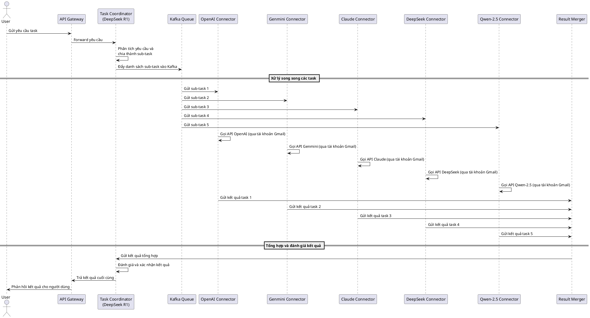

####
https://chatgpt.com/share/67a48ebc-9668-8008-85b6-8dfaa0f635db

Dưới đây là một phân tích chi tiết và kế hoạch triển khai cho hệ thống theo ý tưởng của bạn, kèm theo các bản vẽ sơ bộ (với **diagrams** cho kiến trúc Microservices và **Sequence Diagram** cho các flow xử lý) để bạn có thể hình dung cách hệ thống vận hành.

---

## 1. Tổng quan kiến trúc hệ thống

Hệ thống được xây dựng theo mô hình **Microservices Architecture** với các thành phần chính sau:

- **Account Manager & Credential Storage**  
  Quản lý danh sách tài khoản Gmail đã được tạo trước cùng với các tài khoản API của các LLM (OpenAI, Genmini, Claude, DeepSeek, Qwen-2.5). Mục đích là dùng đa tài khoản để tối ưu giới hạn gọi API.

- **Task Coordinator (LLM DeepSeek R1 - Coordinator Role)**  
  Đây là “bộ não” của hệ thống, dùng một mô hình LLM (DeepSeek R1) làm trung tâm để:  
  - Nhận yêu cầu từ người dùng.
  - Làm rõ, phân tích yêu cầu (nếu cần) thành danh sách các **sub-task**.
  - Đánh giá và tổng hợp kết quả cuối cùng.

- **Task Dispatcher**  
  Sau khi Task Coordinator có danh sách các sub-task, các task này được đẩy vào hệ thống message queue (sử dụng **Kafka**) để thực hiện xử lý song song.

- **Task Processors (LLM API Connectors)**  
  Mỗi task được gửi đến một trong các service connector của từng LLM (OpenAI, Genmini, Claude, DeepSeek, Qwen-2.5). Các service này được chạy song song theo đa tiến trình.  
  - Mỗi connector sử dụng một tài khoản Gmail tương ứng để gọi API LLM.
  - Hệ thống cần tự động cân bằng tải (load balancing) giữa các kết nối API nhằm không vượt quá giới hạn của từng dịch vụ.

- **Result Merger & Final Evaluator**  
  Sau khi các task được xử lý song song, các kết quả sẽ được tổng hợp lại.  
  - Một service (có thể cũng dựa vào LLM DeepSeek R1) đánh giá, hợp nhất và trả về kết quả cuối cùng cho người dùng.

- **Message Queue (Kafka Cluster)**  
  Đảm bảo quá trình gửi nhận các task giữa Task Dispatcher và Task Processors được xử lý một cách bất đồng bộ và có khả năng mở rộng cao.

- **API Gateway & Load Balancer**  
  Xác định các yêu cầu đầu vào từ người dùng và phân phối chúng đến Task Coordinator. Đồng thời, đảm bảo tự động cân bằng các cuộc gọi API tới các LLM theo số lượng tài khoản và giới hạn sử dụng.

---

## 2. Quy trình xử lý yêu cầu (Flow)

1. **Nhận yêu cầu**  
   - Người dùng gửi một yêu cầu cụ thể vào hệ thống thông qua API Gateway.

2. **Phân tích và chia nhỏ task**  
   - **Task Coordinator (DeepSeek R1)** nhận yêu cầu và dùng khả năng LLM của mình để làm rõ yêu cầu (nếu chưa rõ) và chia nhỏ thành danh sách các sub-task.

3. **Đẩy task vào Kafka**  
   - Task Dispatcher nhận danh sách các sub-task và đẩy từng task vào các topic cụ thể trên Kafka, đảm bảo thứ tự ưu tiên và cân bằng tải.

4. **Xử lý song song các task**  
   - Các **Task Processors** (mỗi connector tương ứng với các tài khoản API: OpenAI, Genmini, Claude, DeepSeek, Qwen-2.5) nhận các task từ Kafka, thực hiện xử lý theo mô hình của từng LLM.
   - Việc gọi API được thực hiện thông qua các tài khoản Gmail tương ứng, đảm bảo không vượt giới hạn và tối ưu song song (multithreading, multiprocessing).

5. **Merge kết quả & đánh giá**  
   - Sau khi các task hoàn thành, kết quả được tổng hợp (merge) bởi một service trung gian.
   - Cuối cùng, **Task Coordinator (DeepSeek R1)** dùng khả năng đánh giá để kiểm tra độ hoàn thiện của task, hợp nhất và trả về kết quả cuối cùng cho người dùng.

6. **Phản hồi kết quả**  
   - Kết quả cuối cùng được gửi lại qua API Gateway đến phía người dùng.

---

## 3. Thiết kế Kiến trúc hệ thống (Microservice Architecture Diagram)

Bạn có thể sử dụng thư viện [diagrams](https://diagrams.mingrammer.com/) trong Python để vẽ sơ đồ kiến trúc. Dưới đây là một ví dụ code:

```python
from diagrams import Diagram, Cluster, Edge
from diagrams.aws.compute import ECS
from diagrams.aws.integration import SQS
from diagrams.onprem.queue import Kafka
from diagrams.onprem.client import User
from diagrams.generic.device import Mobile
from diagrams.custom import Custom

with Diagram("Hệ thống Task Dispatcher & LLM Aggregator", show=False):
    user = User("Người dùng")

    with Cluster("API Gateway"):
        gateway = ECS("API Gateway")
    
    with Cluster("Task Coordination"):
        coordinator = Custom("LLM DeepSeek R1\n(Task Coordinator & Evaluator)", "./llm_icon.png")
    
    with Cluster("Message Queue"):
        kafka = Kafka("Kafka Cluster")
    
    with Cluster("Task Processors"):
        openai = Custom("OpenAI Connector", "./openai_icon.png")
        genmini = Custom("Genmini Connector", "./genmini_icon.png")
        claude = Custom("Claude Connector", "./claude_icon.png")
        deepseek = Custom("DeepSeek Connector", "./deepseek_icon.png")
        qwen = Custom("Qwen-2.5 Connector", "./qwen_icon.png")
    
    with Cluster("Result Merger"):
        merger = ECS("Result Merger")
    
    # Flow connections
    user >> gateway >> coordinator
    coordinator >> kafka

    # Kafka đẩy task tới các connector song song
    kafka >> Edge(label="Task 1") >> openai
    kafka >> Edge(label="Task 2") >> genmini
    kafka >> Edge(label="Task 3") >> claude
    kafka >> Edge(label="Task 4") >> deepseek
    kafka >> Edge(label="Task 5") >> qwen

    # Các connector gửi kết quả về merger
    openai >> merger
    genmini >> merger
    claude >> merger
    deepseek >> merger
    qwen >> merger

    # Merger gửi kết quả tổng hợp về coordinator
    merger >> coordinator

    # Coordinator gửi kết quả cuối cùng về gateway và sau đó tới người dùng
    coordinator >> gateway >> user
```

> **Chú ý:**  
> - Các biểu tượng `Custom` (ví dụ `./openai_icon.png`) cần có file ảnh tương ứng trong thư mục hiện hành hoặc có thể thay thế bằng các icon mặc định.
> - Sơ đồ trên là một ví dụ minh họa cho kiến trúc Microservices.

---

## 4. Biểu đồ tuần tự (Sequence Diagram)

Dưới đây là một bản thiết kế Sequence Diagram dùng cho **StarUML** (hoặc có thể chuyển sang PlantUML nếu cần). Bạn có thể sử dụng định dạng sau:



> **Lưu ý:**  
> - Bạn có thể dán mã trên vào StarUML (hoặc các công cụ hỗ trợ PlantUML) để tạo biểu đồ tuần tự.
> - Các bước xử lý song song, gọi API qua tài khoản Gmail và load balancing đã được làm rõ trong sơ đồ.

---

## 5. Các điểm cần bổ sung và làm rõ thêm

- **Quản lý giới hạn API:**  
  - Cần có một module quản lý (có thể là bên trong Account Manager) để theo dõi số lượng gọi API của từng tài khoản Gmail và đảm bảo không vượt giới hạn của các dịch vụ LLM.
  - Sử dụng các cơ chế retry và circuit breaker để đảm bảo tính ổn định.

- **Monitoring & Logging:**  
  - Xây dựng hệ thống giám sát (Monitoring) và logging cho từng service, đặc biệt là việc xử lý các task qua Kafka và các kết nối API.
  - Báo cáo lỗi, tình trạng quá tải và hiệu năng của từng connector.

- **Cơ chế Scale-out:**  
  - Các microservices như Task Processors, Result Merger nên có khả năng scale-out theo số lượng task.
  - Sử dụng container orchestration (như Kubernetes) để dễ dàng triển khai, quản lý và mở rộng hệ thống.

- **Bảo mật:**  
  - Mã hóa thông tin xác thực của các tài khoản Gmail và API keys.
  - Xác thực và ủy quyền cho người dùng truy cập API Gateway.

- **Kiến trúc Message Queue:**  
  - Cân nhắc sử dụng thêm các cơ chế bảo đảm độ tin cậy của Kafka (ví dụ: replication, consumer group management).

---

## 6. Kết luận

Với kế hoạch chi tiết trên, hệ thống của bạn sẽ có khả năng:
- Phân tích và chia nhỏ các task bằng mô hình LLM (DeepSeek R1).
- Xử lý song song các task qua Kafka và các connector API.
- Tự động cân bằng tải giữa các tài khoản Gmail để gọi API, đảm bảo không vượt giới hạn của dịch vụ.
- Tổng hợp và đánh giá kết quả cuối cùng để trả về người dùng một cách chính xác.

Bạn có thể tùy chỉnh và bổ sung thêm các module theo yêu cầu thực tế khi triển khai. Hy vọng bản phân tích và các sơ đồ trên giúp bạn hình dung rõ hơn về giải pháp kiến trúc hệ thống.