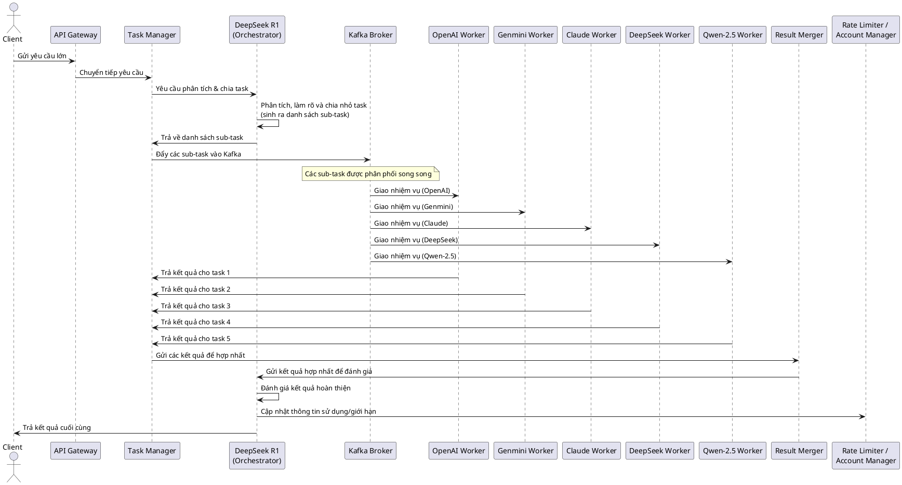

Dưới đây là một kế hoạch phân tích và thiết kế chi tiết cho hệ thống mà bạn mô tả. Tôi sẽ bổ sung một số ý và làm rõ thêm các thành phần để đảm bảo hệ thống có thể xử lý quy mô lớn, chạy song song, tự động cân bằng tải và tuân thủ giới hạn gọi API của các LLM.

---

## 1. Kiến trúc Hệ thống (Microservice Architecture)

### Các thành phần chính:

1. **API Gateway**  
   - **Chức năng:** Tiếp nhận các yêu cầu từ client, thực hiện xác thực và định tuyến các request đến dịch vụ Task Manager.
   
2. **Task Manager (Quản lý nhiệm vụ)**  
   - **Chức năng:** Tiếp nhận yêu cầu từ API Gateway, chuyển tiếp yêu cầu đến Orchestrator để phân tích và chia nhỏ thành các sub-task.
   - **Chú ý:** Cần có cơ chế quản lý trạng thái của từng task (ví dụ: pending, processing, completed) và lưu trữ log.

3. **Orchestrator (DeepSeek R1 – LLM chính)**  
   - **Chức năng:**  
     - Phân tích yêu cầu tổng thể và làm rõ nhiệm vụ nếu chưa rõ.  
     - Chia nhỏ nhiệm vụ thành danh sách các sub-task.  
     - Sau khi các sub-task được xử lý, đánh giá và hợp nhất kết quả.
   - **Chú ý:** Đây là thành phần "trọng tâm" của hệ thống, sử dụng LLM DeepSeek R1.

4. **Message Broker (Kafka Broker)**  
   - **Chức năng:** Làm trung gian phân phối các sub-task cho các worker.  
   - **Chú ý:** Đảm bảo tính sẵn sàng, khả năng mở rộng và tự động cân bằng tải (ví dụ: qua các partition).

5. **LLM Worker Services (Các dịch vụ xử lý với LLM khác nhau)**  
   - **Thành phần:**  
     - OpenAI Worker  
     - Genmini Worker  
     - Claude Worker  
     - DeepSeek Worker (song song với orchestrator để xử lý các nhiệm vụ cụ thể)  
     - Qwen-2.5 Worker  
   - **Chức năng:** Nhận nhiệm vụ từ Kafka, gọi API LLM tương ứng sử dụng thông qua các tài khoản Gmail đã được cấu hình sẵn.
   - **Chú ý:**  
     - Mỗi worker cần quản lý giới hạn gọi API (rate limit) và thực hiện retry khi cần.
     - Các worker chạy song song, độc lập và đồng thời.

6. **Result Merger (Hợp nhất kết quả)**  
   - **Chức năng:** Thu thập kết quả từ các LLM Worker, hợp nhất và gửi lại cho Orchestrator để đánh giá kết quả hoàn thiện.
   - **Chú ý:** Có thể cần có cơ chế timeout hoặc fallback nếu một số worker không phản hồi.

7. **Load Balancer & Rate Limiter**  
   - **Chức năng:**  
     - Cân bằng tải giữa các tài khoản Gmail/LLM để đảm bảo không vượt quá giới hạn API.
     - Theo dõi số lượng request hiện tại và phân phối nhiệm vụ dựa trên trạng thái tài khoản.
     
8. **Account Manager**  
   - **Chức năng:** Quản lý n tài khoản Gmail và các thông tin xác thực liên quan đến LLM (OpenAI, Genmini, Claude, …).
   - **Chú ý:** Cần có cơ chế luân phiên và theo dõi trạng thái của từng tài khoản (đang hoạt động, đạt giới hạn, v.v).

9. **Logging, Monitoring & Error Handling**  
   - **Chức năng:** Giám sát toàn bộ hệ thống, log các hoạt động, cảnh báo khi xảy ra lỗi và cung cấp dashboard để theo dõi hiệu suất.

---

## 2. Luồng Xử Lý (Flow) của Hệ thống

1. **Nhận Yêu Cầu:**  
   - Client gửi yêu cầu lớn đến **API Gateway**.

2. **Quản Lý Nhiệm Vụ:**  
   - API Gateway chuyển yêu cầu đến **Task Manager**.
   - Task Manager gọi **Orchestrator (DeepSeek R1)** để phân tích, làm rõ và chia nhỏ nhiệm vụ thành danh sách các sub-task.

3. **Phân Phối Nhiệm Vụ:**  
   - Task Manager đẩy danh sách các sub-task vào **Kafka Broker**.
   - Kafka phân phối các nhiệm vụ đến các **LLM Worker Services** (OpenAI, Genmini, Claude, DeepSeek, Qwen-2.5) theo cơ chế song song và cân bằng tải.

4. **Xử Lý Nhiệm Vụ Song Song:**  
   - Mỗi LLM Worker nhận nhiệm vụ và gọi API LLM tương ứng, sử dụng tài khoản Gmail đã được cấu hình.
   - Khi nhận kết quả từ các nhiệm vụ, các worker gửi kết quả về cho **Result Merger**.

5. **Hợp Nhất & Đánh Giá Kết Quả:**  
   - **Result Merger** thu thập và hợp nhất kết quả từ các worker.
   - Kết quả hợp nhất được gửi lại cho **Orchestrator (DeepSeek R1)** để đánh giá mức độ hoàn thành của nhiệm vụ.
   - Sau đánh giá, kết quả cuối cùng được gửi trả lại cho client.

6. **Quản Lý Giới Hạn & Cân Bằng Tải:**  
   - **Load Balancer & Rate Limiter** theo dõi số lượng yêu cầu và phân phối nhiệm vụ dựa trên trạng thái của tài khoản, tránh vượt quá giới hạn API.

---

## 3. Bản Vẽ Kiến Trúc Hệ Thống (Microservice Architecture)

Sử dụng thư viện `diagrams` của Python (pip diagram) để vẽ sơ đồ kiến trúc:

```python
from diagrams import Diagram, Cluster
from diagrams.generic.network import LoadBalancer
from diagrams.onprem.queue import Kafka
from diagrams.onprem.compute import Server

with Diagram("Microservice Architecture", show=False):
    client = Server("Client")
    gateway = Server("API Gateway")
    task_manager = Server("Task Manager")
    orchestrator = Server("DeepSeek R1 (Orchestrator)")
    rate_limiter = Server("Rate Limiter / Account Manager")
    
    kafka = Kafka("Kafka Broker")
    
    with Cluster("LLM Worker Services"):
        openai_worker = Server("OpenAI Worker")
        genmini_worker = Server("Genmini Worker")
        claude_worker = Server("Claude Worker")
        deepseek_worker = Server("DeepSeek Worker")
        qwen_worker = Server("Qwen-2.5 Worker")
    
    client >> gateway >> task_manager >> orchestrator
    orchestrator >> kafka
    kafka >> openai_worker
    kafka >> genmini_worker
    kafka >> claude_worker
    kafka >> deepseek_worker
    kafka >> qwen_worker
    
    # Các worker gửi kết quả về hợp nhất và đánh giá
    openai_worker >> orchestrator
    genmini_worker >> orchestrator
    claude_worker >> orchestrator
    deepseek_worker >> orchestrator
    qwen_worker >> orchestrator
    
    # Đường truyền quản lý giới hạn và cân bằng tải
    orchestrator >> rate_limiter
```

---

## 4. Biểu Đồ Tuần Tự (Sequence Diagram)

Dưới đây là ví dụ về biểu đồ tuần tự được vẽ bằng StartUML. Bạn có thể copy đoạn code sau vào StartUML để xem biểu đồ:



---

## 5. Một Số Lưu Ý Bổ Sung

- **Xử lý lỗi & Retry:**  
  Mỗi worker cần có cơ chế xử lý lỗi khi gọi API LLM (ví dụ: timeout, lỗi mạng) và thực hiện retry theo cấu hình.

- **Monitoring & Logging:**  
  Các dịch vụ nên tích hợp với hệ thống giám sát (như Prometheus, Grafana) để theo dõi trạng thái, hiệu năng và phát hiện lỗi kịp thời.

- **Scalability:**  
  Hệ thống nên được triển khai theo mô hình container (Docker, Kubernetes) để dễ dàng mở rộng khi cần thiết.

- **Bảo mật:**  
  Bảo vệ thông tin xác thực của tài khoản Gmail và các API keys; sử dụng các biện pháp bảo mật khi giao tiếp giữa các microservice.

---

Với kế hoạch và các biểu đồ trên, bạn đã có một bản thiết kế kiến trúc hệ thống và flow tuần tự chi tiết, sẵn sàng cho giai đoạn triển khai. Nếu có thêm yêu cầu hay cần bổ sung chi tiết cụ thể, hãy cho tôi biết để cùng phát triển thêm!