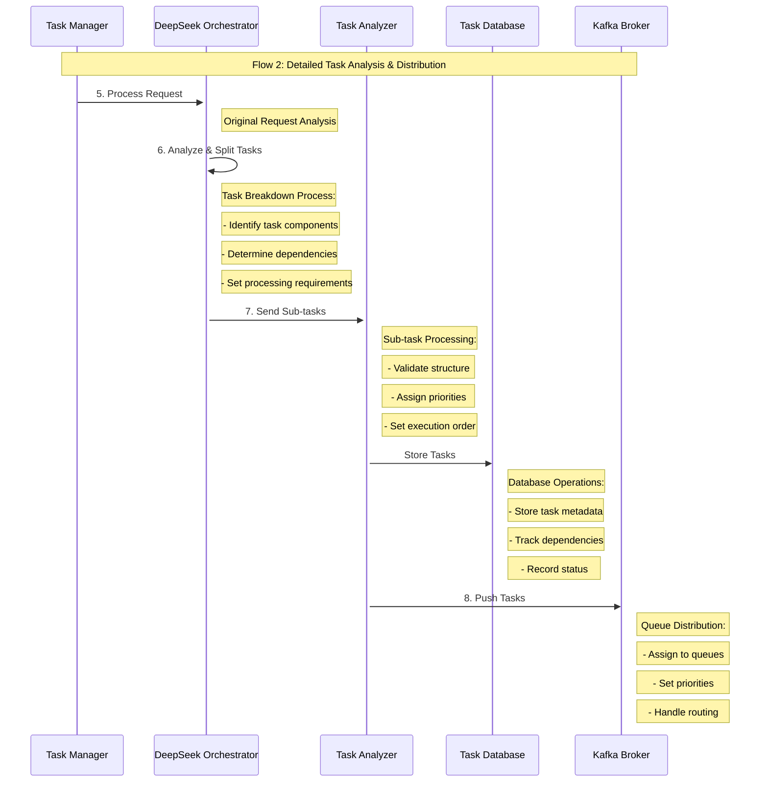

# Flow 2: Task Analysis

Can you explain this section to me in more detail?

 
%% Flow 2: Task Analysis
    Note over TM,KB: Flow 2: Task Analysis & Distribution
    TM->>+DO: 5. Process Request
    DO->>DO: 6. Analyze & Split Tasks
    DO->>+TA: 7. Send Sub-tasks
    TA->>TD: Store Tasks
    TA->>KB: 8. Push Tasks

###     
Let me explain Flow 2 (Task Analysis & Distribution) in detail:



Let's break down each step in detail:

1. Step 5 - Process Request (TM → DO):
```python
# Example request structure
request = {
    "task_id": "T123",
    "type": "content_generation",
    "requirements": {
        "output_format": "markdown",
        "language": "english",
        "length": "2000_words",
        "style": "technical"
    },
    "context": {
        "domain": "AI_technology",
        "target_audience": "developers",
        "key_points": ["architecture", "implementation", "best_practices"]
    },
    "priority": "high"
}
```

2. Step 6 - Analyze & Split Tasks (DO internal):
```python
class DeepSeekOrchestrator:
    def analyze_and_split(self, request):
        # Analyze task complexity
        complexity = self.analyze_complexity(request)
        
        # Identify subtasks
        subtasks = []
        
        # Example subtask breakdown
        subtasks.extend([
            {
                "id": f"{request['task_id']}_1",
                "type": "research",
                "content": "Architecture analysis",
                "requirements": {...},
                "dependencies": []
            },
            {
                "id": f"{request['task_id']}_2",
                "type": "content_generation",
                "content": "Implementation details",
                "requirements": {...},
                "dependencies": [f"{request['task_id']}_1"]
            },
            {
                "id": f"{request['task_id']}_3",
                "type": "review",
                "content": "Best practices compilation",
                "requirements": {...},
                "dependencies": [f"{request['task_id']}_2"]
            }
        ])
        
        return subtasks
```

3. Step 7 - Send Sub-tasks (DO → TA):
```python
class TaskAnalyzer:
    def process_subtasks(self, subtasks):
        for subtask in subtasks:
            # Validate subtask structure
            self.validate_structure(subtask)
            
            # Assign priority
            priority = self.calculate_priority(subtask)
            subtask['priority'] = priority
            
            # Determine execution order
            execution_order = self.determine_execution_order(subtask)
            subtask['execution_order'] = execution_order
            
            # Add processing metadata
            subtask['metadata'] = {
                'created_at': timestamp,
                'estimated_duration': self.estimate_duration(subtask),
                'required_resources': self.calculate_resources(subtask)
            }
```

4. Step 8 - Store Tasks (TA → TD):
```python
class TaskDatabase:
    def store_task(self, task):
        # Store task details
        task_record = {
            'task_id': task['id'],
            'parent_id': task['parent_id'],
            'status': 'pending',
            'priority': task['priority'],
            'dependencies': task['dependencies'],
            'metadata': task['metadata'],
            'execution_order': task['execution_order'],
            'created_at': current_timestamp(),
            'updated_at': current_timestamp()
        }
        
        # Update dependency graph
        self.update_dependencies(task['id'], task['dependencies'])
        
        return self.db.insert(task_record)
```

5. Step 9 - Push Tasks (TA → KB):
```python
class KafkaPublisher:
    def publish_task(self, task):
        # Prepare message
        message = {
            'task_id': task['id'],
            'type': task['type'],
            'content': task['content'],
            'priority': task['priority'],
            'routing_key': self.determine_routing(task),
            'timestamp': current_timestamp()
        }
        
        # Select appropriate topic
        topic = self.select_topic(task)
        
        # Publish to Kafka
        self.kafka_producer.send(
            topic=topic,
            value=message,
            partition=self.get_partition(task['priority'])
        )
```

Key Features of Flow 2:
1. Intelligent Task Breakdown:
   - Complexity analysis
   - Dependency identification
   - Resource requirement calculation

2. Priority Management:
   - Dynamic priority assignment
   - Execution order optimization
   - Resource allocation planning

3. Data Persistence:
   - Complete task metadata storage
   - Dependency tracking
   - Status management

4. Queue Distribution:
   - Smart routing
   - Priority-based queueing
   - Load balancing consideration

Would you like me to elaborate on any specific part of this flow?