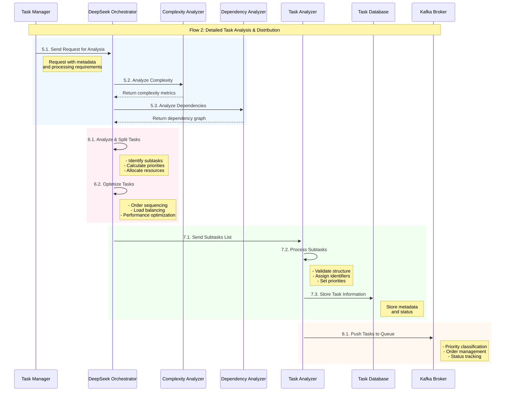
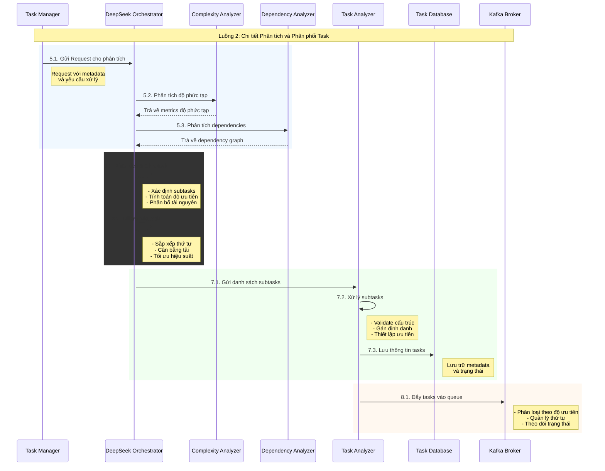

### Flow 2-v2- Chi tiết Luồng Phân tích Task 

Tôi sẽ giải thích chi tiết về Luồng 2 (Phân tích và Phân phối Task):
### English

### Việt Nam



Chi tiết các thành phần và quy trình:

1. Task Manager và DeepSeek Orchestrator:
```python
class DeepSeekOrchestrator:
    def process_request(self, request):
        # Khởi tạo phiên xử lý
        session = {
            "request_id": request["id"],
            "timestamp": current_timestamp(),
            "status": "processing",
            "metadata": request["metadata"]
        }

        try:
            # Phân tích độ phức tạp
            complexity_metrics = self.complexity_analyzer.analyze(request)
            
            # Phân tích dependencies
            dependencies = self.dependency_analyzer.analyze(request)
            
            # Tổng hợp thông tin phân tích
            analysis = {
                "complexity": complexity_metrics,
                "dependencies": dependencies,
                "estimated_resources": self.estimate_resources(complexity_metrics),
                "priority_level": self.calculate_priority(request, complexity_metrics)
            }
            
            return analysis
            
        except Exception as e:
            self.handle_analysis_error(e, session)
```

2. Phân tích và Chia Task:
```python
class TaskSplitter:
    def split_tasks(self, analysis):
        subtasks = []
        
        # Phân chia task dựa trên phân tích
        try:
            # Xác định các thành phần cần xử lý
            components = self.identify_components(analysis)
            
            for component in components:
                subtask = {
                    "id": generate_subtask_id(),
                    "parent_id": analysis["request_id"],
                    "type": component["type"],
                    "requirements": {
                        "input": component["input"],
                        "expected_output": component["output"],
                        "constraints": component["constraints"]
                    },
                    "dependencies": self.map_dependencies(component, analysis["dependencies"]),
                    "priority": self.calculate_subtask_priority(component, analysis),
                    "resources": self.allocate_resources(component, analysis)
                }
                
                subtasks.append(subtask)
            
            # Tối ưu hóa thứ tự xử lý
            optimized_tasks = self.optimize_task_order(subtasks)
            
            return optimized_tasks
            
        except Exception as e:
            self.handle_splitting_error(e, analysis)
```

3. Task Analyzer và Lưu trữ:
```python
class TaskAnalyzer:
    def process_subtasks(self, subtasks):
        processed_tasks = []
        
        for task in subtasks:
            try:
                # Validate cấu trúc task
                validated_task = self.validate_task_structure(task)
                
                # Bổ sung metadata
                enriched_task = self.enrich_task_metadata(validated_task)
                
                # Gán định danh và priority
                final_task = {
                    **enriched_task,
                    "tracking_id": generate_tracking_id(),
                    "priority_score": self.calculate_priority_score(enriched_task),
                    "execution_plan": self.generate_execution_plan(enriched_task)
                }
                
                processed_tasks.append(final_task)
                
                # Lưu vào database
                self.task_database.store_task(final_task)
                
            except Exception as e:
                self.handle_processing_error(e, task)
                
        return processed_tasks
```

4. Đẩy Task vào Kafka:
```python
class KafkaTaskPublisher:
    def publish_tasks(self, processed_tasks):
        try:
            for task in processed_tasks:
                # Chuẩn bị message
                message = {
                    "task_id": task["tracking_id"],
                    "type": task["type"],
                    "priority": task["priority_score"],
                    "payload": {
                        "requirements": task["requirements"],
                        "dependencies": task["dependencies"],
                        "execution_plan": task["execution_plan"]
                    },
                    "metadata": {
                        "timestamp": current_timestamp(),
                        "source": "task_analyzer",
                        "version": "1.0"
                    }
                }
                
                # Chọn partition dựa trên priority
                partition = self.select_partition(task["priority_score"])
                
                # Publish to Kafka
                self.kafka_producer.send(
                    topic="task_queue",
                    key=str(task["tracking_id"]),
                    value=message,
                    partition=partition
                )
                
                # Log metrics
                self.log_publish_metrics(task)
                
        except Exception as e:
            self.handle_publish_error(e, processed_tasks)
```

Các tính năng chính:

1. Phân tích Thông minh:
   - Đánh giá độ phức tạp
   - Phân tích dependencies
   - Ước tính tài nguyên
   - Tính toán độ ưu tiên

2. Phân chia Task:
   - Chia nhỏ thành subtasks
   - Tối ưu thứ tự xử lý
   - Cân bằng tải
   - Quản lý dependencies

3. Xử lý và Lưu trữ:
   - Validation cấu trúc
   - Gán metadata
   - Lưu trữ thông tin
   - Tracking trạng thái

4. Phân phối Queue:
   - Priority-based routing
   - Load balancing
   - Monitoring
   - Error handling

Ví dụ về Task Structure:
```python
task = {
    "id": "task-123",
    "tracking_id": "trk-456",
    "type": "content_processing",
    "priority_score": 0.85,
    "requirements": {
        "input_type": "text",
        "output_format": "json",
        "processing_rules": [...]
    },
    "dependencies": {
        "upstream": ["task-120", "task-121"],
        "downstream": ["task-124", "task-125"]
    },
    "execution_plan": {
        "steps": [...],
        "estimated_duration": "120s",
        "resource_requirements": {
            "cpu": "2 cores",
            "memory": "4GB",
            "model": "gpt-4"
        }
    },
    "metadata": {
        "created_at": "2024-02-19T10:00:00Z",
        "source": "task_analyzer",
        "version": "1.0",
        "status": "queued"
    }
}
```

Bạn muốn tìm hiểu thêm về phần nào trong Luồng 2 không?