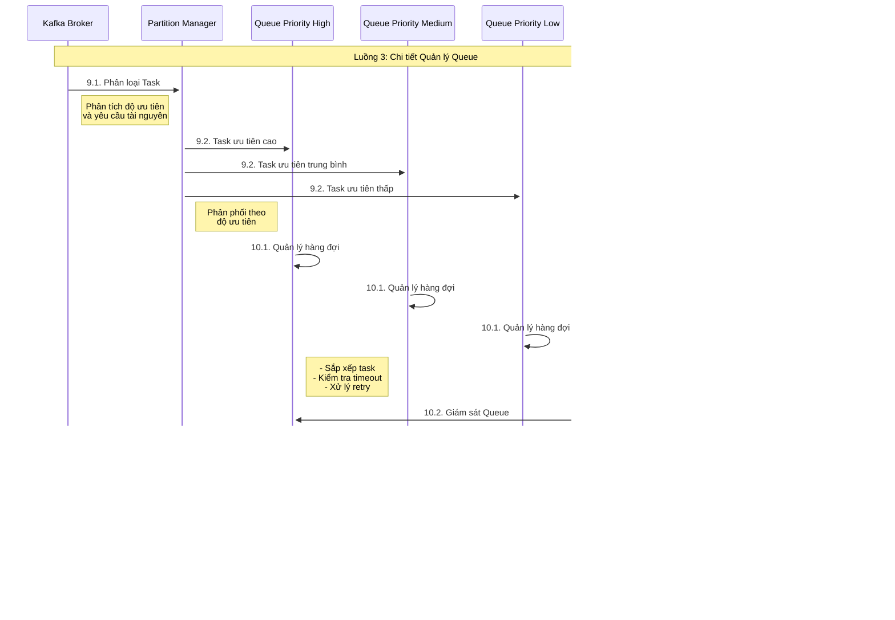

### Flow 3-Chi tiết Luồng Quản lý Queue

Can you explain this section to me in more detail?


Copy
    %% Flow 3: Queue Management
    Note over KB,Q: Flow 3: Task Queue Management
    KB->>+Q: 9. Distribute Tasks
    Q->>Q: 10. Queue Management

-----

Tôi sẽ giải thích chi tiết về Luồng 3 (Quản lý Queue):




Chi tiết về các thành phần và quy trình:

1. Kafka Broker và Partition Manager:
```python
class KafkaManager:
    def distribute_task(self, task):
        # Phân tích task để quyết định partition
        partition_key = self.analyze_task_requirements(task)
        
        # Cấu trúc message Kafka
        message = {
            "task_id": task["id"],
            "priority": task["priority"],
            "requirements": task["requirements"],
            "metadata": {
                "created_at": current_timestamp(),
                "retry_count": 0,
                "timeout": self.calculate_timeout(task)
            }
        }
        
        # Gửi đến partition thích hợp
        self.kafka_producer.send(
            topic="task_queue",
            key=partition_key,
            value=message,
            partition=self.get_partition(task["priority"])
        )
```

2. Quản lý Queue theo Priority:
```python
class QueueManager:
    def manage_queue(self, priority_level):
        while True:
            # Lấy messages từ queue
            messages = self.consumer.poll(timeout_ms=1000)
            
            for message_batch in messages.values():
                for message in message_batch:
                    try:
                        # Xử lý message
                        task = self.process_message(message)
                        
                        # Kiểm tra timeout
                        if self.is_task_timeout(task):
                            self.handle_timeout(task)
                            continue
                            
                        # Kiểm tra retry
                        if self.need_retry(task):
                            self.handle_retry(task)
                            continue
                            
                        # Cập nhật trạng thái
                        self.update_task_status(task)
                        
                    except Exception as e:
                        self.handle_error(e, message)
```

3. Quản lý Retry và Timeout:
```python
class RetryManager:
    def handle_retry(self, task):
        # Kiểm tra số lần retry
        if task["metadata"]["retry_count"] >= MAX_RETRIES:
            self.move_to_dead_letter_queue(task)
            return
            
        # Tăng retry count
        task["metadata"]["retry_count"] += 1
        
        # Tính toán delay cho lần retry tiếp theo
        delay = self.calculate_retry_delay(task)
        
        # Đưa task vào retry queue
        self.retry_queue.send(
            topic="retry_queue",
            value=task,
            timestamp_ms=current_timestamp() + delay
        )
```

4. Monitor Queue:
```python
class QueueMonitor:
    def monitor_queues(self):
        queue_metrics = {
            "high_priority": {
                "length": self.get_queue_length("high"),
                "avg_wait_time": self.calculate_avg_wait_time("high"),
                "processing_rate": self.calculate_processing_rate("high")
            },
            "medium_priority": {
                "length": self.get_queue_length("medium"),
                "avg_wait_time": self.calculate_avg_wait_time("medium"),
                "processing_rate": self.calculate_processing_rate("medium")
            },
            "low_priority": {
                "length": self.get_queue_length("low"),
                "avg_wait_time": self.calculate_avg_wait_time("low"),
                "processing_rate": self.calculate_processing_rate("low")
            }
        }
        
        # Cập nhật metrics
        self.update_metrics(queue_metrics)
        
        # Kiểm tra ngưỡng cảnh báo
        self.check_alerts(queue_metrics)
```

5. Resource Monitor:
```python
class ResourceMonitor:
    def monitor_resources(self):
        resource_status = {
            "cpu_usage": self.get_cpu_usage(),
            "memory_usage": self.get_memory_usage(),
            "network_throughput": self.get_network_stats(),
            "available_workers": self.get_worker_count()
        }
        
        # Cập nhật thông tin tài nguyên
        self.update_resource_status(resource_status)
        
        # Điều chỉnh queue processing
        self.adjust_processing_rate(resource_status)
```

Các tính năng chính:

1. Quản lý Priority:
   - Phân loại task theo độ ưu tiên
   - Xử lý ưu tiên động
   - Điều chỉnh thứ tự xử lý

2. Xử lý Lỗi:
   - Retry logic
   - Dead letter queue
   - Error logging
   - Alert system

3. Monitoring:
   - Queue length
   - Processing rate
   - Wait time
   - Resource usage

4. Tối ưu hóa:
   - Dynamic partitioning
   - Load balancing
   - Resource allocation
   - Performance tuning

Bạn muốn tìm hiểu thêm về phần nào trong Luồng 3 không?    