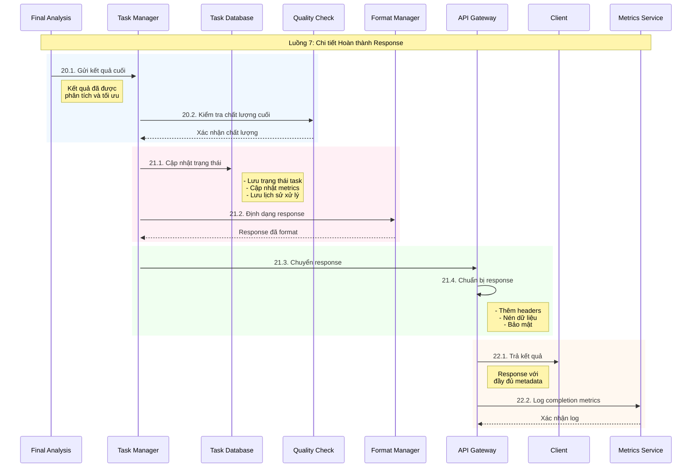

### Flow 7 Chi tiết Hoàn thành Response

Can you explain this section to me in more detail?

Copy
 %% Flow 7: Response Completion
    Note over FA,C: Flow 7: Response Completion
    FA->>TM: 20. Send Final Results
    TM->>TD: 21. Update Status
    TM->>AG: Forward Response
    AG->>C: 22. Return Results

Tôi sẽ giải thích chi tiết về Luồng 7 (Hoàn thành Response):




Chi tiết từng bước trong quy trình:

1. Gửi Kết quả Cuối (Final Results Delivery):
```python
class TaskManager:
    def process_final_results(self, final_results):
        try:
            # Kiểm tra chất lượng cuối cùng
            quality_check = self.quality_checker.verify_results(final_results)
            
            if not quality_check.is_acceptable():
                return self.handle_quality_issues(quality_check)
            
            # Chuẩn bị response
            prepared_response = {
                "task_id": final_results["task_id"],
                "status": "completed",
                "results": final_results["content"],
                "metadata": {
                    "processing_info": final_results["processing_info"],
                    "quality_metrics": quality_check.metrics,
                    "completion_timestamp": current_timestamp()
                }
            }
            
            return prepared_response
            
        except Exception as e:
            self.handle_processing_error(e, final_results)
```

2. Cập nhật Trạng thái (Status Update):
```python
class TaskDatabase:
    def update_task_status(self, task_id, final_results):
        update_data = {
            "status": "completed",
            "completion_time": current_timestamp(),
            "processing_history": {
                "start_time": final_results["metadata"]["start_time"],
                "end_time": current_timestamp(),
                "processing_steps": final_results["metadata"]["processing_steps"]
            },
            "performance_metrics": {
                "total_processing_time": calculate_processing_time(final_results),
                "resource_usage": calculate_resource_usage(final_results),
                "quality_scores": final_results["metadata"]["quality_scores"]
            }
        }
        
        # Cập nhật database
        self.db.update_task(task_id, update_data)
        
        # Log metrics
        self.metrics_service.log_completion_metrics(task_id, update_data)
```

3. Định dạng Response (Response Formatting):
```python
class ResponseFormatter:
    def format_response(self, results):
        # Cấu trúc response chuẩn
        formatted_response = {
            "status": "success",
            "data": {
                "task_id": results["task_id"],
                "content": self.format_content(results["content"]),
                "summary": self.generate_summary(results["content"]),
                "metadata": {
                    "processing_info": {
                        "total_time": results["metadata"]["processing_time"],
                        "resources_used": results["metadata"]["resources"],
                        "quality_score": results["metadata"]["quality_score"]
                    },
                    "usage": {
                        "tokens": results["metadata"]["token_usage"],
                        "cost": results["metadata"]["processing_cost"]
                    }
                }
            },
            "timestamp": current_timestamp()
        }
        
        return formatted_response
```

4. Trả Kết quả (Result Return):
```python
class APIGateway:
    def prepare_and_send_response(self, formatted_results):
        try:
            # Chuẩn bị headers
            headers = {
                "Content-Type": "application/json",
                "X-Request-ID": formatted_results["task_id"],
                "X-Processing-Time": str(formatted_results["metadata"]["processing_info"]["total_time"]),
                "X-Response-Version": "1.0"
            }
            
            # Nén dữ liệu nếu cần
            if self.should_compress(formatted_results):
                response_data = self.compress_response(formatted_results)
                headers["Content-Encoding"] = "gzip"
            else:
                response_data = formatted_results
            
            # Log metrics trước khi gửi
            self.log_response_metrics(formatted_results)
            
            # Gửi response
            return {
                "statusCode": 200,
                "headers": headers,
                "body": response_data
            }
            
        except Exception as e:
            return self.handle_response_error(e, formatted_results)
```

Các tính năng chính:

1. Xử lý Kết quả Cuối:
   - Kiểm tra chất lượng cuối cùng
   - Validation toàn diện
   - Tối ưu hóa format
   - Bổ sung metadata

2. Quản lý Trạng thái:
   - Cập nhật database
   - Lưu lịch sử xử lý
   - Tracking metrics
   - Audit logging

3. Format Response:
   - Chuẩn hóa cấu trúc
   - Tối ưu hóa dữ liệu
   - Thêm metadata
   - Nén dữ liệu

4. Logging và Monitoring:
   - Performance metrics
   - Usage statistics
   - Error tracking
   - Audit trail

Ví dụ về Response Structure:
```python
response = {
    "status": "success",
    "data": {
        "task_id": "task-123",
        "content": {
            "main_result": "...",
            "additional_info": "...",
            "suggestions": [...]
        },
        "metadata": {
            "processing_info": {
                "start_time": "2024-02-19T10:00:00Z",
                "end_time": "2024-02-19T10:01:30Z",
                "total_time": "90s",
                "steps_completed": 7
            },
            "usage_metrics": {
                "total_tokens": 3500,
                "prompt_tokens": 500,
                "completion_tokens": 3000,
                "cost": 0.45
            },
            "quality_metrics": {
                "coherence_score": 0.95,
                "relevance_score": 0.92,
                "completeness_score": 0.88
            }
        }
    },
    "timestamp": "2024-02-19T10:01:31Z"
}
```

Bạn muốn tìm hiểu thêm về phần nào trong Luồng 7 không?