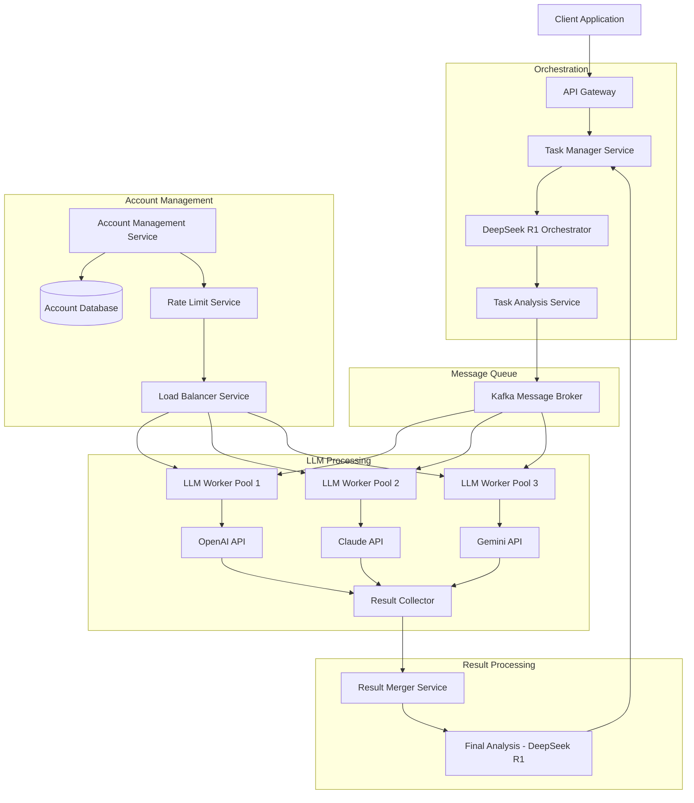
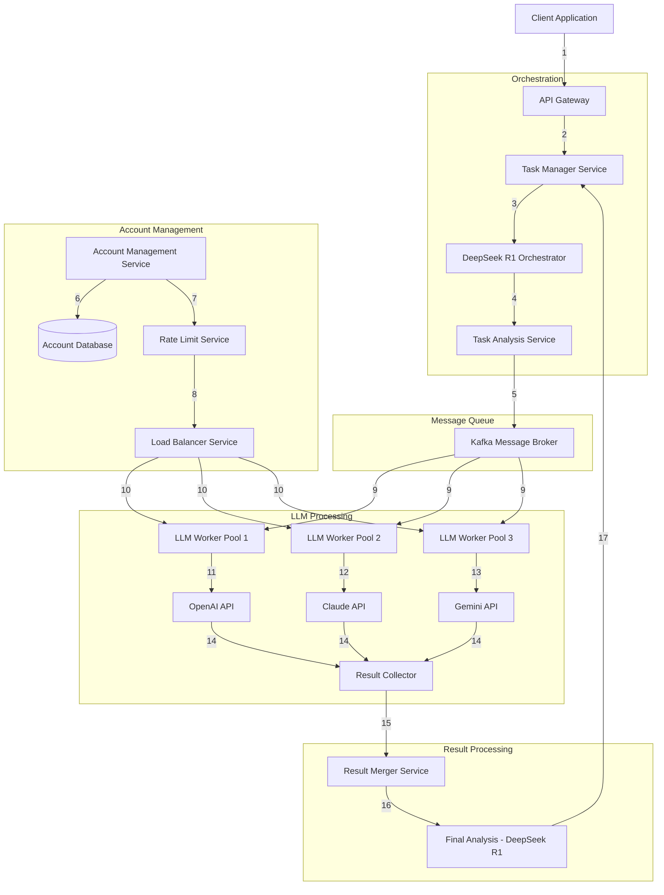
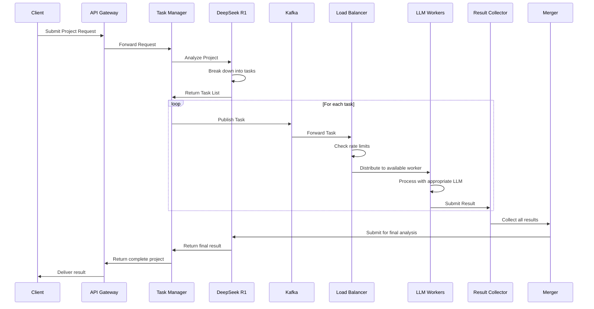
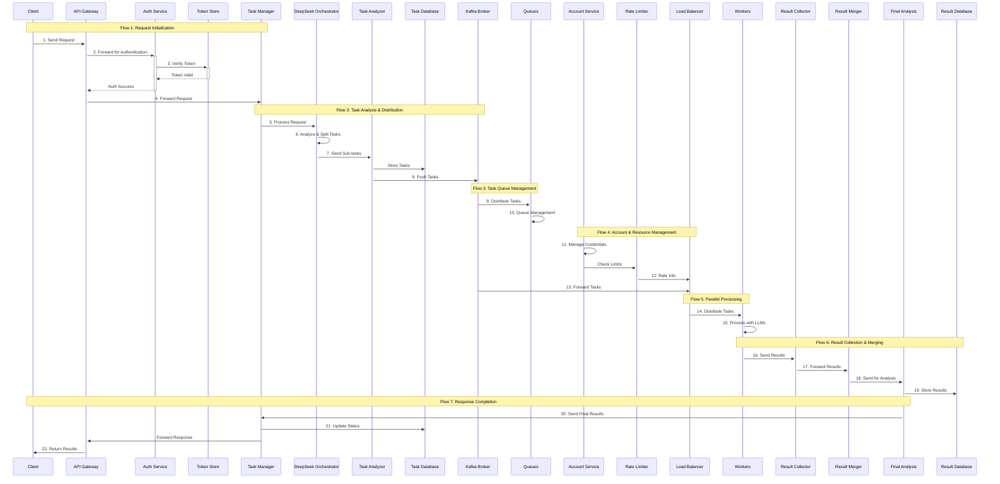

### Tôi muốn bạn hỗ trợ tôi phần tích,  làm một plan (Hãy bổ sung và làm rõ thêm các ý nếu còn thiếu cho ý tưởng sau ) về 1 hệ thống như mô tả sau:
Hệ thống gần giống https://openrouter.ai/ 
idea:
Có n tài khoản gmail được tạo trước và tương ứng với nó có n tài khoản đã được đăng kí trước với các LLM sau :
   + Có n tài khoản OpenAI
   + có n tài khoản Genmini
   + Có n tài khoản Claude
   + Có n tài khoản DeepSeek
   + Có n tài khoản Qwen-2.5
   
để xử lý dự án lớn với n task cụ thể , đối với mỗi một yêu cầu cụ thể hãy :
  - Dùng 1 Mô hình ngôn ngữ lớn như DeepSeek R1 làm LLM chính có nhiệm vụ điều phối , chia task , làm rõ task nếu task chưa rõ.
  - Sau khi có danh sách Task hãy đẩy lần lượt các task qua Kafka lần lượt tới các Mô hình ngôn ngữ lơn sau :  để thực hiện đa tiến trình các task , 
    sau đó Merge kết quả n tiến trình trên để cho LLM DeepSeek R1 đánh giá task hoàn thành
  - Tôi muốn chạy song song , đa tiến trình , tự động cân bằng các lần gọi các task với giới hạn limit của mối mô hình ngôn ngữ lớn . 
  - sử dụng với n tài khoản gmail để gọi API LLM như OpenAI , Claude , Genmini ,.... 
  
Kết quả mong muốn :
  - Hãy dùng lib pip diagram python  trả về cho tôi 1 bản vẽ   Thiết kế Kiến trúc hệ thống (Microservice Architecture)
  - Dùng StartUML hãy vẽ biểu đồ Tuần tư từng luồng / flow mà bạn đã phân tích được.


## Res
  Tôi sẽ giúp phân tích và thiết kế kiến trúc hệ thống theo yêu cầu của bạn. Đầu tiên, hãy tạo sơ đồ kiến trúc hệ thống microservice.




## Đánh số thứ tự :


Bây giờ, tôi sẽ tạo biểu đồ tuần tự để mô tả chi tiết luồng xử lý:


Giải thích chi tiết về kiến trúc hệ thống:

1. Thành phần chính:

- API Gateway: Điểm vào duy nhất của hệ thống, xử lý authentication và routing
- Task Manager Service: Quản lý và theo dõi trạng thái của các task
- DeepSeek R1 Orchestrator: LLM chính điều phối và phân tích task
- Kafka Message Broker: Hệ thống message queue để phân phối task
- Account Management Service: Quản lý tài khoản và credentials các LLM
- Rate Limit Service: Đảm bảo không vượt quá giới hạn API của các LLM
- Load Balancer Service: Cân bằng tải giữa các worker
- Worker Pools: Các nhóm worker xử lý task với các LLM khác nhau
- Result Collector & Merger: Thu thập và tổng hợp kết quả

2. Luồng xử lý chính:

- Client gửi yêu cầu project qua API Gateway
- Task Manager chuyển cho DeepSeek R1 phân tích và chia nhỏ thành các task
- Các task được đưa vào Kafka queue
- Load Balancer phân phối task cho các worker pool dựa trên:
  + Tình trạng rate limit của từng LLM
  + Số lượng tài khoản khả dụng
  + Khả năng xử lý của từng worker pool
- Các worker xử lý task song song với LLM tương ứng
- Result Collector thu thập kết quả
- Merger tổng hợp kết quả
- DeepSeek R1 phân tích kết quả cuối cùng
- Trả về kết quả cho client

3. Các điểm quan trọng:

- Hệ thống có khả năng scale theo chiều ngang
- Xử lý song song nhiều task
- Tự động cân bằng tải và rate limit
- Fault tolerance với việc sử dụng message queue
- Monitoring và logging tập trung
- Circuit breaker pattern cho các API call

Bạn có cần tôi làm rõ thêm phần nào không?
  

## Giải thích 17 Step in flow


Tôi sẽ giải thích các flow chính theo thứ tự trong diagram, đánh số từ 1-15 cho các luồng xử lý quan trọng:

Flow Khởi tạo Request:
1. Client Application → API Gateway
2. API Gateway → Task Manager Service

Flow Phân tích và Phân chia Task:
3. Task Manager Service → DeepSeek R1 Orchestrator 
4. DeepSeek R1 Orchestrator → Task Analysis Service
5. Task Analysis Service → Kafka Message Broker

Flow Quản lý Tài khoản và Rate Limit:
6. Account Management Service → Account Database
7. Account Management Service → Rate Limit Service
8. Rate Limit Service → Load Balancer Service

Flow Phân phối và Xử lý Task:
9. Kafka Message Broker → Worker Pools (1,2,3)
10. Load Balancer Service → Worker Pools (1,2,3)
11. Worker Pool 1 → OpenAI API
12. Worker Pool 2 → Claude API
13. Worker Pool 3 → Gemini API

Flow Thu thập và Xử lý Kết quả:
14. LLM APIs (OpenAI, Claude, Gemini) → Result Collector
15. Result Collector → Result Merger Service
16. Result Merger Service → Final Analysis (DeepSeek R1)
17. Final Analysis → Task Manager Service

Vòng lặp hoàn thành:
18. Quay lại Task Manager Service để kiểm tra và trả kết quả cuối cùng

Mỗi flow được thiết kế để hoạt động độc lập và có thể scale theo nhu cầu. Hệ thống sử dụng các microservice riêng biệt cho từng chức năng, cho phép:
- Xử lý đồng thời nhiều task
- Tự động cân bằng tải giữa các worker
- Quản lý hiệu quả rate limit của các LLM API
- Thu thập và tổng hợp kết quả một cách đáng tin cậy

Các số thứ tự này thể hiện luồng logic của dữ liệu từ khi nhận request ban đầu cho đến khi hoàn thành và trả về kết quả cuối cùng cho client.


## Hãy dùng lib pip diagram python trả về cho tôi 1 bản vẽ  final Thiết kế Kiến trúc hệ thống (Microservice Architecture)
Tôi sẽ tạo một bản vẽ chi tiết hơn về kiến trúc hệ thống bằng Python với thư viện diagrams.

```python
from diagrams import Diagram, Cluster, Edge
from diagrams.k8s.compute import Pod, StatefulSet
from diagrams.k8s.network import Service
from diagrams.aws.integration import SQS
from diagrams.aws.database import RDS
from diagrams.onprem.queue import Kafka
from diagrams.programming.framework import React
from diagrams.onprem.compute import Server
from diagrams.aws.network import APIGateway
from diagrams.aws.security import IAM
from diagrams.aws.storage import S3
from diagrams.aws.analytics import EMR

with Diagram("LLM Processing System Architecture", show=False, direction="TB"):
    # Client and API Gateway
    client = React("Client Application")
    api_gateway = APIGateway("API Gateway")
    
    # Authentication & Authorization
    with Cluster("Security Layer"):
        auth = IAM("Auth Service")
        token_store = S3("Token Store")
        auth - token_store

    # Task Management
    with Cluster("Task Management"):
        task_manager = Server("Task Manager")
        deepseek = Pod("DeepSeek R1\nOrchestrator")
        task_analyzer = Pod("Task Analyzer")
        task_db = RDS("Task Database")
        
        task_manager >> deepseek >> task_analyzer
        task_analyzer - task_db

    # Message Queue
    with Cluster("Message Queue"):
        kafka = Kafka("Kafka Broker")
        kafka_cluster = [
            SQS("Queue 1"),
            SQS("Queue 2"),
            SQS("Queue 3")
        ]
        kafka >> Edge(color="darkgreen") >> kafka_cluster

    # Account Management
    with Cluster("Account Management"):
        account_service = StatefulSet("Account Service")
        rate_limiter = Pod("Rate Limiter")
        load_balancer = Service("Load Balancer")
        account_db = RDS("Account DB")
        
        account_service >> rate_limiter >> load_balancer
        account_service - account_db

    # LLM Workers
    with Cluster("LLM Processing"):
        workers = [
            Pod("OpenAI Workers"),
            Pod("Claude Workers"),
            Pod("Gemini Workers"),
            Pod("DeepSeek Workers"),
            Pod("Qwen Workers")
        ]
        result_collector = StatefulSet("Result Collector")
        
        for worker in workers:
            worker >> result_collector

    # Result Processing
    with Cluster("Result Processing"):
        merger = EMR("Result Merger")
        final_analysis = Pod("Final Analysis")
        result_db = RDS("Result Database")
        
        result_collector >> merger >> final_analysis
        final_analysis - result_db

    # Connect components
    client >> api_gateway >> auth
    api_gateway >> task_manager
    task_analyzer >> kafka
    kafka >> load_balancer
    load_balancer >> workers
    final_analysis >> task_manager
```

Tôi đã tạo một diagram sử dụng Python với thư viện diagrams để thể hiện kiến trúc hệ thống hoàn chỉnh. Diagram này bao gồm các thành phần chính:

1. Frontend Layer:
   - Client Application
   - API Gateway làm điểm vào duy nhất

2. Security Layer:
   - Authentication Service
   - Token Store để quản lý phiên và xác thực

3. Task Management:
   - Task Manager điều phối
   - DeepSeek R1 Orchestrator phân tích và chia task
   - Task Database lưu trữ thông tin

4. Message Queue Layer:
   - Kafka Broker chính
   - Multiple queues cho các loại task khác nhau

5. Account Management:
   - Account Service quản lý tài khoản
   - Rate Limiter theo dõi giới hạn API
   - Load Balancer phân phối tải
   - Account Database

6. Processing Layer:
   - Worker pools cho từng LLM (OpenAI, Claude, Gemini, DeepSeek, Qwen)
   - Result Collector thu thập kết quả
   - Result Merger tổng hợp
   - Final Analysis với DeepSeek R1

7. Storage Layer:
   - Task Database
   - Result Database
   - Token Store

Diagram thể hiện rõ luồng dữ liệu và mối quan hệ giữa các thành phần:
- Các arrow thể hiện luồng xử lý
- Các cluster nhóm các thành phần liên quan
- Màu sắc phân biệt các loại service khác nhau
- Icons trực quan cho từng loại service

Bạn có muốn tôi điều chỉnh hoặc bổ sung thêm thành phần nào không?

## Tôi sẽ giải thích chi tiết các flow chính trong hệ thống theo thứ tự xử lý:

Flow 1: Khởi tạo Request
1. Client Application gửi request đến API Gateway
2. API Gateway chuyển request đến Authentication Service (Security Layer)
3. Auth Service xác thực với Token Store
4. Sau khi xác thực thành công, request được chuyển đến Task Manager

Flow 2: Task Analysis & Distribution
5. Task Manager nhận request và chuyển cho DeepSeek R1 Orchestrator
6. DeepSeek R1 phân tích và chia nhỏ thành các sub-tasks
7. Task Analyzer nhận các sub-tasks và lưu vào Task Database
8. Task Analyzer đẩy các tasks vào Kafka Broker

Flow 3: Task Queue Management
9. Kafka Broker phân phối tasks vào các Queue (Queue 1, 2, 3)
10. Các Queue giữ tasks trong hàng đợi cho đến khi có worker sẵn sàng

Flow 4: Account & Resource Management
11. Account Service quản lý và cung cấp credentials cho các LLM
12. Rate Limiter kiểm tra giới hạn API call cho mỗi service
13. Load Balancer nhận tasks từ Kafka và phân phối cho các worker dựa trên:
    - Thông tin rate limit từ Rate Limiter
    - Tình trạng tài khoản từ Account DB

Flow 5: Parallel Processing
14. Load Balancer phân phối tasks cho các worker pools:
    - OpenAI Workers
    - Claude Workers
    - Gemini Workers
    - DeepSeek Workers
    - Qwen Workers
15. Các worker xử lý task song song với các LLM tương ứng

Flow 6: Result Collection & Merging
16. Result Collector nhận kết quả từ tất cả các workers
17. Result Merger tổng hợp các kết quả thành một output tổng thể
18. Final Analysis (DeepSeek R1) đánh giá và tinh chỉnh kết quả cuối
19. Kết quả được lưu vào Result Database

Flow 7: Response Completion
20. Final Analysis gửi kết quả về Task Manager
21. Task Manager cập nhật trạng thái task trong Task Database
22. Kết quả cuối cùng được trả về cho client thông qua API Gateway

Các Flow Phụ:
- Monitoring Flow: Theo dõi trạng thái của tất cả các components
- Error Handling Flow: Xử lý các lỗi và retry logic
- Scaling Flow: Tự động scale các workers dựa trên tải
- Cleanup Flow: Dọn dẹp resources và cập nhật trạng thái

Mỗi flow được thiết kế để:
- Đảm bảo tính atomic
- Có khả năng retry
- Được log đầy đủ
- Có error handling
- Có thể scale độc lập

Bạn có muốn tôi giải thích chi tiết thêm về flow nào không?


#### Dùng Mermaid hãy vẽ biểu đồ sequence diagram Tuần tư đủ 7 flow quan trọng nhất như sau :
Flow 1: Khởi tạo Request
1. Client Application gửi request đến API Gateway
2. API Gateway chuyển request đến Authentication Service (Security Layer)
3. Auth Service xác thực với Token Store
4. Sau khi xác thực thành công, request được chuyển đến Task Manager

Flow 2: Task Analysis & Distribution
5. Task Manager nhận request và chuyển cho DeepSeek R1 Orchestrator
6. DeepSeek R1 phân tích và chia nhỏ thành các sub-tasks
7. Task Analyzer nhận các sub-tasks và lưu vào Task Database
8. Task Analyzer đẩy các tasks vào Kafka Broker

Flow 3: Task Queue Management
9. Kafka Broker phân phối tasks vào các Queue (Queue 1, 2, 3)
10. Các Queue giữ tasks trong hàng đợi cho đến khi có worker sẵn sàng

Flow 4: Account & Resource Management
11. Account Service quản lý và cung cấp credentials cho các LLM
12. Rate Limiter kiểm tra giới hạn API call cho mỗi service
13. Load Balancer nhận tasks từ Kafka và phân phối cho các worker dựa trên:
    - Thông tin rate limit từ Rate Limiter
    - Tình trạng tài khoản từ Account DB

Flow 5: Parallel Processing
14. Load Balancer phân phối tasks cho các worker pools:
    - OpenAI Workers
    - Claude Workers
    - Gemini Workers
    - DeepSeek Workers
    - Qwen Workers
15. Các worker xử lý task song song với các LLM tương ứng

Flow 6: Result Collection & Merging
16. Result Collector nhận kết quả từ tất cả các workers
17. Result Merger tổng hợp các kết quả thành một output tổng thể
18. Final Analysis (DeepSeek R1) đánh giá và tinh chỉnh kết quả cuối
19. Kết quả được lưu vào Result Database

Flow 7: Response Completion
20. Final Analysis gửi kết quả về Task Manager
21. Task Manager cập nhật trạng thái task trong Task Database
22. Kết quả cuối cùng được trả về cho client thông qua API Gateway

-----
Tôi sẽ tạo sequence diagram thể hiện 7 flow chính của hệ thống:



Trong sequence diagram này, tôi đã thể hiện đầy đủ 7 flow chính với các đặc điểm sau:

1. Sắp xếp các thành phần (participants) theo thứ tự xử lý logic từ trái sang phải
2. Sử dụng Note blocks để phân chia rõ ràng các flow
3. Đánh số các bước tương ứng với flow description
4. Thể hiện các parallel processing bằng cách gộp nhóm các tương tác liên quan
5. Sử dụng các loại arrow khác nhau để phân biệt:
   - ->> : Synchronous request
   - -->> : Response
   - -x : Error/Failed request
   
Mỗi flow được tách biệt rõ ràng và có thể theo dõi được luồng xử lý từ đầu đến cuối. Diagram cũng thể hiện được tính song song của hệ thống, đặc biệt là trong các phần:
- Worker processing
- Queue management
- Result collection

Bạn có muốn tôi điều chỉnh hoặc làm rõ thêm phần nào của diagram không?

## https://claude.site/artifacts/d9bc1275-ddf2-4a9b-b8a6-cafbc5bd6dbb