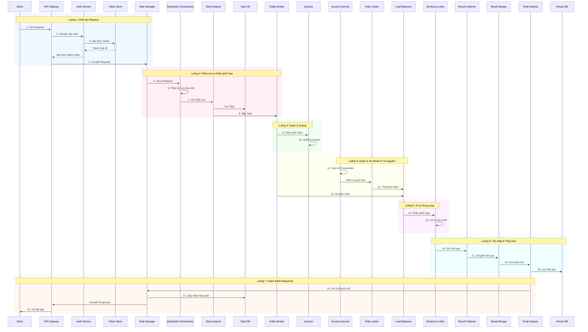

Tôi sẽ giải thích chi tiết về 7 luồng xử lý trong hệ thống:

Chi tiết từng luồng xử lý:

1. Luồng 1: Khởi tạo Request
- Bước 1: Client gửi request đến API Gateway
- Bước 2: API Gateway chuyển request đến Auth Service
- Bước 3: Auth Service xác thực token với Token Store
- Bước 4: Sau khi xác thực thành công, request được chuyển đến Task Manager

2. Luồng 2: Phân tích Task
- Bước 5: Task Manager xử lý request
- Bước 6: DeepSeek Orchestrator phân tích và chia nhỏ task
- Bước 7: Gửi các task con đến Task Analyzer
- Bước 8: Lưu trữ task và đẩy vào Kafka

3. Luồng 3: Quản lý Queue
- Bước 9: Kafka Broker phân phối task vào các queue
- Bước 10: Các queue quản lý task trong hàng đợi

4. Luồng 4: Quản lý Tài nguyên
- Bước 11: Account Service quản lý credentials
- Bước 12: Rate Limiter kiểm tra giới hạn API
- Bước 13: Load Balancer nhận thông tin và task

5. Luồng 5: Xử lý Song song
- Bước 14: Load Balancer phân phối task cho workers
- Bước 15: Workers xử lý task với các LLM

6. Luồng 6: Thu thập Kết quả
- Bước 16: Workers gửi kết quả đến Result Collector
- Bước 17: Result Collector chuyển đến Result Merger
- Bước 18: Gửi đến Final Analysis để đánh giá
- Bước 19: Lưu kết quả vào Result Database

7. Luồng 7: Hoàn thành Response
- Bước 20: Final Analysis gửi kết quả cuối về Task Manager
- Bước 21: Task Manager cập nhật trạng thái
- Bước 22: Trả kết quả cuối cùng về cho Client

Đặc điểm quan trọng:
1. Xử lý Bất đồng bộ:
   - Sử dụng message queue (Kafka)
   - Xử lý song song nhiều task
   - Không blocking giữa các bước

2. Quản lý Tài nguyên:
   - Kiểm soát rate limit
   - Cân bằng tải
   - Quản lý credentials

3. Đảm bảo Chất lượng:
   - Xác thực ở nhiều bước
   - Lưu trữ trạng thái
   - Kiểm tra kết quả

4. Khả năng Mở rộng:
   - Thiết kế modular
   - Có thể scale từng component
   - Xử lý độc lập các luồng

Bạn muốn tìm hiểu thêm về phần nào trong các luồng xử lý này không?