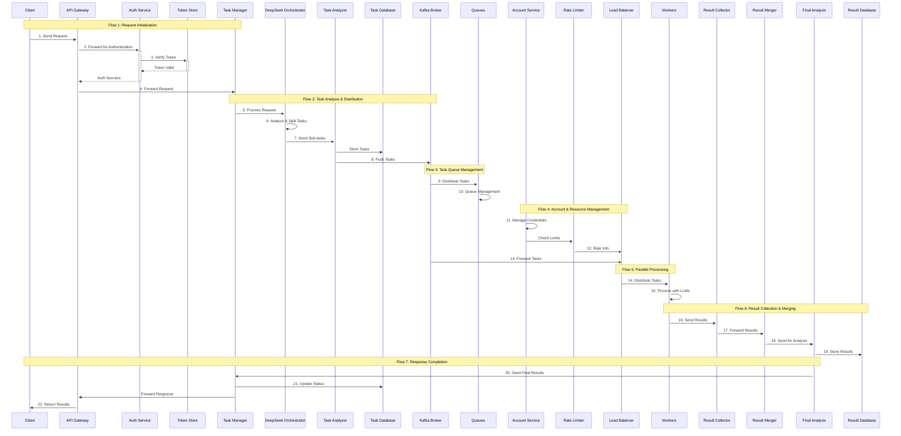

## tạo sequence diagram thể hiện 7 flow chính của hệ thống
Tôi sẽ tạo sequence diagram thể hiện 7 flow chính của hệ thống:

Trong sequence diagram này, tôi đã thể hiện đầy đủ 7 flow chính với các đặc điểm sau:

1. Sắp xếp các thành phần (participants) theo thứ tự xử lý logic từ trái sang phải
2. Sử dụng Note blocks để phân chia rõ ràng các flow
3. Đánh số các bước tương ứng với flow description
4. Thể hiện các parallel processing bằng cách gộp nhóm các tương tác liên quan
5. Sử dụng các loại arrow khác nhau để phân biệt:
   - ->> : Synchronous request
   - -->> : Response
   - -x : Error/Failed request
   
Mỗi flow được tách biệt rõ ràng và có thể theo dõi được luồng xử lý từ đầu đến cuối. Diagram cũng thể hiện được tính song song của hệ thống, đặc biệt là trong các phần:
- Worker processing
- Queue management
- Result collection