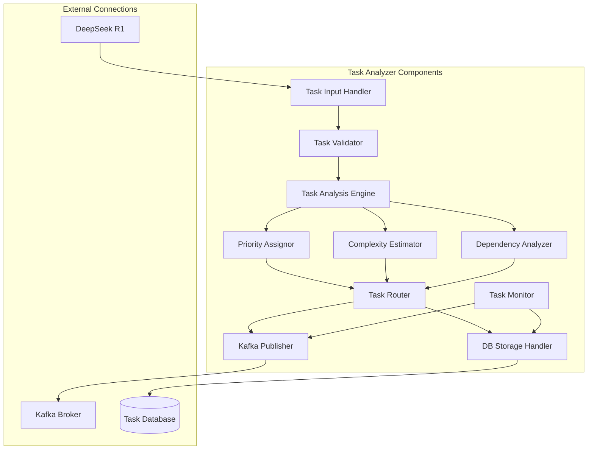

### Can you explain "Task Analyzer" to me in more detail?

Let me explain the Task Analyzer component in detail:



The Task Analyzer's key components and responsibilities:

1. Input Handler:
   - Receives subtasks from DeepSeek R1 Orchestrator
   - Normalizes input format
   - Performs initial validation of task structure

2. Task Validator:
   - Validates task requirements and parameters
   - Checks for required fields and data types
   - Ensures task compatibility with available LLMs
   - Validates resource requirements

3. Task Analysis Engine:
   - Analyzes task complexity and requirements
   - Breaks down into three main aspects:
     a. Priority Assignor: Determines task priority based on:
        - User requirements
        - Task dependencies
        - Resource availability
     b. Complexity Estimator: Evaluates:
        - Computational requirements
        - Expected processing time
        - Required LLM capabilities
     c. Dependency Analyzer: Identifies:
        - Task dependencies
        - Execution order requirements
        - Resource dependencies

4. Task Router:
   - Determines optimal processing path
   - Assigns tasks to appropriate queues
   - Considers:
     - Task priority
     - Available resources
     - Load balancing requirements
     - LLM capabilities

5. Storage Handler:
   - Manages task persistence in database
   - Stores:
     - Task metadata
     - Processing requirements
     - Dependencies
     - Current status
     - Execution history

6. Kafka Publisher:
   - Prepares tasks for distribution
   - Handles:
     - Message formatting
     - Queue selection
     - Delivery confirmation
     - Retry logic

7. Task Monitor:
   - Monitors task status
   - Tracks:
     - Processing progress
     - Resource utilization
     - Error conditions
     - Performance metrics

Key Features:
- Real-time task analysis
- Dynamic priority adjustment
- Intelligent resource allocation
- Automatic error handling
- Performance optimization
- Scale-out architecture

Example Task Processing Flow:
```python
# Example task structure
task = {
    "id": "task-123",
    "type": "text-analysis",
    "priority": "high",
    "dependencies": ["task-122"],
    "requirements": {
        "llm": "gpt-4",
        "min_tokens": 1000,
        "max_tokens": 4000
    },
    "metadata": {
        "user_id": "user-456",
        "project_id": "proj-789"
    }
}

# Processing steps
1. Input Handler receives and normalizes task
2. Validator checks task structure and requirements
3. Analysis Engine:
   - Assigns priority level: P1
   - Estimates complexity: Medium
   - Identifies dependencies: 1 predecessor
4. Router determines optimal queue and processing path
5. Storage Handler persists task information
6. Kafka Publisher sends task to appropriate queue
7. Monitor tracks task through processing lifecycle
```

Integration Points:
1. Upstream:
   - DeepSeek R1 Orchestrator
   - Task Manager Service
   - Configuration Service

2. Downstream:
   - Kafka Message Broker
   - Task Database
   - Monitoring System
   - Load Balancer

Would you like me to elaborate on any specific aspect of the Task Analyzer?