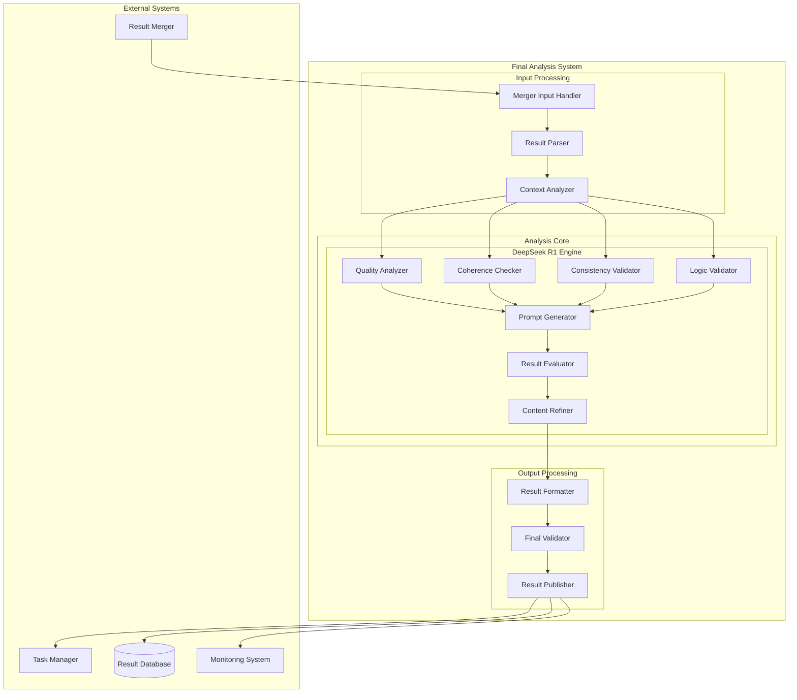

### Final Analysis . Can you explain this section to me in more detail?
 
 Let me explain the Final Analysis (DeepSeek R1) component in detail:



The Final Analysis component's key elements and responsibilities:

1. Input Processing:
   a. Merger Input Handler:
      - Receives merged results from Result Merger
      - Validates input format
      - Manages input queue
      ```python
      # Example input structure
      input_data = {
          "task_id": "task-123",
          "merged_results": [
              {
                  "llm": "gpt-4",
                  "content": "...",
                  "confidence": 0.95,
                  "metadata": {...}
              },
              {
                  "llm": "claude",
                  "content": "...",
                  "confidence": 0.92,
                  "metadata": {...}
              }
          ],
          "context": {...},
          "requirements": {...}
      }
      ```

   b. Result Parser:
      - Normalizes data format
      - Extracts key information
      - Prepares for analysis

   c. Context Analyzer:
      - Analyzes original task context
      - Identifies key requirements
      - Sets evaluation criteria

2. Analysis Core:
   a. Quality Analysis Components:
      - Quality Analyzer:
        * Evaluates result quality
        * Checks completeness
        * Validates against requirements
      
      - Coherence Checker:
        * Ensures logical flow
        * Checks narrative consistency
        * Validates structural integrity
      
      - Consistency Validator:
        * Cross-references multiple results
        * Checks for contradictions
        * Validates factual consistency
      
      - Logic Validator:
        * Validates logical reasoning
        * Checks argument structure
        * Ensures conclusion validity

   b. DeepSeek R1 Engine:
      - Prompt Generator:
        * Creates evaluation prompts
        * Includes context and criteria
        * Generates refinement instructions
        ```python
        # Example prompt template
        prompt_template = """
        Task Context: {context}
        Original Requirements: {requirements}
        Merged Results: {merged_results}
        
        Evaluation Criteria:
        1. Accuracy and completeness
        2. Consistency across sources
        3. Logical coherence
        4. Requirement fulfillment
        
        Please analyze and refine the results considering:
        - Accuracy of information
        - Consistency of logic
        - Completeness of response
        - Alignment with requirements
        
        Provide:
        1. Quality assessment
        2. Identified issues
        3. Refined content
        4. Confidence score
        """
        ```

      - Result Evaluator:
        * Applies evaluation criteria
        * Generates quality scores
        * Identifies improvements needed
        
      - Content Refiner:
        * Improves content quality
        * Resolves inconsistencies
        * Enhances clarity

3. Output Processing:
   a. Result Formatter:
      - Structures final output
      - Applies formatting rules
      - Prepares metadata
      ```python
      # Example output structure
      final_output = {
          "task_id": "task-123",
          "final_result": {
              "content": "...",
              "quality_score": 0.96,
              "confidence": 0.94,
              "improvements_made": [...],
              "validation_summary": {...}
          },
          "metadata": {
              "processing_time": "1.2s",
              "version": "2.0",
              "refinement_steps": 3
          },
          "audit_trail": {
              "original_sources": [...],
              "changes_made": [...],
              "validation_checks": [...]
          }
      }
      ```

   b. Final Validator:
      - Performs final quality check
      - Validates output format
      - Ensures requirement completion

   c. Result Publisher:
      - Distributes final results
      - Updates task status
      - Triggers notifications

Key Features:
- Comprehensive quality analysis
- Multi-dimensional validation
- Intelligent content refinement
- Detailed audit trail
- High confidence scoring

Integration Points:
1. Input:
   - Result Merger Service
   - Task Context Repository
   - Quality Criteria Service

2. Output:
   - Task Manager
   - Result Database
   - Monitoring System
   - Audit System

Would you like me to elaborate on any specific aspect of the Final Analysis component?


