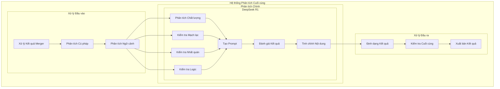

### Final Analysis . Can you explain this section to me in more detail?
 Tôi sẽ giải thích chi tiết về thành phần Final Analysis (Phân tích Cuối cùng) bằng DeepSeek R1:

Hệ thống Phân tích Cuối cùng gồm ba phần chính:

1. Phần Xử lý Đầu vào:

Module này có nhiệm vụ tiếp nhận và xử lý ban đầu các kết quả từ Result Merger. Nó bao gồm:

- Bộ xử lý kết quả Merger: Tiếp nhận dữ liệu từ Result Merger và kiểm tra tính hợp lệ của định dạng đầu vào. Ví dụ, khi nhận được kết quả từ các LLM khác nhau như GPT-4 hay Claude, module này sẽ đảm bảo các kết quả có đầy đủ thông tin như độ tin cậy, metadata và nội dung.

- Bộ phân tích cú pháp: Chuyển đổi dữ liệu thành định dạng chuẩn để xử lý tiếp theo. Module này cũng trích xuất các thông tin quan trọng từ kết quả như các điểm chính, logic luận điểm.

- Bộ phân tích ngữ cảnh: Phân tích yêu cầu ban đầu của task và thiết lập các tiêu chí đánh giá phù hợp.

2. Phần Phân tích Chính:

Đây là phần quan trọng nhất, sử dụng DeepSeek R1 để phân tích chuyên sâu. Bao gồm:

- Các thành phần phân tích chất lượng:
  * Đánh giá độ hoàn thiện và chính xác của nội dung
  * Kiểm tra tính mạch lạc trong luận điểm
  * Xác minh tính nhất quán giữa các phần
  * Kiểm tra logic tổng thể

- Động cơ DeepSeek R1:
  * Tạo ra các prompt phân tích chuyên sâu
  * Đánh giá kết quả theo nhiều tiêu chí
  * Tinh chỉnh nội dung để nâng cao chất lượng

3. Phần Xử lý Đầu ra:

Phần này hoàn thiện và phân phối kết quả cuối cùng:

- Bộ định dạng kết quả: Cấu trúc lại kết quả theo định dạng chuẩn, bao gồm nội dung chính, điểm chất lượng, và metadata.

- Bộ kiểm tra cuối cùng: Thực hiện kiểm tra chất lượng lần cuối và đảm bảo đáp ứng tất cả yêu cầu.

- Bộ xuất bản kết quả: Phân phối kết quả đến các thành phần liên quan như Task Manager và cơ sở dữ liệu.

Đặc điểm nổi bật:
- Phân tích đa chiều và toàn diện
- Quy trình kiểm tra chất lượng chặt chẽ
- Khả năng tinh chỉnh thông minh
- Theo dõi chi tiết quá trình xử lý
- Hệ thống chấm điểm độ tin cậy

Kết quả đầu ra bao gồm:
- Nội dung đã được tinh chỉnh
- Điểm chất lượng và độ tin cậy
- Tóm tắt các cải tiến đã thực hiện
- Thông tin metadata chi tiết
- Lịch sử kiểm tra và xác thực

Bạn muốn tôi giải thích thêm về phần nào của hệ thống Phân tích Cuối cùng không?