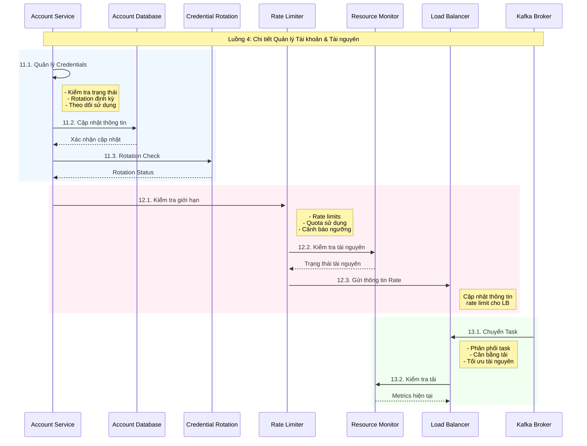

## Flow 4 : Chi tiết Quản lý Tài khoản & Tài nguyên
Can you explain this section to me in more detail?

Copy
    %% Flow 4: Resource Management
    Note over ACS,LB: Flow 4: Account & Resource Management
    ACS->>ACS: 11. Manage Credentials
    ACS->>+RL: Check Limits
    RL->>LB: 12. Rate Info
    KB->>LB: 13. Forward Tasks

Tôi sẽ giải thích chi tiết về Luồng 4 (Quản lý Tài khoản & Tài nguyên):



Chi tiết từng thành phần:

1. Account Service (Quản lý Credentials):
```python
class AccountService:
    def manage_credentials(self):
        # Kiểm tra trạng thái tài khoản
        accounts = self.get_active_accounts()
        
        for account in accounts:
            # Kiểm tra hạn mức sử dụng
            usage = self.check_account_usage(account)
            
            # Rotation credentials nếu cần
            if self.need_rotation(account):
                self.rotate_credentials(account)
            
            # Cập nhật trạng thái
            self.update_account_status(account, usage)

    def rotate_credentials(self, account):
        try:
            # Tạo credentials mới
            new_credentials = self.generate_new_credentials()
            
            # Cập nhật credentials cho các LLM
            self.update_llm_credentials(account, new_credentials)
            
            # Lưu lịch sử rotation
            self.log_rotation_history(account)
            
        except Exception as e:
            self.handle_rotation_error(e, account)
```

2. Rate Limiter (Kiểm soát Giới hạn):
```python
class RateLimiter:
    def check_limits(self, account):
        # Cấu trúc giới hạn cho từng LLM
        limits = {
            "openai": {
                "requests_per_min": 60,
                "tokens_per_min": 40000,
                "concurrent_requests": 10
            },
            "claude": {
                "requests_per_min": 50,
                "tokens_per_min": 35000,
                "concurrent_requests": 8
            },
            "gemini": {
                "requests_per_min": 45,
                "tokens_per_min": 30000,
                "concurrent_requests": 6
            }
        }
        
        # Kiểm tra usage hiện tại
        current_usage = self.get_current_usage(account)
        
        # Tính toán remaining limits
        remaining_limits = {}
        for llm, limit in limits.items():
            remaining_limits[llm] = {
                "requests": limit["requests_per_min"] - current_usage[llm]["requests"],
                "tokens": limit["tokens_per_min"] - current_usage[llm]["tokens"],
                "concurrent": limit["concurrent_requests"] - current_usage[llm]["concurrent"]
            }
            
        return remaining_limits
```

3. Resource Monitor (Giám sát Tài nguyên):
```python
class ResourceMonitor:
    def monitor_resources(self):
        # Thu thập metrics
        metrics = {
            "cpu": self.get_cpu_metrics(),
            "memory": self.get_memory_metrics(),
            "network": self.get_network_metrics(),
            "llm_services": self.get_llm_metrics()
        }
        
        # Tính toán health score
        health_scores = self.calculate_health_scores(metrics)
        
        # Cập nhật trạng thái
        self.update_resource_status(metrics, health_scores)
        
        # Kiểm tra cảnh báo
        self.check_alerts(metrics, health_scores)
        
        return metrics, health_scores
```

4. Load Balancer (Cân bằng Tải):
```python
class LoadBalancer:
    def distribute_task(self, task, rate_info):
        # Lấy thông tin tài nguyên hiện tại
        resources = self.resource_monitor.get_current_status()
        
        # Tính toán score cho mỗi worker
        worker_scores = {}
        for worker in self.available_workers:
            score = self.calculate_worker_score(
                worker=worker,
                task=task,
                rate_info=rate_info,
                resources=resources
            )
            worker_scores[worker] = score
        
        # Chọn worker phù hợp nhất
        selected_worker = max(worker_scores.items(), key=lambda x: x[1])[0]
        
        # Gửi task đến worker
        self.assign_task(selected_worker, task)
```

Các tính năng chính:

1. Quản lý Tài khoản:
   - Theo dõi trạng thái tài khoản
   - Rotation credentials định kỳ
   - Logging và monitoring usage
   - Cảnh báo vượt ngưỡng

2. Rate Limiting:
   - Kiểm soát số lượng request
   - Quản lý token usage
   - Giới hạn concurrent requests
   - Adaptive rate limiting

3. Resource Monitoring:
   - Theo dõi CPU, memory, network
   - Health check services
   - Performance metrics
   - Alert system

4. Load Balancing:
   - Dynamic task distribution
   - Resource-aware balancing
   - Priority-based routing
   - Fail-over handling

Ví dụ về cấu trúc dữ liệu monitoring:
```python
monitoring_data = {
    "account_status": {
        "account_id": "acc_123",
        "llm_credentials": {
            "openai": {"status": "active", "last_rotation": "2024-02-19T10:00:00Z"},
            "claude": {"status": "active", "last_rotation": "2024-02-19T09:00:00Z"},
            "gemini": {"status": "active", "last_rotation": "2024-02-19T08:00:00Z"}
        },
        "usage_metrics": {
            "daily_requests": 15000,
            "daily_tokens": 1200000,
            "cost": 25.50
        }
    },
    "rate_limits": {
        "openai": {
            "current_rpm": 45,
            "remaining_rpm": 15,
            "reset_time": "2024-02-19T10:01:00Z"
        },
        "claude": {
            "current_rpm": 35,
            "remaining_rpm": 15,
            "reset_time": "2024-02-19T10:01:00Z"
        }
    },
    "resource_status": {
        "cpu_usage": 65.5,
        "memory_usage": 78.2,
        "network_throughput": 850,
        "service_health": {
            "openai": "healthy",
            "claude": "healthy",
            "gemini": "degraded"
        }
    }
}
```

Bạn muốn tìm hiểu thêm về phần nào trong Luồng 4 không?