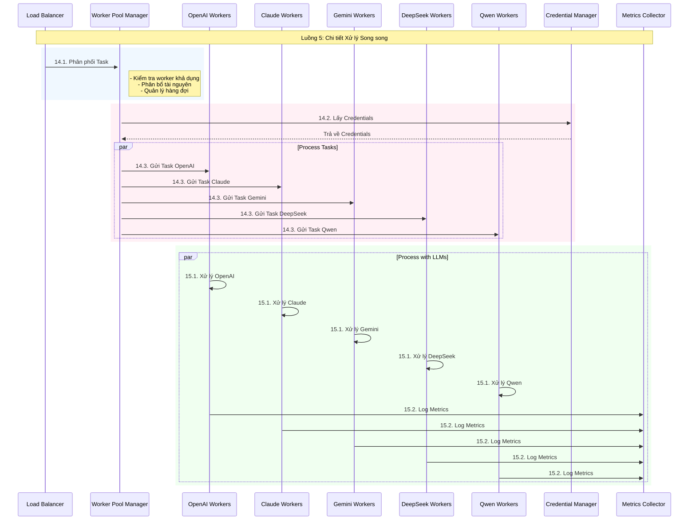

### Flow 5 Chi tiết Xử lý Song song
Can you explain this section to me in more detail?

Copy
  %% Flow 5: Parallel Processing
    Note over LB,W: Flow 5: Parallel Processing
    LB->>+W: 14. Distribute Tasks
    W->>W: 15. Process with LLMs
    
-----    

Tôi sẽ giải thích chi tiết về Luồng 5 (Xử lý Song song với LLMs):



Chi tiết các thành phần:

1. Worker Pool Manager (Quản lý Workers):
```python
class WorkerPoolManager:
    def __init__(self):
        self.worker_pools = {
            'openai': WorkerPool(model='gpt-4', max_workers=10),
            'claude': WorkerPool(model='claude-3', max_workers=8),
            'gemini': WorkerPool(model='gemini-pro', max_workers=8),
            'deepseek': WorkerPool(model='deepseek-67b', max_workers=6),
            'qwen': WorkerPool(model='qwen-72b', max_workers=6)
        }
        
    def distribute_task(self, task):
        # Xác định worker pool phù hợp
        pool = self.select_worker_pool(task)
        
        # Kiểm tra tài nguyên
        if not pool.has_available_workers():
            self.handle_resource_exhaustion(task)
            return
            
        # Lấy credentials
        credentials = self.credential_manager.get_credentials(pool.model_type)
        
        # Gửi task đến worker
        worker = pool.get_available_worker()
        worker.process_task(task, credentials)
```

2. LLM Worker Implementation:
```python
class LLMWorker:
    def process_task(self, task, credentials):
        try:
            # Chuẩn bị prompt
            prompt = self.prepare_prompt(task)
            
            # Thiết lập tham số
            parameters = {
                "temperature": task.get("temperature", 0.7),
                "max_tokens": task.get("max_tokens", 2000),
                "top_p": task.get("top_p", 0.95),
                "frequency_penalty": task.get("frequency_penalty", 0),
                "presence_penalty": task.get("presence_penalty", 0)
            }
            
            # Gọi API LLM
            response = self.call_llm_api(prompt, parameters, credentials)
            
            # Xử lý kết quả
            processed_result = self.process_response(response)
            
            # Log metrics
            self.log_metrics(task, response)
            
            return processed_result
            
        except Exception as e:
            self.handle_error(e, task)
```

3. Xử lý Song song với các LLM:
```python
class ParallelProcessor:
    async def process_parallel_tasks(self, tasks):
        async with aiohttp.ClientSession() as session:
            # Tạo coroutines cho mỗi task
            coroutines = []
            for task in tasks:
                if task.llm_type == "openai":
                    coroutines.append(self.process_openai_task(session, task))
                elif task.llm_type == "claude":
                    coroutines.append(self.process_claude_task(session, task))
                # Thêm các LLM khác...
            
            # Chạy các task song song
            results = await asyncio.gather(*coroutines, return_exceptions=True)
            
            # Xử lý kết quả
            processed_results = self.process_results(results)
            
            return processed_results
```

4. Quản lý Metrics:
```python
class MetricsCollector:
    def collect_metrics(self, task_execution):
        metrics = {
            "task_id": task_execution.id,
            "llm_type": task_execution.llm_type,
            "execution_time": task_execution.duration,
            "token_usage": {
                "prompt_tokens": task_execution.prompt_tokens,
                "completion_tokens": task_execution.completion_tokens,
                "total_tokens": task_execution.total_tokens
            },
            "performance": {
                "latency": task_execution.latency,
                "throughput": task_execution.throughput,
                "success_rate": task_execution.success_rate
            },
            "resource_usage": {
                "cpu": task_execution.cpu_usage,
                "memory": task_execution.memory_usage,
                "network": task_execution.network_usage
            }
        }
        
        # Lưu metrics
        self.store_metrics(metrics)
        
        # Kiểm tra ngưỡng cảnh báo
        self.check_alerts(metrics)
```

Các tính năng chính:

1. Xử lý Song song:
   - Concurrent task execution
   - Resource pooling
   - Load distribution
   - Error handling

2. Quản lý Worker:
   - Worker lifecycle
   - Health monitoring
   - Auto-scaling
   - Resource optimization

3. LLM Integration:
   - API management
   - Credential rotation
   - Rate limiting
   - Retry logic

4. Performance Monitoring:
   - Latency tracking
   - Resource usage
   - Success rates
   - Cost optimization

Ví dụ về cấu hình worker pool:
```python
worker_config = {
    "openai": {
        "model_configs": {
            "gpt-4": {
                "max_tokens": 8000,
                "timeout": 30,
                "retry_attempts": 3
            },
            "gpt-3.5-turbo": {
                "max_tokens": 4000,
                "timeout": 20,
                "retry_attempts": 2
            }
        },
        "pool_settings": {
            "min_workers": 2,
            "max_workers": 10,
            "scaling_factor": 1.5
        }
    },
    "claude": {
        "model_configs": {
            "claude-3": {
                "max_tokens": 10000,
                "timeout": 40,
                "retry_attempts": 3
            }
        },
        "pool_settings": {
            "min_workers": 2,
            "max_workers": 8,
            "scaling_factor": 1.5
        }
    }
}
```

Bạn muốn tìm hiểu thêm về phần nào trong Luồng 5 không?