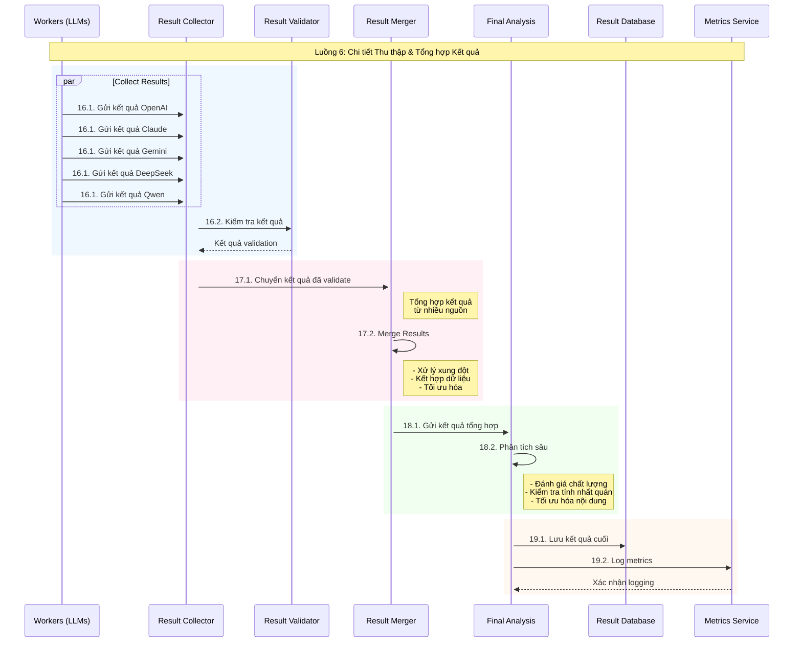

### Flow 6 Chi tiết Thu thập & Tổng hợp Kết quả

Can you explain this section to me in more detail?


Copy
%% Flow 6: Result Collection
    Note over W,RD: Flow 6: Result Collection & Merging
    W->>+RC: 16. Send Results
    RC->>+RM: 17. Forward Results
    RM->>+FA: 18. Send for Analysis
    FA->>RD: 19. Store Results

 ####   

Tôi sẽ giải thích chi tiết về Luồng 6 (Thu thập và Tổng hợp Kết quả):




Chi tiết từng bước trong quy trình:

1. Thu thập Kết quả (Result Collection):
```python
class ResultCollector:
    def collect_results(self, task_id, results):
        collected_results = {
            "task_id": task_id,
            "timestamp": current_timestamp(),
            "results": {},
            "metadata": {
                "collection_status": "in_progress",
                "total_expected": len(results),
                "received": 0,
                "errors": []
            }
        }
        
        # Thu thập kết quả từ các LLM
        for llm_result in results:
            try:
                # Validate kết quả
                validated_result = self.validator.validate_result(llm_result)
                
                # Thêm vào collected results
                collected_results["results"][llm_result["source"]] = {
                    "content": validated_result["content"],
                    "confidence": validated_result["confidence"],
                    "metrics": validated_result["metrics"],
                    "processing_time": validated_result["processing_time"]
                }
                
                collected_results["metadata"]["received"] += 1
                
            except Exception as e:
                collected_results["metadata"]["errors"].append({
                    "source": llm_result["source"],
                    "error": str(e)
                })
        
        return collected_results
```

2. Tổng hợp Kết quả (Result Merger):
```python
class ResultMerger:
    def merge_results(self, collected_results):
        merged_result = {
            "task_id": collected_results["task_id"],
            "content": {},
            "metadata": {
                "merge_timestamp": current_timestamp(),
                "sources": [],
                "confidence_scores": {},
                "processing_metrics": {}
            }
        }
        
        # Tổng hợp nội dung từ các nguồn
        for source, result in collected_results["results"].items():
            # Phân tích và kết hợp nội dung
            self.analyze_and_merge_content(merged_result, result)
            
            # Cập nhật metadata
            merged_result["metadata"]["sources"].append(source)
            merged_result["metadata"]["confidence_scores"][source] = result["confidence"]
            merged_result["metadata"]["processing_metrics"][source] = result["metrics"]
        
        # Xử lý xung đột
        self.resolve_conflicts(merged_result)
        
        # Tối ưu hóa kết quả
        self.optimize_merged_result(merged_result)
        
        return merged_result
```

3. Phân tích Cuối cùng (Final Analysis):
```python
class FinalAnalysis:
    def analyze_results(self, merged_results):
        analysis = {
            "task_id": merged_results["task_id"],
            "quality_metrics": self.analyze_quality(merged_results),
            "consistency_check": self.check_consistency(merged_results),
            "optimization_suggestions": self.generate_optimizations(merged_results),
            "final_confidence": self.calculate_final_confidence(merged_results)
        }
        
        # Tối ưu hóa nội dung cuối cùng
        optimized_content = self.optimize_content(
            merged_results["content"],
            analysis["optimization_suggestions"]
        )
        
        final_result = {
            "task_id": merged_results["task_id"],
            "content": optimized_content,
            "analysis": analysis,
            "metadata": {
                "processing_history": merged_results["metadata"],
                "final_processing_timestamp": current_timestamp()
            }
        }
        
        return final_result
```

4. Lưu trữ Kết quả (Result Storage):
```python
class ResultStorage:
    def store_results(self, final_result):
        try:
            # Chuẩn bị dữ liệu để lưu
            storage_data = {
                "task_id": final_result["task_id"],
                "content": final_result["content"],
                "analysis": final_result["analysis"],
                "metadata": {
                    **final_result["metadata"],
                    "storage_timestamp": current_timestamp(),
                    "version": "1.0"
                }
            }
            
            # Lưu vào database
            self.db.insert_result(storage_data)
            
            # Log metrics
            self.metrics_service.log_storage_metrics({
                "task_id": final_result["task_id"],
                "storage_size": len(str(storage_data)),
                "processing_time": calculate_processing_time(storage_data),
                "storage_timestamp": storage_data["metadata"]["storage_timestamp"]
            })
            
            return {
                "status": "success",
                "task_id": final_result["task_id"],
                "storage_id": storage_data["_id"]
            }
            
        except Exception as e:
            self.handle_storage_error(e, final_result)
```

Các tính năng chính:

1. Thu thập và Validation:
   - Tập hợp kết quả từ nhiều nguồn
   - Kiểm tra tính hợp lệ
   - Xử lý lỗi
   - Tracking tiến độ

2. Tổng hợp Thông minh:
   - Phân tích nội dung
   - Xử lý xung đột
   - Tối ưu hóa kết quả
   - Tính toán độ tin cậy

3. Phân tích Chuyên sâu:
   - Đánh giá chất lượng
   - Kiểm tra tính nhất quán
   - Đề xuất cải tiến
   - Tối ưu hóa cuối cùng

4. Lưu trữ và Tracking:
   - Persistent storage
   - Version control
   - Metrics logging
   - Audit trail

Bạn muốn tìm hiểu thêm về phần nào trong Luồng 6 không?