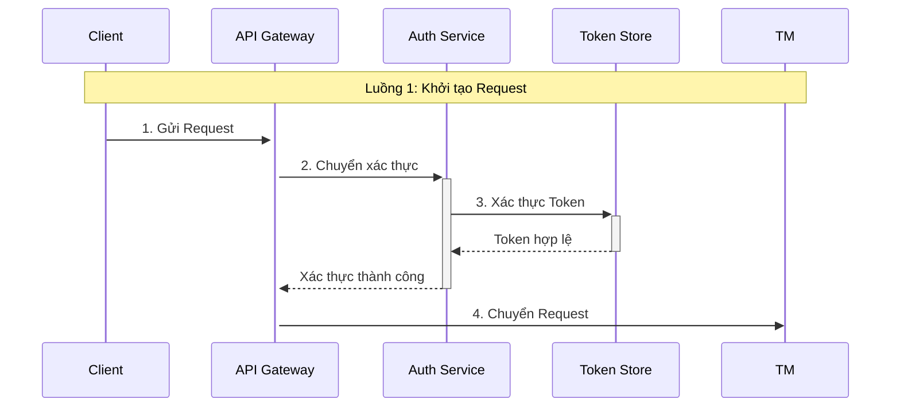
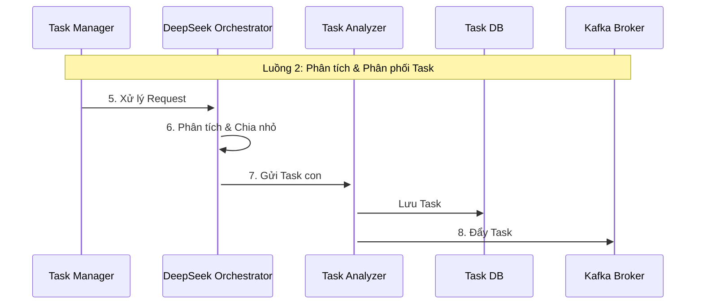
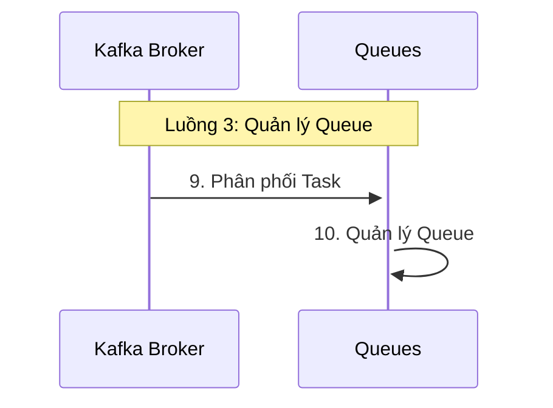
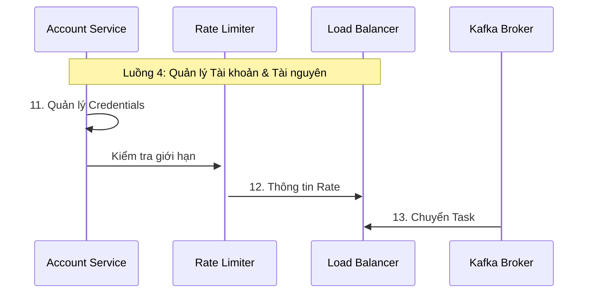
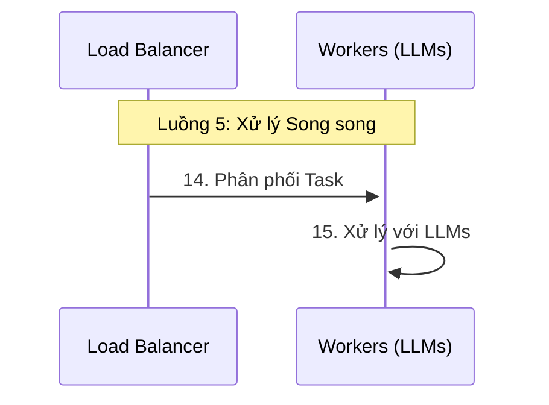
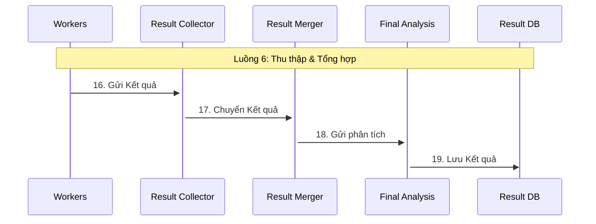
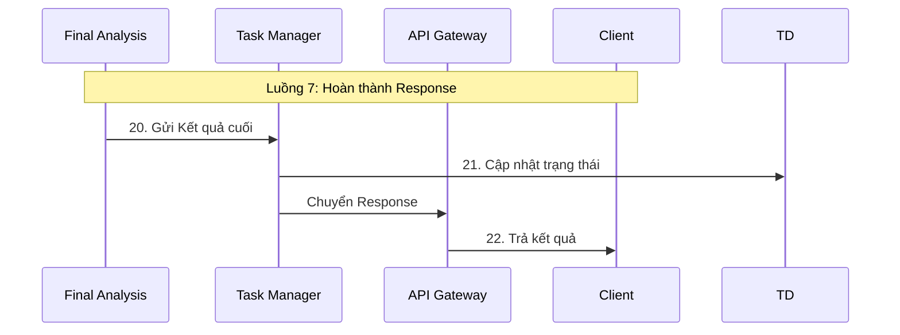

# Kiến Trúc Hệ Thống Xử Lý Đa LLM Trên Cơ Sở Hạ Tầng Tại Chỗ

## Tổng Quan

Hệ thống xử lý đa LLM được thiết kế để cung cấp giải pháp xử lý tác vụ phân tán, an toàn và có khả năng mở rộng cao, sử dụng nhiều mô hình ngôn ngữ lớn (LLM) khác nhau.

## Các Luồng Xử Lý Chi Tiết

### Luồng 1: Khởi Tạo Request



**Chi Tiết Luồng:**
- Bước 1: Client gửi request đến API Gateway
- Bước 2: API Gateway chuyển request đến Auth Service
- Bước 3: Auth Service xác thực token với Token Store
- Bước 4: Sau khi xác thực thành công, request được chuyển đến Task Manager

### Luồng 2: Phân Tích Task



**Chi Tiết Luồng:**
- Bước 5: Task Manager xử lý request
- Bước 6: DeepSeek Orchestrator phân tích và chia nhỏ task
- Bước 7: Gửi các task con đến Task Analyzer
- Bước 8: Lưu trữ task và đẩy vào Kafka

### Luồng 3: Quản Lý Queue



**Chi Tiết Luồng:**
- Bước 9: Kafka Broker phân phối task vào các queue
- Bước 10: Các queue quản lý task trong hàng đợi

### Luồng 4: Quản Lý Tài Nguyên



**Chi Tiết Luồng:**
- Bước 11: Account Service quản lý credentials
- Bước 12: Rate Limiter kiểm tra giới hạn API
- Bước 13: Load Balancer nhận thông tin và task

### Luồng 5: Xử Lý Song Song



**Chi Tiết Luồng:**
- Bước 14: Load Balancer phân phối task cho workers
- Bước 15: Workers xử lý task với các LLM

### Luồng 6: Thu Thập Kết Quả



**Chi Tiết Luồng:**
- Bước 16: Workers gửi kết quả đến Result Collector
- Bước 17: Result Collector chuyển đến Result Merger
- Bước 18: Gửi đến Final Analysis để đánh giá
- Bước 19: Lưu kết quả vào Result Database

### Luồng 7: Hoàn Thành Response



**Chi Tiết Luồng:**
- Bước 20: Final Analysis gửi kết quả cuối về Task Manager
- Bước 21: Task Manager cập nhật trạng thái
- Bước 22: Trả kết quả cuối cùng về cho Client

## Kiến Trúc Hạ Tầng Chi Tiết

```mermaid
graph TB
subgraph "1. Tầng Người Dùng"
WC[Web Client\nVue/React/Angular]
MC[Mobile Client\niOS/Android]
NGX[Nginx CDN Cluster]
FW[Cisco/Palo Alto\nFirewall Cluster]
end

subgraph "2. Tầng Bảo Mật"
WAF[ModSecurity WAF\nNginx Module]
API[Kong API Gateway\nEnterprise]
AUTH[Keycloak\nIdentity & Access]
TS[MinIO\nToken Storage]
end

subgraph "3. Tầng Xử Lý Dữ Liệu"
IV[Input Validator\nJSON Schema]
DS[Data Sanitizer\nCustom Rules]
SV[Schema Validator\nOpenAPI]
DT[Data Transformer\nApache NiFi]
end

subgraph "4. Tầng Điều Phối Tác Vụ"
TM[K8s Task Manager]
LO[LLM Orchestrator\nCustom Service]
TA[Task Analyzer\nML Model]
TD[(PostgreSQL 15\nTask DB)]
TC[(Redis 7\nTask Cache)]
end

subgraph "5. Tầng Quản Lý Queue"
KF[Kafka 3.5\nCluster]
PQ[RabbitMQ\nPriority Queue]
SQ[RabbitMQ\nStandard Queue]
BQ[RabbitMQ\nBatch Queue]
DQ[RabbitMQ\nDead Letter Queue]
end

subgraph "6. Tầng Quản Lý Tài Nguyên"
AS[Account Service\nSpring Boot]
RL[HAProxy\nRate Limiter]
LB[HAProxy\nLoad Balancer]
AD[(PostgreSQL 15\nAccount DB)]
AC[(Redis 7\nAccount Cache)]
end

subgraph "7. Tầng Xử Lý LLM"
KS[K8s HPA\nAuto Scaling]
OE[OpenAI Engine\nGPT-4]
CE[Claude Engine\nAnthropic]
GE[Gemini Engine\nGoogle]
DE[DeepSeek Engine]
QE[Qwen Engine\nAlibaba]
RC[Result Collector\nCustom Service]
RCH[(Redis 7\nResult Cache)]
end

subgraph "8. Tầng Xử Lý Kết Quả"
RM[Result Merger\nCustom Service]
RA[Result Analyzer\nML Model]
FP[Final Processor\nApache Camel]
RD[(PostgreSQL 15\nResult DB)]
end

subgraph "9. Tầng Giám Sát"
MA[Prometheus\nMetrics Alert]
LA[ELK Stack 8.x\nLog Analysis]
DT[Jaeger\nDistributed Tracing]
RT[Apache Flink\nStream Processing]
SM[Grafana\nDashboards]
end

subgraph "10. Tầng Độ Tin Cậy"
BS[MinIO\nBackup Storage]
REM[Recovery Manager\nCustom Service]
HC[Health Checker\nSpring Actuator]
HA[High Availability\nKeepalived]
end
end

## Đặc Điểm Kiến Trúc

### 1. Xử Lý Bất Đồng Bộ
- Sử dụng message queue (Kafka)
- Xử lý song song nhiều task
- Không blocking giữa các bước

### 2. Quản Lý Tài Nguyên
- Kiểm soát rate limit
- Cân bằng tải
- Quản lý credentials

### 3. Đảm Bảo Chất Lượng
- Xác thực ở nhiều bước
- Lưu trữ trạng thái
- Kiểm tra kết quả

### 4. Khả Năng Mở Rộng
- Thiết kế modular
- Có thể scale từng component
- Xử lý độc lập các luồng

## Chi Tiết Công Nghệ

### Tầng Người Dùng
- Web Client: Vue/React/Angular
- Mobile Client: iOS/Android
- CDN & Firewall: Nginx, Cisco/Palo Alto

### Tầng Bảo Mật
- WAF: ModSecurity trên Nginx
- API Gateway: Kong Enterprise
- Xác Thực: Keycloak
- Token Storage: MinIO

### Tầng Xử Lý Dữ Liệu
- Validation: JSON Schema, OpenAPI
- Data Transformation: Apache NiFi

### Tầng Điều Phối
- Task Manager: Kubernetes
- Orchestrator: Custom Service
- Task Analysis: ML Model
- Databases: PostgreSQL 15, Redis 7

### Tầng Queue
- Message Broker: Kafka 3.5
- Queue Management: RabbitMQ

### Tầng Xử Lý LLM
- Auto Scaling: Kubernetes HPA
- LLM Engines: 
  - OpenAI GPT-4
  - Claude (Anthropic)
  - Google Gemini
  - DeepSeek
  - Alibaba Qwen

### Tầng Giám Sát
- Metrics: Prometheus
- Logging: ELK Stack 8.x
- Tracing: Jaeger
- Dashboards: Grafana

### Tầng Độ Tin Cậy
- Backup: MinIO
- Recovery: Custom Service
- Health Check: Spring Actuator
- High Availability: Keepalived
