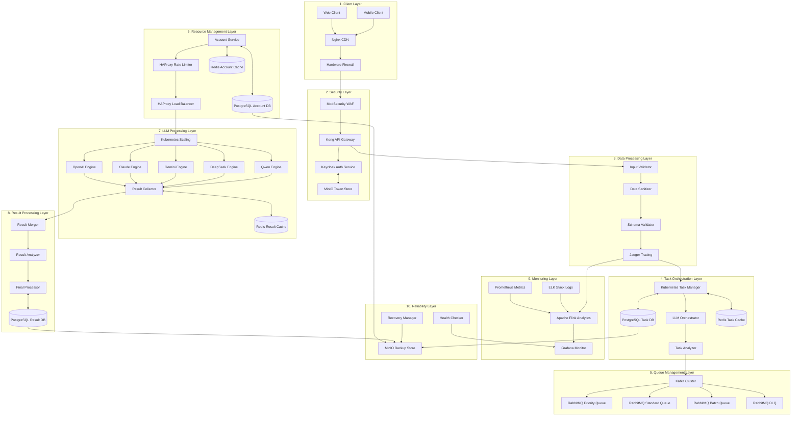

### On-Premises Multi-LLM Processing System Architecture



Tôi sẽ giải thích chi tiết về việc chuyển đổi từ hệ thống AWS sang hệ thống On-premises:

1. Tầng Người Dùng (Client Layer):
- Thay thế CloudFront bằng Nginx để làm CDN, giúp phân phối nội dung nhanh chóng
- Sử dụng tường lửa phần cứng (Hardware Firewall) thay cho AWS Shield để bảo vệ khỏi tấn công DDoS

2. Tầng Bảo Mật (Security Layer):
- Sử dụng ModSecurity làm Web Application Firewall thay cho AWS WAF
- Triển khai Kong API Gateway thay thế cho AWS API Gateway
- Áp dụng Keycloak để xử lý xác thực người dùng thay cho Lambda
- Dùng MinIO để lưu trữ token thay vì S3

3. Tầng Xử Lý Dữ Liệu và Tác Vụ:
- Vẫn giữ nguyên các thành phần xử lý như Input Validator, Data Sanitizer
- Sử dụng Kubernetes để quản lý và điều phối các container
- Thay thế AWS Auto Scaling bằng tính năng tự động mở rộng của Kubernetes

4. Tầng Quản Lý Queue:
- Giữ nguyên Kafka cho xử lý message streaming
- Thay thế AWS SQS bằng RabbitMQ cho các queue:
  + Priority Queue: Xử lý các tác vụ ưu tiên cao
  + Standard Queue: Xử lý các tác vụ thông thường
  + Batch Queue: Xử lý hàng loạt
  + Dead Letter Queue: Xử lý các message thất bại

5. Tầng Quản Lý Tài Nguyên:
- Sử dụng HAProxy làm load balancer và rate limiter
- Dùng PostgreSQL thay cho AWS RDS để lưu trữ dữ liệu
- Áp dụng Redis thay cho ElastiCache để làm cache

6. Tầng Xử Lý LLM:
- Vẫn duy trì 5 engine chính: OpenAI, Claude, Gemini, DeepSeek, Qwen
- Sử dụng Kubernetes để quản lý việc mở rộng các worker
- Dùng Redis để cache kết quả

7. Tầng Giám Sát và Phân Tích:
- Thay thế CloudWatch bằng Prometheus để theo dõi metrics
- Sử dụng ELK Stack (Elasticsearch, Logstash, Kibana) để quản lý logs
- Áp dụng Jaeger để theo dõi distributed tracing
- Dùng Apache Flink thay cho Kinesis để phân tích real-time
- Triển khai Grafana để visualize và monitor hệ thống

8. Tầng Độ Tin Cậy:
- Sử dụng MinIO để lưu trữ các bản backup thay vì S3
- Vẫn duy trì các thành phần Recovery Manager và Health Checker

Ưu điểm của việc chuyển sang On-premises:

1. Kiểm Soát Tốt Hơn:
- Toàn quyền kiểm soát về hạ tầng và bảo mật
- Có thể tùy chỉnh các thành phần theo nhu cầu cụ thể
- Không phụ thuộc vào nhà cung cấp cloud

2. Chi Phí:
- Tiết kiệm chi phí trong dài hạn với hệ thống có quy mô lớn
- Không phải trả phí theo lưu lượng sử dụng

3. Bảo Mật:
- Dữ liệu được lưu trữ nội bộ, đảm bảo an toàn
- Kiểm soát toàn diện về các chính sách bảo mật

Bạn cần tôi giải thích chi tiết thêm về phần nào không?

## # Enterprise On-Premises Multi-LLM System Architecture
```python
# Enterprise On-Premises Multi-LLM System Architecture
# Author: System Architecture Team
# Version: 2.0.0
# Last Updated: 2025-02-19

from diagrams import Diagram, Cluster, Edge
from diagrams.onprem.network import Nginx, HAProxy
from diagrams.onprem.security import Vault
from diagrams.onprem.monitoring import Grafana, Prometheus
from diagrams.onprem.database import PostgreSQL, Redis, Minio
from diagrams.onprem.queue import Kafka, RabbitMQ
from diagrams.onprem.compute import Server
from diagrams.onprem.client import Client
from diagrams.onprem.container import Docker
from diagrams.programming.framework import Spring, React
from diagrams.onprem.analytics import Spark
from diagrams.k8s.compute import Pod, StatefulSet
from diagrams.generic.network import Firewall
from diagrams.generic.storage import Storage

# System-wide configuration
GRAPH_ATTR = {
    "fontsize": "45",
    "fontname": "Arial",
    "splines": "ortho",
    "nodesep": "0.8",
    "ranksep": "1.0",
    "pad": "2.0"
}

# Edge color definitions for different data flows
EDGE_COLORS = {
    "primary": "#1E88E5",    # Main processing flow
    "secondary": "#43A047",   # Queue processing
    "warning": "#FDD835",     # Monitoring alerts
    "error": "#E53935",       # Error handling
    "info": "#00ACC1",        # Data flow
    "success": "#4CAF50"      # Successful completion
}

# Node styling configuration
NODE_CONFIG = {
    "fontsize": "13",
    "fontname": "Arial",
    "width": "2.0",
    "height": "1.5",
    "margin": "0.4"
}

def create_enterprise_architecture():
    """
    Generates the enterprise architecture diagram for the Multi-LLM Processing System
    """
    with Diagram(
        "Enterprise On-Premises Multi-LLM Processing System Architecture",
        show=True,
        direction="TB",
        graph_attr=GRAPH_ATTR,
        filename="enterprise_architecture_v2",
        outformat="png"
    ):
        # 1. Client Access Layer
        with Cluster("1. Client Access Layer"):
            web_client = React("Web Client\nVue/React/Angular")
            mobile_client = React("Mobile Client\niOS/Android")
            nginx_cdn = Nginx("Nginx CDN Cluster\nGlobal Content Delivery")
            firewall = Firewall("Enterprise Firewall\nPalo Alto/Cisco")
            
            [web_client, mobile_client] >> nginx_cdn >> firewall

        # 2. Security Layer
        with Cluster("2. Security & Authentication Layer"):
            modsec = Server("ModSecurity WAF\nWeb Protection")
            kong = Server("Kong API Gateway\nEnterprise Edition")
            keycloak = Server("Keycloak IAM\nIdentity Management")
            minio_token = Minio("MinIO Token Store\nHigh Availability")
            
            firewall >> modsec >> kong
            kong >> Edge(color=EDGE_COLORS["primary"]) >> keycloak
            keycloak - minio_token

        # 3. Data Processing Layer
        with Cluster("3. Data Validation & Processing Layer"):
            validator = Pod("Input Validator\nJSON Schema")
            sanitizer = Pod("Data Sanitizer\nSecurity Cleaning")
            schema = Pod("Schema Validator\nOpenAPI")
            transformer = Pod("Data Transformer\nApache NiFi")
            
            kong >> validator >> sanitizer >> schema >> transformer

        # 4. Task Orchestration Layer
        with Cluster("4. Task Management & Orchestration Layer"):
            task_mgr = StatefulSet("Kubernetes Task Manager")
            llm_orch = Pod("LLM Request Orchestrator")
            task_analyzer = Pod("ML-based Task Analyzer")
            task_db = PostgreSQL("PostgreSQL 15\nTask Database")
            task_cache = Redis("Redis 7\nTask Cache")
            
            transformer >> task_mgr >> llm_orch >> task_analyzer
            task_analyzer - task_db
            task_mgr - task_cache

        # 5. Message Queue Layer
        with Cluster("5. Queue Management Layer"):
            kafka = Kafka("Kafka 3.5\nMessage Broker")
            rmq_priority = RabbitMQ("High Priority Queue")
            rmq_standard = RabbitMQ("Standard Queue")
            rmq_batch = RabbitMQ("Batch Processing Queue")
            rmq_dlq = RabbitMQ("Dead Letter Queue")
            
            task_analyzer >> kafka >> Edge(color=EDGE_COLORS["secondary"]) >> [rmq_priority, rmq_standard, rmq_batch]
            kafka >> Edge(color=EDGE_COLORS["error"]) >> rmq_dlq

        # 6. Resource Management Layer
        with Cluster("6. Resource & Access Management Layer"):
            account_svc = Spring("Account Service\nSpring Boot 3.x")
            rate_limit = HAProxy("HAProxy Rate Limiter")
            load_bal = HAProxy("HAProxy Load Balancer")
            account_db = PostgreSQL("PostgreSQL 15\nAccount Database")
            account_cache = Redis("Redis 7\nAccount Cache")
            
            account_svc >> rate_limit >> load_bal
            account_svc - account_db
            account_svc - account_cache

        # 7. LLM Processing Layer
        with Cluster("7. LLM Engine Processing Layer"):
            k8s_scaling = Pod("Kubernetes HPA\nHorizontal Pod Autoscaling")
            llm_engines = [
                Docker("OpenAI GPT-4\nEngine"),
                Docker("Claude 3\nEngine"),
                Docker("Gemini Pro\nEngine"),
                Docker("DeepSeek\nEngine"),
                Docker("Qwen Max\nEngine")
            ]
            collector = StatefulSet("Result Aggregator Service")
            result_cache = Redis("Redis 7\nResult Cache")
            
            [rmq_priority, rmq_standard, rmq_batch] >> load_bal >> k8s_scaling
            for engine in llm_engines:
                k8s_scaling >> engine >> collector
            collector - result_cache

        # 8. Result Processing Layer
        with Cluster("8. Result Analysis & Processing Layer"):
            merger = Spark("Apache Spark 3.5\nResult Merger")
            result_analyzer = Pod("Quality Analysis Service")
            final_proc = Pod("Final Processing Service")
            result_db = PostgreSQL("PostgreSQL 15\nResult Database")
            
            collector >> merger >> result_analyzer >> final_proc
            final_proc - result_db

        # 9. Monitoring Layer
        with Cluster("9. System Monitoring & Analytics Layer"):
            prom = Prometheus("Prometheus\nMetrics Collection")
            elastic = Server("ELK Stack 8.x\nLog Analytics")
            jaeger = Server("Jaeger\nDistributed Tracing")
            flink = Spark("Apache Flink\nStream Analytics")
            grafana = Grafana("Grafana\nEnterprise Dashboards")
            
            prom >> grafana
            [elastic, jaeger] >> flink >> grafana

        # 10. Reliability Layer
        with Cluster("10. High Availability & Disaster Recovery Layer"):
            backup = Minio("MinIO Enterprise\nBackup Storage")
            recovery = Pod("Disaster Recovery Service")
            health = Spring("Health Monitoring Service")
            keepalived = Server("Keepalived\nHigh Availability")
            
            [task_db, account_db, result_db] >> backup
            recovery >> backup
            health >> grafana
            keepalived >> [firewall, load_bal, kafka]

        # System Feedback Loop
        final_proc >> Edge(color=EDGE_COLORS["success"]) >> task_mgr

        # Monitoring Connections
        grafana >> Edge(color=EDGE_COLORS["warning"]) >> [
            task_mgr,
            kafka,
            load_bal,
            k8s_scaling,
            collector
        ]

if __name__ == "__main__":
    create_enterprise_architecture()
```