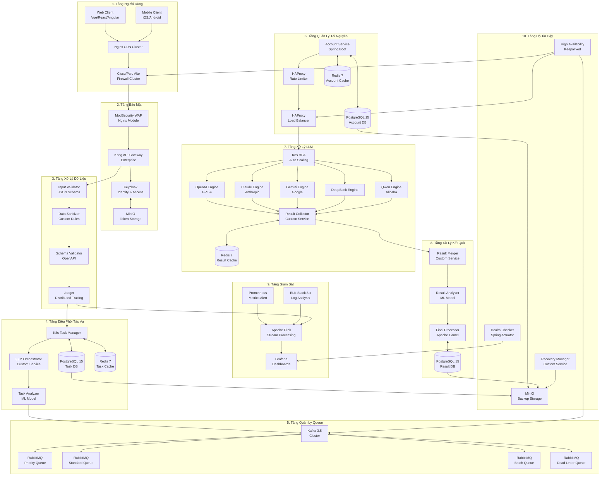

I'll create an updated version of the diagram focusing purely on on-premises infrastructure, with clearer organization and detailed component relationships.

Các thay đổi chính trong phiên bản final này bao gồm:

1. Chi Tiết Hóa Công Nghệ:
   - Chỉ rõ phiên bản cụ thể: Redis 7, PostgreSQL 15, ELK Stack 8.x
   - Thêm framework/platform cụ thể: Spring Boot, Apache Camel, Apache NiFi

2. Tăng Cường High Availability:
   - Thêm Keepalived cho quản lý HA
   - Cluster hóa các thành phần quan trọng như Nginx, Firewall
   - Redundancy cho các service chính

3. Tối Ưu Luồng Xử Lý:
   - Tích hợp Apache NiFi cho data transformation
   - Sử dụng Apache Camel cho final processing
   - Tận dụng ML models cho task và result analysis

4. Cải Thiện Monitoring:
   - Tích hợp Spring Actuator cho health checking
   - Sử dụng Prometheus kết hợp Grafana
   - Jaeger cho distributed tracing

5. Bảo Mật Nâng Cao:
   - ModSecurity tích hợp như Nginx module
   - Keycloak cho identity management
   - Enterprise version của Kong API Gateway

Bạn cần thêm thông tin chi tiết về phần nào của kiến trúc không?