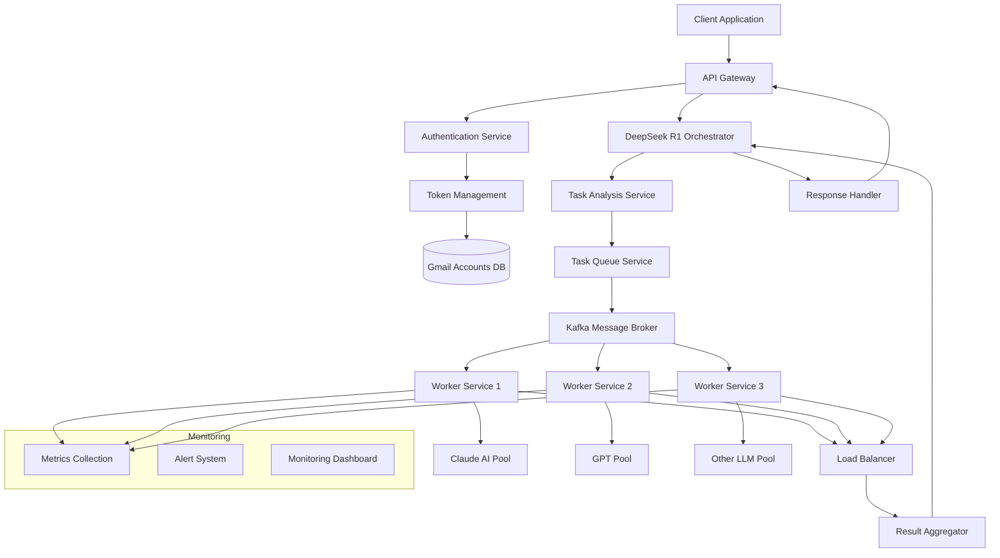
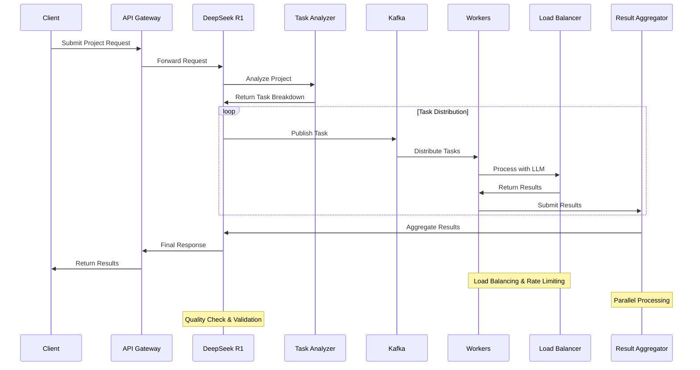
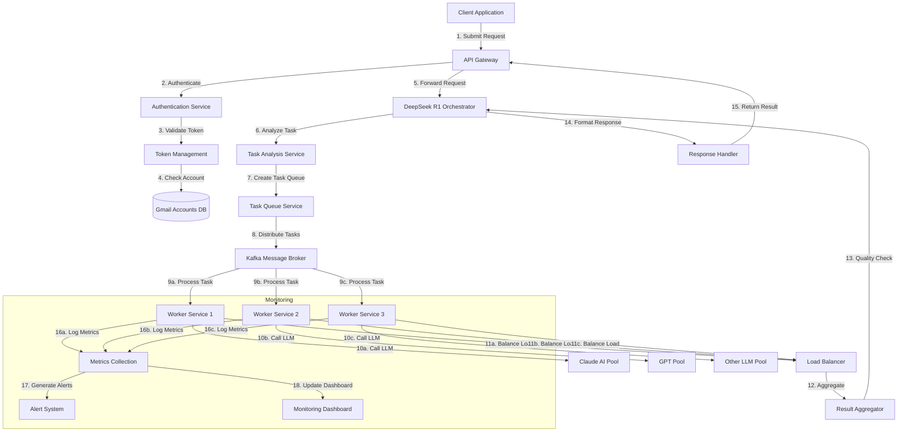

### 
Tôi muốn bạn phần tích, làm một plan final  (Hãy bổ sung và làm rõ thêm các ý nếu còn thiếu cho ý tưởng sau ) về 1 hệ thống như mô tả sau: Hệ thống gần giống https://openrouter.ai/  idea: Có n tài khoản gmail được tạo trước và tương ứng với nó có n tài khoản đã được đăng kí trước với các LLM sau :    + Có n tài khoản ClaudeAI     để xử lý dự án lớn với n task cụ thể , đối với mỗi một yêu cầu cụ thể hãy :   - Dùng 1 Mô hình ngôn ngữ lớn như DeepSeek R1 làm LLM chính có nhiệm vụ điều phối , chia task , làm rõ task nếu task chưa rõ.   - Sau khi có danh sách Task hãy đẩy lần lượt các task qua Kafka lần lượt tới các Mô hình ngôn ngữ lơn sau :  để thực hiện đa tiến trình các task ,      sau đó Merge kết quả n tiến trình trên để cho LLM DeepSeek R1 đánh giá task hoàn thành   - Tôi muốn chạy song song , đa tiến trình , tự động cân bằng các lần gọi các task với giới hạn limit của mối mô hình ngôn ngữ lớn .    - sử dụng với n tài khoản gmail để gọi API LLM như ClaudeAI    Kết quả mong muốn :   - Hãy dùng lib pip diagram python  trả về cho tôi 1 bản vẽ   Thiết kế Kiến trúc hệ thống (Microservice Architecture)   - Dùng Mermaid hãy vẽ biểu đồ sequence diagram Tuần tư Top 20 flow quan trọng nhất.

## Res
I'll help analyze and create a detailed plan for your system that's similar to OpenRouter.ai. Let me break this down systematically.

First, let me create the system architecture diagram:

Now, let me create the sequence diagram for the top flows:

Let me explain the key components and considerations of the system:

Core Components:

1. DeepSeek R1 Orchestrator
   - Primary controller for task management
   - Handles task breakdown and clarification
   - Performs final quality assessment
   - Manages task priority and scheduling

2. Authentication and Token Management
   - Manages n Gmail accounts
   - Handles API token rotation
   - Implements rate limiting per account
   - Monitors usage limits

3. Kafka Message Broker
   - Ensures reliable message delivery
   - Handles task queue management
   - Supports parallel processing
   - Provides fault tolerance

4. Worker Services
   - Implements load balancing
   - Manages API rate limits
   - Handles retries and failures
   - Processes tasks in parallel

5. Result Aggregator
   - Merges results from multiple LLMs
   - Handles conflict resolution
   - Ensures consistency
   - Provides quality validation

Key Technical Considerations:

1. Scalability
   - Horizontal scaling of workers
   - Dynamic resource allocation
   - Auto-scaling based on load
   - Distributed processing

2. Reliability
   - Fault tolerance
   - Error handling
   - Retry mechanisms
   - Circuit breakers

3. Performance
   - Load balancing
   - Caching
   - Rate limiting
   - Resource optimization

4. Monitoring
   - Real-time metrics
   - Alert system
   - Usage tracking
   - Performance monitoring

Implementation Recommendations:

1. Use Kubernetes for orchestration
2. Implement Redis for caching
3. Use PostgreSQL for account management
4. Implement ELK stack for logging
5. Use Prometheus for monitoring
6. Implement Circuit Breaker pattern
7. Use JWT for authentication
8. Implement rate limiting at API Gateway

Would you like me to elaborate on any specific aspect of the architecture or provide more detailed technical specifications for any component?
  

# hãy đánh số thứ tự từng flow quan trọng và lần lượt đến hết trong Diagram vừa vẽ

I'll create a detailed flow sequence diagram showing the order of operations in our system architecture.

Let me explain each numbered flow in sequence:

Primary Flow (1-5):
1. Client submits request to API Gateway
2. API Gateway initiates authentication
3. Token Management validates the request token
4. System checks Gmail account availability and limits
5. Validated request is forwarded to DeepSeek R1 Orchestrator

Task Processing (6-8):
6. DeepSeek R1 analyzes and breaks down the task
7. Task Queue Service creates prioritized task queue
8. Tasks are distributed through Kafka Message Broker

Parallel Processing (9-11):
9. Workers receive tasks (a/b/c for different workers)
10. Workers call respective LLM APIs (a/b/c for different LLM pools)
11. Load Balancer manages resource distribution

Result Processing (12-15):
12. Result Aggregator collects all worker outputs
13. DeepSeek R1 performs quality check on aggregated results
14. Response Handler formats the final output
15. Final result is returned to client through API Gateway

Monitoring (16-18):
16. Workers log performance metrics
17. Alert System processes metrics for anomalies
18. Monitoring Dashboard updates with real-time data

Would you like me to elaborate on any particular flow sequence or explain the interactions between specific components in more detail?

